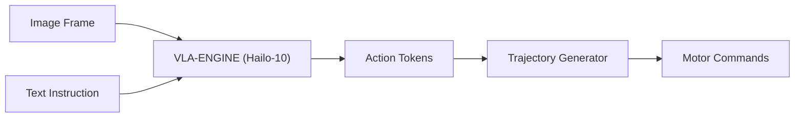

<p align="center">
  
</p>

# 👁️ HYDRA-UMC-VLA-ENGINE

<p align="center">🇺🇸 <b>English</b> | <a href="README_spa.md">🇪🇸 Español</a> | <a href="README_fra.md">🇫🇷 Français</a> | <a href="README_ita.md">🇮🇹 Italiano</a> | <a href="README_deu.md">🇩🇪 Deutsch</a> | <a href="README_zho.md">🇨🇳 简体中文</a> | <a href="README_jpn.md">🇯🇵 日本語</a></p>

### 🤖 Multimodal Vision-Language-Action Framework for Robotics

<p align="left">
  
  
  
</p>

---

## 1. 🛠️ TECHNICAL OVERVIEW

**HYDRA-UMC-VLA-ENGINE** is the multimodal bridge that translates visual context and natural language into direct robotic actions. It implements quantized versions of state-of-the-art VLA models (like OpenVLA or specialized RT-2 variants) to run locally on the Hailo-10 NPU.

This engine allows the robot to understand commands such as "pick the blue component and place it on the red tray" by analyzing the live camera feed and generating the corresponding kinematic sequence.

### Key Features:
* ✅ **Real v0 - action tokens & trajectory:** `action_tokens.py` implements the OpenVLA/RT-2-style 256-bin discretization scheme (continuous action <-> discrete token, per the 7-DOF pose-delta + gripper action space), and `trajectory.py` integrates a decoded action sequence into an absolute pose trajectory. Exposed via `tokens encode`/`tokens decode`/`trajectory integrate` below - no VLA model or Hailo-10 NPU needed to run or test it.
* 📜 **Model manifest + output validation:** A real, versioned contract (`model_manifest.py`) any future model integration must satisfy - matching action/vocab shape and a known Hailo chip family - plus shape/confidence validation for a model's raw inference output. *(implemented)*
* 🔌 **HailoRT integration boundary, prepared ahead of the module:** `hailo_runtime.py` is written against the real, confirmed `hailo_platform` API (`VDevice`, `HEF`, `ConfigureParams`, `InputVStreamParams`/`OutputVStreamParams`) - lazily imported so this repo installs/tests cleanly with no `hailort` package or Hailo-10 module present, and `hailo_output_to_tokens()` (the piece that maps a real inference result onto this engine's own token contract) is fully unit-tested today. *(implemented, integration boundary only - see below)*
* 🩺 **Honest `status` subcommand:** Reports real accelerator/model-weight availability - `no_accelerator`, `no_model_weights`, or `hardware_ready_no_inference` - never a fake "ready" state. *(implemented)*
* 🌉 **Semantic Control (planned):** Direct mapping from pixels and text to joint positions or tool commands. *(needs a real VLA model - future work.)*
* ⚡ **Real-Time Reasoning (planned):** Hailo-10 accelerated inference for low-latency action generation. *(needs the real Hailo-10 NPU this environment doesn't have.)*
* 🔄 **Zero-Shot Generalization (planned):** Capable of handling unseen objects based on semantic descriptions. *(needs a real trained VLA model.)*
* 🛠️ **Task Planning (planned):** Decomposes complex goals into atomic robotic primitives. *(needs a real VLA model.)*
* 👨‍👩‍👧 **Cognitive AI Node Child:** Runs as one of four sibling services
  under [HYDRA-UMC-COGNITIVE-NODE](https://github.com/JuanenRac/HYDRA-UMC-COGNITIVE-NODE)
  (alongside Voice-UI, Semantic-Planner and Docs-QA), sharing its parent's
  HydraOS image and model weights instead of keeping its own copies.
* 📦 **Odometer Versioning:** Every real build bumps `pyproject.toml`'s
  own version automatically (`bump_version.py`) - no manual version edits.

---

## 2. 🔄 VLA INFERENCE FLOW



---

## 3. 🧱 ARCHITECTURE & DESIGN DECISIONS

This repository is a **child** of the Cognitive AI Node family - its
parent, [HYDRA-UMC-COGNITIVE-NODE](https://github.com/JuanenRac/HYDRA-UMC-COGNITIVE-NODE),
owns the shared HydraOS image and quantized model weights, and wires this
service into `docker-compose.yml` alongside its three siblings
(Voice-UI, Semantic-Planner, Docs-QA):

* **Why this child has no hardware/firmware/`os/`/`models/` of its
  own.** It runs entirely on the CM5 + Hailo-10 M.2 module already owned
  by the parent - keeping model weights and the HydraOS image
  centralized in one place avoids four divergent multi-gigabyte copies
  across the family.
* **Why a `src/` layout.** Keeps the installable package
  (`hydra_umc_vla_engine`) separate from repo-root tooling
  (`bump_version.py`), matching the layout used by every other Python
  project across the ecosystem.
* **Why action tokenization ships before model inference.** Turning a continuous action into discrete tokens (and back) is fixed math defined by the action space's bounds and vocabulary size - it needs no VLA model or Hailo-10 NPU to write or test, so v0 lands that piece (`action_tokens.py`, `trajectory.py`) first. Real VLA inference needs the model weights and Hailo-10 hardware this environment doesn't have, and lands later.
* **Why `hailo_runtime.py` imports `hailo_platform` lazily, inside just two
  functions.** `hailort` isn't on PyPI and isn't installed on this
  development machine - importing it at module load time would make this
  entire package fail to install/import everywhere except a machine with
  a real Hailo module attached. Only `open_vdevice()` and
  `load_hailo_vla_model()` (the two functions that genuinely need real
  HailoRT) import it, and lazily; both raise a clear
  `HailoNotAvailableError` instead of a bare `ImportError` when it's
  missing. Same pattern this ecosystem already uses for every other real
  hardware transport (GRBL serial, MAVLink, SPI-OTA, ...).
* **How this fits the rest of the ecosystem.** This engine converts raw
  perception (camera frames, forwarded conceptually from
  HYDRA-UMC-VISION-NODE upstream) and natural-language instructions into
  action tokens that HYDRA-UMC-SEMANTIC-PLANNER, its sibling, turns into
  mission-level decisions for HYDRA-UMC-ORCHESTRATOR.
* **Why `model_manifest.py` doesn't name a specific OpenVLA/RT-2
  variant.** No model has actually been chosen yet (see this README's
  own Roadmap) - `EXPECTED_MODEL_MANIFEST` is honestly a shape/target
  contract derived directly from `action_tokens.py`'s own real
  constants, not a loader for a model that doesn't exist. `hailo_arch`
  reuses the same real, closed chip-family set `HYDRA-UMC-DETECTION-HEF`
  already validates its own model registry against.
* **Why `status` reports `hardware_ready_no_inference` instead of
  "ready".** Even once a real Hailo-10 device and real model weights are
  both present, this v0 still has no real inference code - claiming
  readiness at that point would be a real lie about a capability that
  doesn't exist yet. `hardware.py`'s `determine_mode()` checks the
  accelerator first (a cheap device-node probe) before the model
  weights, the same cheapest-precondition-first ordering
  `HYDRA-UMC-DETECTION-HEF`'s `safe_load()` already uses.
* **Why `model_weights_available()` checks the parent's `models/`, not
  a local one.** This child has no `models/` of its own (pruned - see
  the bullet above) - the real shared weights live in the parent
  `HYDRA-UMC-COGNITIVE-NODE`'s own `models/`, one sibling-workspace
  level up, the same real directory that repo's own
  `check_shared_models()` already checks.

---

## 📂 DIRECTORY STRUCTURE

```text
HYDRA-UMC-VLA-ENGINE/
├── src/hydra_umc_vla_engine/   # Source code
│   ├── action_tokens.py        # Action <-> token discretization (OpenVLA/RT-2-style)
│   ├── trajectory.py           # Action-sequence -> pose-trajectory integration
│   ├── model_manifest.py       # Real model shape contract + inference-output validation
│   ├── hardware.py             # Real accelerator/model-weight availability probes
│   ├── hailo_runtime.py        # Real HailoRT (hailo_platform) integration boundary, lazily imported
│   └── main.py                 # CLI entry point (bare invocation + `tokens`/`trajectory`/`status`)
├── tests/                      # Real pytest suite (action_tokens, trajectory, manifest, hardware, CLI)
├── docs/                       # Documentation and benchmarks
├── images/                     # Media and diagrams
├── scripts/                    # Utility scripts
├── build/                      # Local build output (git-ignored)
├── pyproject.toml              # Package metadata (odometer-bumped version)
├── bump_version.py             # Odometer-style version bump (used by build.sh/.bat)
├── build.sh / build.bat        # Create venv, install (with dev extras), verify import, run tests
└── run.sh / run.bat            # Run the entry point
```

> **Note:** `hardware/` and `firmware/` were pruned - this node runs on an
> existing CM5 + Hailo-10 M.2 module with no hardware/firmware design of
> its own. `os/` and `models/` were also pruned - the HydraOS image and
> the shared Hailo-10 model weights live in the parent
> `HYDRA-UMC-COGNITIVE-NODE`, which this project attaches to as a
> service (see its `docker-compose.yml`).

---

## ⚙️ BUILD & RUN

Requires Python >= 3.10.

```bash
# Linux / macOS / Git Bash
./build.sh   # creates .venv, installs the package (editable, with dev
             # extras), verifies import, runs the real test suite
./run.sh     # runs the entry point

# Windows (cmd)
build.bat
run.bat
```

`build.sh`/`build.bat` bump the version (odometer-style, see
`bump_version.py`) before every real build. Expected output of `run.sh`
(bare invocation):

```text
HYDRA-UMC-VLA-ENGINE v0.0.4
Vision-Language-Action engine (Hailo-10) - translates camera frames and text instructions into robotic action sequences.
```

Real example - encode an action into tokens, decode it back, and integrate a short action sequence into a trajectory:

```bash
./run.sh tokens encode --action "0.02,-0.03,0.01,0.05,-0.04,0.02,0.7"
# 179,51,153,192,76,153,179

./run.sh tokens decode --tokens "179,51,153,192,76,153,179"
# 0.020117,-0.029883,0.009961,0.050391,-0.040234,0.019922,0.701172
# (not identical to the encode input above - the 256-bin discretization
# is lossy by design, decode recovers the bin's midpoint, not the exact
# original value)

echo '[[0.01, 0.0, 0.0, 0.0, 0.0, 0.0, 0.5], [0.0, 0.01, 0.0, 0.0, 0.0, 0.0, 1.0]]' > actions.json
./run.sh trajectory integrate --start "0,0,0,0,0,0" --actions actions.json
# step 0: x=0.000000 y=0.000000 z=0.000000 roll=0.000000 pitch=0.000000 yaw=0.000000 gripper=0.000000
# step 1: x=0.010000 y=0.000000 z=0.000000 roll=0.000000 pitch=0.000000 yaw=0.000000 gripper=0.500000
# step 2: x=0.010000 y=0.010000 z=0.000000 roll=0.000000 pitch=0.000000 yaw=0.000000 gripper=1.000000
```

`status` reports real, honest accelerator/model-weight availability -
never a fake ready state:

```text
$ ./run.sh status
accelerator (Hailo-10):    MISSING
model weights (parent):    MISSING
mode: no_accelerator - no Hailo-10 NPU device node on this machine - real inference cannot run here.
```

### 🩺 Troubleshooting

* **`python: command not found` / build fails at step 1.** Requires
  Python >= 3.10 on `PATH`. On Windows, install from
  [python.org](https://python.org) and make sure "Add to PATH" was
  checked during setup; `python3` is the usual name on Linux/macOS.
* **`build.sh` fails to activate the venv.** `python3 -m venv .venv`
  lays out the activate script differently per platform:
  `.venv/bin/activate` on Linux/macOS, `.venv/Scripts/activate` on
  Windows (also true for a Windows Python venv used from Git Bash).
  `build.sh` already checks both paths - if it still fails, delete
  `.venv/` and re-run `./build.sh` to rebuild it from scratch.
* **`pip install -e .` fails.** Usually a stale `.venv/`. Delete the
  `.venv/` folder and re-run `./build.sh`/`build.bat` to recreate it.
* **`import OK` never prints.** Means `python -c "import
  hydra_umc_vla_engine"` itself failed - re-run with the venv active to
  see the real traceback.

---

## ✅ Current Status & Next Steps

**Real today:** action-token encoding/decoding and trajectory generation (`action_tokens.py`, `trajectory.py`) - the "Action Tokens" and "Trajectory Generator" steps in the flow diagram above - plus a real HailoRT integration boundary (`hailo_runtime.py`) ready for a real `.hef` model and a Hailo-10 module the moment they exist. 53 tests and a real CLI.

**Still ahead, and blocked on real hardware/a real model:** actually running inference needs a real compiled `.hef` VLA model (OpenVLA/RT-2 quantized for Hailo-10 - no specific model chosen yet) and a physical Hailo-10 module attached, both real, unavoidable blockers `hailo_runtime.py` cannot remove on its own - but loading and decoding one, once it exists, is no longer unwritten code.

---

## 🚀 ROADMAP
* **Phase 1:** VLA engine deployment and multi-modal input processing on Hailo-10.
* **Phase 2:** Semantic planner integration with swarm behavioral models and long-term memory.
* **Phase 3:** Voice UI low-latency local execution and industrial noise cancellation.
* **Phase 4:** Support for dual-arm coordinated action generation and autonomous decision-making audits.

---

## 🔗 RELATED PROJECTS

This project is part of a larger robotics ecosystem by the same author (JuanenRac / Electro Hobby 3D), spanning firmware, control software, AI nodes, and fleet tooling. This engine has no relations outside its own family (parent HYDRA-UMC-COGNITIVE-NODE and siblings HYDRA-UMC-VOICE-UI, HYDRA-UMC-SEMANTIC-PLANNER, HYDRA-UMC-DOCS-QA) beyond what's already covered above.

### Rest of the Ecosystem

**HYDRA-UMC platform** — the multi-robot micro-factory cell
- **[HYDRA-UMC](https://github.com/JuanenRac/HYDRA-UMC)** — the motherboard itself: Raspberry Pi CM5 host + dual-core STM32H745 real-time co-processor, orchestrating up to 8 distributed robot arms over CAN-OTA/SPI-OTA.
- **[HYDRA-UMC SERVER](https://github.com/JuanenRac/HYDRA-UMC-SERVER)** — headless Express/WebSocket backend that owns robot state.
- **[HYDRA-UMC STUDIO](https://github.com/JuanenRac/HYDRA-UMC-STUDIO)** — web-based control dashboard.
- **[HYDRA-UMC-ANDROID-CONTROL](https://github.com/JuanenRac/HYDRA-UMC-ANDROID-CONTROL)** — Android control app for HYDRA-UMC.
- **[HYDRA-UMC-IOS-CONTROL](https://github.com/JuanenRac/HYDRA-UMC-IOS-CONTROL)** — iOS/iPadOS control app for HYDRA-UMC.
- **[HYDRA-UMC-SUITE](https://github.com/JuanenRac/HYDRA-UMC-SUITE)** — desktop swarm command center.
- **[HYDRA-UMC-EDITOR-URDF](https://github.com/JuanenRac/HYDRA-UMC-EDITOR-URDF)** — desktop graphical URDF creator/editor.
- **[HYDRA-UMC-DSI](https://github.com/JuanenRac/HYDRA-UMC-DSI)** — native touchscreen UI for HYDRA-UMC.

**URTC platform** — the tool head controller every HYDRA-UMC robot arm carries
- **[URTC](https://github.com/JuanenRac/URTC)** — Universal Robot Tool Controller, firmware.
- **[URTC Flasher](https://github.com/JuanenRac/URTC-FLASHER)** — desktop CAN-OTA + SWD/JTAG flashing tool.
- **[URTC Tester](https://github.com/JuanenRac/URTC-TESTER)** — desktop live CAN-bus diagnostic tool.
- **[URTC Web Studio](https://github.com/JuanenRac/URTC-WEB-STUDIO)** — browser-based alternative to the 2 desktop tools above.

**👁️ Vision AI Node (Hailo-8)**
- [HYDRA-UMC-VISION-NODE](https://github.com/JuanenRac/HYDRA-UMC-VISION-NODE)
- [HYDRA-UMC-VISION-STREAMER](https://github.com/JuanenRac/HYDRA-UMC-VISION-STREAMER)
- [HYDRA-UMC-DETECTION-HEF](https://github.com/JuanenRac/HYDRA-UMC-DETECTION-HEF)
- [HYDRA-UMC-SAFETY-ZONES](https://github.com/JuanenRac/HYDRA-UMC-SAFETY-ZONES)
- [HYDRA-UMC-VISUAL-SERVOING-API](https://github.com/JuanenRac/HYDRA-UMC-VISUAL-SERVOING-API)

**🐝 Orchestration & Swarm**
- [HYDRA-UMC-ORCHESTRATOR](https://github.com/JuanenRac/HYDRA-UMC-ORCHESTRATOR)
- [HYDRA-UMC-SWARM-SYNC](https://github.com/JuanenRac/HYDRA-UMC-SWARM-SYNC)
- [HYDRA-UMC-PATH-PLANNER-3D](https://github.com/JuanenRac/HYDRA-UMC-PATH-PLANNER-3D)
- [HYDRA-UMC-JOB-DISPATCHER](https://github.com/JuanenRac/HYDRA-UMC-JOB-DISPATCHER)
- [HYDRA-UMC-NODE-HEALING](https://github.com/JuanenRac/HYDRA-UMC-NODE-HEALING)

**🎮 Digital Twin & Simulation**
- [HYDRA-UMC-TWIN](https://github.com/JuanenRac/HYDRA-UMC-TWIN)
- [HYDRA-UMC-PHYSICS-REPLICA](https://github.com/JuanenRac/HYDRA-UMC-PHYSICS-REPLICA)
- [HYDRA-UMC-HIL-BRIDGE](https://github.com/JuanenRac/HYDRA-UMC-HIL-BRIDGE)
- [HYDRA-UMC-SYNTHETIC-DATA-GEN](https://github.com/JuanenRac/HYDRA-UMC-SYNTHETIC-DATA-GEN)

**📊 Data & Analytics**
- [HYDRA-UMC-DATALAKE](https://github.com/JuanenRac/HYDRA-UMC-DATALAKE)
- [HYDRA-UMC-TELEMETRY-COLLECTOR](https://github.com/JuanenRac/HYDRA-UMC-TELEMETRY-COLLECTOR)
- [HYDRA-UMC-ANOMALY-DETECTOR](https://github.com/JuanenRac/HYDRA-UMC-ANOMALY-DETECTOR)
- [HYDRA-UMC-PRODUCTION-REPORTS](https://github.com/JuanenRac/HYDRA-UMC-PRODUCTION-REPORTS)

**🏭 Industrial Gateway**
- [HYDRA-UMC-GATEWAY-INDUSTRIAL](https://github.com/JuanenRac/HYDRA-UMC-GATEWAY-INDUSTRIAL)
- [HYDRA-UMC-OPCUA-SERVER](https://github.com/JuanenRac/HYDRA-UMC-OPCUA-SERVER)
- [HYDRA-UMC-MQTT-BROKER](https://github.com/JuanenRac/HYDRA-UMC-MQTT-BROKER)
- [HYDRA-UMC-MTCONNECT-ADAPTER](https://github.com/JuanenRac/HYDRA-UMC-MTCONNECT-ADAPTER)

**🛠️ Complementary Tools**
- [URTC-SMART-RACK](https://github.com/JuanenRac/URTC-SMART-RACK)
- [URTC-VISION-TOOL](https://github.com/JuanenRac/URTC-VISION-TOOL)
- [HYDRA-UMC-WATCH](https://github.com/JuanenRac/HYDRA-UMC-WATCH)
- [HYDRA-UMC-TOOL-CLI](https://github.com/JuanenRac/HYDRA-UMC-TOOL-CLI)
- [HYDRA-UMC-DASHBOARD-AI](https://github.com/JuanenRac/HYDRA-UMC-DASHBOARD-AI)

---

## 👤 AUTHOR
**JuanenRac** (Electro Hobby 3D)
📧 electrohobby3d@gmail.com

## 📜 LICENSE
GPL-3.0 - See LICENSE for details.

## 🛠️ BUILD & RUN

Use the non-versioning build check before a release build:

| Action | Windows | Linux / macOS |
|---|---|---|
| Build check (no version or CHANGELOG change) | `build-test.bat` | `./build-test.sh` |
| Run / development (when provided) | `run*.bat` or `dev*.bat` | `./run*.sh` or `./dev*.sh` |

`build-test.bat` and `build-test.sh` compile or validate the project stack without incrementing `hydra-umc.project.json` or modifying `CHANGELOG.md`. They may create normal compiler output only. Existing `build*.bat`, `build*.sh`, `run*` and `dev*` scripts retain their project-specific, versioned or runtime behavior; use them when that behavior is required.