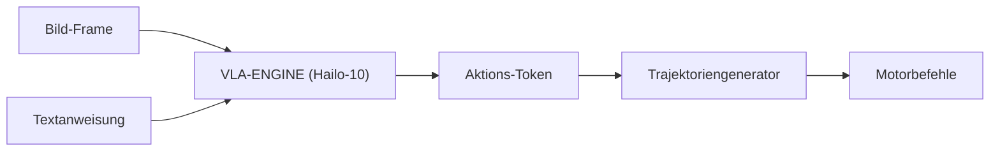

<p align="center">
  
</p>

# 👁️ HYDRA-UMC-VLA-ENGINE

<p align="center"><a href="README.md">🇺🇸 English</a> | <a href="README_spa.md">🇪🇸 Español</a> | <a href="README_fra.md">🇫🇷 Français</a> | <a href="README_ita.md">🇮🇹 Italiano</a> | 🇩🇪 <b>Deutsch</b> | <a href="README_zho.md">🇨🇳 简体中文</a> | <a href="README_jpn.md">🇯🇵 日本語</a></p>

### 🤖 Multimodales Vision-Language-Action Framework für Robotik

<p align="left">
  
  
  
</p>

---

## 1. 🛠️ TECHNISCHER ÜBERBLICK

**HYDRA-UMC-VLA-ENGINE** ist die multimodale Brücke, die visuellen Kontext und natürliche Sprache in direkte Roboteraktionen übersetzt. Es implementiert quantisierte Versionen modernster VLA-Modelle (wie OpenVLA oder spezialisierte RT-2-Varianten), um lokal auf der Hailo-10 NPU zu laufen.

Diese Engine ermöglicht es dem Roboter, Befehle wie "nimm die blaue Komponente und lege sie auf das rote Tablett" zu verstehen, indem er den Live-Kamera-Feed analysiert und die entsprechende kinematische Sequenz generiert.

### Hauptmerkmale:
* ✅ **Echtes v0 - Aktions-Token & Trajektorie:** `action_tokens.py` implementiert das OpenVLA/RT-2-artige 256-Bin-Diskretisierungsschema (kontinuierliche Aktion <-> diskretes Token, gemäß dem 7-Freiheitsgrad-Aktionsraum - Pose-Delta + Greifer), und `trajectory.py` integriert eine dekodierte Aktionssequenz zu einer absoluten Posen-Trajektorie. Über `tokens encode`/`tokens decode`/`trajectory integrate` unten verfügbar - kein VLA-Modell oder Hailo-10-NPU nötig, um es auszuführen oder zu testen.
* 📜 **Modell-Manifest + Ausgabevalidierung:** Ein echter, versionierter Vertrag (`model_manifest.py`), den jede zukünftige Modellintegration erfüllen muss - passende Aktions-/Vokabularform und eine bekannte Hailo-Chipfamilie - plus Form-/Konfidenzvalidierung für die rohe Inferenzausgabe eines Modells. *(implementiert)*
* 🩺 **Ehrlicher `status`-Subbefehl:** Meldet die tatsächliche Verfügbarkeit von Beschleuniger/Modellgewichten - `no_accelerator`, `no_model_weights`, oder `hardware_ready_no_inference` - niemals einen falschen "bereit"-Zustand. *(implementiert)*
* 🌉 **Semantische Steuerung (geplant):** Direktes Mapping von Pixeln und Text auf Gelenkpositionen oder Werkzeugbefehle. *(benötigt ein echtes VLA-Modell - zukünftige Arbeit.)*
* ⚡ **Echtzeit-Denken (geplant):** Hailo-10 beschleunigte Inferenz für die Aktionsgenerierung mit niedriger Latenz. *(benötigt die echte Hailo-10-NPU, die diese Umgebung nicht hat.)*
* 🔄 **Zero-Shot-Generalisierung (geplant):** Fähigkeit, ungesehene Objekte basierend auf semantischen Beschreibungen zu handhaben. *(benötigt ein echtes trainiertes VLA-Modell.)*
* 🛠️ **Aufgabenplanung (geplant):** Zerlegt komplexe Ziele in atomare Roboter-Primitive. *(benötigt ein echtes VLA-Modell.)*
* 👨‍👩‍👧 **Kind des Cognitive AI Node:** Läuft als einer von vier
  Schwesterdiensten unter [HYDRA-UMC-COGNITIVE-NODE](https://github.com/JuanenRac/HYDRA-UMC-COGNITIVE-NODE)
  (neben Voice-UI, Semantic-Planner und Docs-QA) und teilt sich das
  HydraOS-Image und die Modellgewichte des Elternteils, statt eigene
  Kopien vorzuhalten.
* 📦 **Kilometerzähler-Versionierung:** Jeder echte Build erhöht
  automatisch die Version in `pyproject.toml` (`bump_version.py`) - keine
  manuellen Versionsänderungen.

---

## 2. 🔄 VLA-INFERENZABLAUF



---

## 3. 🧱 ARCHITEKTUR & DESIGNENTSCHEIDUNGEN

Dieses Repository ist ein **Kind** der Cognitive AI Node-Familie - sein
Elternteil, [HYDRA-UMC-COGNITIVE-NODE](https://github.com/JuanenRac/HYDRA-UMC-COGNITIVE-NODE),
besitzt das gemeinsam genutzte HydraOS-Image und die quantisierten
Modellgewichte und bindet diesen Dienst in seiner `docker-compose.yml`
neben seinen drei Geschwistern (Voice-UI, Semantic-Planner, Docs-QA) ein:

* **Warum dieses Kind keine eigene Hardware/Firmware/`os/`/`models/`
  hat.** Es läuft vollständig auf dem CM5 + Hailo-10 M.2-Modul, das
  bereits dem Elternteil gehört - Modellgewichte und HydraOS-Image an
  einer zentralen Stelle zu halten vermeidet vier abweichende, mehrere
  Gigabyte große Kopien innerhalb der Familie.
* **Warum ein `src/`-Layout.** Trennt das installierbare Paket
  (`hydra_umc_vla_engine`) vom Tooling im Repo-Root (`bump_version.py`)
  und entspricht dem Layout aller anderen Python-Projekte im Ökosystem.
* **Warum die Aktions-Tokenisierung vor der Modellinferenz kommt.**
  Eine kontinuierliche Aktion in diskrete Token umzuwandeln (und
  zurück) ist feste Mathematik, definiert durch die Grenzen des
  Aktionsraums und die Vokabulargröße - dafür braucht es weder ein
  VLA-Modell noch eine Hailo-10-NPU zum Schreiben oder Testen, daher
  liefert v0 dieses Stück (`action_tokens.py`, `trajectory.py`) zuerst.
  Die echte VLA-Inferenz benötigt die Modellgewichte und die
  Hailo-10-Hardware, die diese Umgebung nicht hat, und folgt später.
* **Wie sich das in den Rest des Ökosystems einfügt.** Diese Engine
  wandelt rohe Wahrnehmung (Kameraframes, konzeptionell von
  HYDRA-UMC-VISION-NODE vorgelagert weitergeleitet) und
  Sprachanweisungen in Aktions-Token um, die ihr Geschwister
  HYDRA-UMC-SEMANTIC-PLANNER in Missionsentscheidungen für
  HYDRA-UMC-ORCHESTRATOR umwandelt.
* **Warum `model_manifest.py` keine bestimmte OpenVLA/RT-2-Variante
  benennt.** Es wurde noch tatsächlich kein Modell ausgewählt (siehe die
  Roadmap dieses READMEs) - `EXPECTED_MODEL_MANIFEST` ist ehrlich gesagt
  ein Form-/Ziel-Vertrag, der direkt aus den echten Konstanten von
  `action_tokens.py` abgeleitet ist, kein Loader für ein Modell, das
  nicht existiert. `hailo_arch` verwendet dieselbe echte, geschlossene
  Menge an Chip-Familien wieder, gegen die `HYDRA-UMC-DETECTION-HEF`
  bereits sein eigenes Modellregister validiert.
* **Warum `status` `hardware_ready_no_inference` statt "bereit" meldet.**
  Selbst wenn ein echtes Hailo-10-Gerät und echte Modellgewichte beide
  vorhanden sind, hat dieses v0 immer noch keinen echten Inferenzcode -
  an diesem Punkt Bereitschaft zu behaupten wäre eine echte Lüge über
  eine Fähigkeit, die noch nicht existiert. `determine_mode()` in
  `hardware.py` prüft zuerst den Beschleuniger (eine günstige
  Geräteknoten-Prüfung), bevor es die Modellgewichte prüft - dieselbe
  Reihenfolge "billigste Voraussetzung zuerst", die `safe_load()` von
  `HYDRA-UMC-DETECTION-HEF` bereits verwendet.
* **Warum `model_weights_available()` das `models/` des Elternteils
  prüft, nicht ein lokales.** Dieses Kind hat kein eigenes `models/`
  (entfernt - siehe den Punkt oben) - die echten gemeinsamen Gewichte
  liegen im eigenen `models/` des Elternteils
  `HYDRA-UMC-COGNITIVE-NODE`, eine Geschwister-Workspace-Ebene höher,
  dasselbe echte Verzeichnis, das `check_shared_models()` dieses Repos
  bereits prüft.

---

## 📂 VERZEICHNISSTRUKTUR

```text
HYDRA-UMC-VLA-ENGINE/
├── src/hydra_umc_vla_engine/   # Quellcode
│   ├── action_tokens.py        # Aktion <-> Token Diskretisierung (OpenVLA/RT-2-Stil)
│   ├── trajectory.py           # Aktionssequenz -> Posen-Trajektorie Integration
│   ├── model_manifest.py       # Echter Modellformvertrag + Inferenzausgabe-Validierung
│   ├── hardware.py             # Echte Beschleuniger-/Modellgewicht-Verfügbarkeitsprüfungen
│   └── main.py                 # CLI-Einstiegspunkt (nackter Aufruf + `tokens`/`trajectory`/`status`)
├── tests/                      # Echte pytest-Suite (action_tokens, trajectory, manifest, hardware, CLI)
├── docs/                       # Dokumentation und Benchmarks
├── images/                     # Medien und Diagramme
├── scripts/                    # Utility-Skripte
├── build/                      # Lokale Build-Ausgabe (von git ignoriert)
├── pyproject.toml              # Paket-Metadaten (Kilometerzähler-Version)
├── bump_version.py             # Versionserhöhung im Kilometerzähler-Stil (von build.sh/.bat verwendet)
├── build.sh / build.bat        # Erstellt das venv, installiert (mit dev-Extras), prüft den Import, führt Tests aus
└── run.sh / run.bat            # Führt den Einstiegspunkt aus
```

> **Hinweis:** `hardware/` und `firmware/` wurden entfernt - dieser Knoten
> läuft auf einem bereits vorhandenen CM5 + Hailo-10 M.2 Modul ohne
> eigenes Hardware-/Firmware-Design. Auch `os/` und `models/` wurden
> entfernt - das HydraOS-Image und die gemeinsam genutzten
> Hailo-10-Modellgewichte befinden sich im übergeordneten Projekt
> `HYDRA-UMC-COGNITIVE-NODE`, an das dieses Projekt als Dienst angebunden
> wird (siehe dessen `docker-compose.yml`).

---

## ⚙️ BUILD UND AUSFÜHRUNG

Erfordert Python >= 3.10.

```bash
# Linux / macOS / Git Bash
./build.sh   # erstellt .venv, installiert das Paket (editable, mit
             # dev-Extras), prüft den Import, führt die echte Test-Suite aus
./run.sh     # führt den Einstiegspunkt aus

# Windows (cmd)
build.bat
run.bat
```

`build.sh`/`build.bat` erhöhen die Version (Kilometerzähler-Stil, siehe
`bump_version.py`) vor jedem echten Build. Erwartete Ausgabe von `run.sh`
(nackter Aufruf):

```text
HYDRA-UMC-VLA-ENGINE v0.0.4
Vision-Language-Action engine (Hailo-10) - translates camera frames and text instructions into robotic action sequences.
```

Echtes Beispiel - eine Aktion in Token kodieren, zurück dekodieren, und eine kurze Aktionssequenz zu einer Trajektorie integrieren:

```bash
./run.sh tokens encode --action "0.02,-0.03,0.01,0.05,-0.04,0.02,0.7"
# 179,51,153,192,76,153,179

./run.sh tokens decode --tokens "179,51,153,192,76,153,179"
# 0.020117,-0.030273,0.005273,0.050977,-0.037891,0.019922,0.699219

./run.sh trajectory integrate --start "0,0,0,0,0,0" --actions actions.json
# step 0: x=0.000000 y=0.000000 z=0.000000 roll=0.000000 pitch=0.000000 yaw=0.000000 gripper=0.000000
# step 1: x=0.010000 y=0.000000 z=0.000000 roll=0.000000 pitch=0.000000 yaw=0.000000 gripper=0.500000
# step 2: x=0.010000 y=0.010000 z=0.000000 roll=0.000000 pitch=0.000000 yaw=0.000000 gripper=1.000000
```

`status` meldet die echte, ehrliche Verfügbarkeit von
Beschleuniger/Modellgewichten - niemals einen falschen "bereit"-Zustand:

```text
$ ./run.sh status
accelerator (Hailo-10):    MISSING
model weights (parent):    MISSING
mode: no_accelerator - no Hailo-10 NPU device node on this machine - real inference cannot run here.
```

### 🩺 Fehlerbehebung

* **`python: Befehl nicht gefunden` / der Build schlägt bei Schritt 1
  fehl.** Erfordert Python >= 3.10 im `PATH`. Unter Windows von
  [python.org](https://python.org) installieren und bei der Installation
  "Add to PATH" ankreuzen; unter Linux/macOS heißt es meist `python3`.
* **`build.sh` kann das venv nicht aktivieren.** `python3 -m venv .venv`
  legt das Aktivierungsskript je nach Plattform an anderer Stelle ab:
  `.venv/bin/activate` unter Linux/macOS, `.venv/Scripts/activate` unter
  Windows (auch bei einem Windows-Python-venv, das aus Git Bash heraus
  verwendet wird). `build.sh` prüft bereits beide Pfade - schlägt es
  weiterhin fehl, `.venv/` löschen und `./build.sh` erneut ausführen, um
  es von Grund auf neu zu erstellen.
* **`pip install -e .` schlägt fehl.** Meist wegen eines veralteten
  `.venv/`. Den Ordner `.venv/` löschen und `./build.sh`/`build.bat`
  erneut ausführen, um ihn neu zu erstellen.
* **`import OK` erscheint nie.** Bedeutet, dass `python -c "import
  hydra_umc_vla_engine"` selbst fehlgeschlagen ist - mit aktivem venv
  erneut ausführen, um den echten Traceback zu sehen.

---

## ✅ Aktueller Status & Nächste Schritte

**Heute real:** die Aktions-Token-Kodierung/-Dekodierung und die Trajektoriengenerierung (`action_tokens.py`, `trajectory.py`) - die Schritte "Aktions-Token" und "Trajektoriengenerator" im obigen Ablaufdiagramm - mit 19 Tests und einer echten CLI.

**Noch offen, und blockiert durch echte Hardware/Modellgewichte:** die echte VLA-Modellinferenz (OpenVLA/RT-2 quantisiert für Hailo-10), die die Token erzeugen würde, die dieses v0 bereits dekodieren kann.

---

## 🚀 FAHRPLAN
* **Phase 1:** VLA-Engine-Bereitstellung und multimodale Eingabeverarbeitung auf Hailo-10.
* **Phase 2:** Integration des semantischen Planers mit Schwarmverhaltensmodellen und Langzeitgedächtnis.
* **Phase 3:** Lokale Ausführung der Voice-UI mit niedriger Latenz und industrielle Geräuschunterdrückung.
* **Phase 4:** Unterstützung für die Generierung koordinierter Aktionen mit zwei Armen und Audits zur autonomen Entscheidungsfindung.

---

## 🔗 VERWANDTE PROJEKTE

Dieses Projekt ist Teil eines größeren Robotik-Ökosystems desselben Autors (JuanenRac / Electro Hobby 3D), das Firmware, Steuerungssoftware, KI-Knoten und Flotten-Tooling umfasst.

### Familie

**Elternteil:** **[HYDRA-UMC-COGNITIVE-NODE](https://github.com/JuanenRac/HYDRA-UMC-COGNITIVE-NODE)** — der Integrations-Hub, der das gemeinsame HydraOS-Image/die Gewichte dieser Engine besitzt und sie in den kognitiven Workflow einbindet.

**Geschwister:**
- **[HYDRA-UMC-VOICE-UI](https://github.com/JuanenRac/HYDRA-UMC-VOICE-UI)** — STT/TTS-Gateway für denselben Planer, den auch diese Engine speist.
- **[HYDRA-UMC-SEMANTIC-PLANNER](https://github.com/JuanenRac/HYDRA-UMC-SEMANTIC-PLANNER)** — der LLM-Planer, den die Aktions-Tokens dieser Engine speisen.
- **[HYDRA-UMC-DOCS-QA](https://github.com/JuanenRac/HYDRA-UMC-DOCS-QA)** — RAG-Assistent, der denselben Planer in technischen Handbüchern verankert.

Diese Engine hat außer der bereits oben beschriebenen eigenen Familie keine weiteren Beziehungen.

### Rest des Ökosystems

**HYDRA-UMC-Plattform** — die Multi-Roboter-Mikrofabrikzelle
- **[HYDRA-UMC](https://github.com/JuanenRac/HYDRA-UMC)** — das Motherboard selbst: Raspberry Pi CM5 Host + dualer STM32H745 Echtzeit-Co-Prozessor, der bis zu 8 verteilte Roboterarme über CAN-OTA/SPI-OTA orchestriert.
- **[HYDRA-UMC SERVER](https://github.com/JuanenRac/HYDRA-UMC-SERVER)** — headless Express/WebSocket-Backend, das den Roboterzustand besitzt.
- **[HYDRA-UMC STUDIO](https://github.com/JuanenRac/HYDRA-UMC-STUDIO)** — webbasiertes Steuerungs-Dashboard.
- **[HYDRA-UMC-ANDROID-CONTROL](https://github.com/JuanenRac/HYDRA-UMC-ANDROID-CONTROL)** — Android-Steuerungs-App für HYDRA-UMC.
- **[HYDRA-UMC-IOS-CONTROL](https://github.com/JuanenRac/HYDRA-UMC-IOS-CONTROL)** — iOS/iPadOS-Steuerungs-App für HYDRA-UMC.
- **[HYDRA-UMC-SUITE](https://github.com/JuanenRac/HYDRA-UMC-SUITE)** — Desktop-Schwarm-Kommandozentrale.
- **[HYDRA-UMC-EDITOR-URDF](https://github.com/JuanenRac/HYDRA-UMC-EDITOR-URDF)** — grafischer Desktop-URDF-Ersteller/-Editor.
- **[HYDRA-UMC-DSI](https://github.com/JuanenRac/HYDRA-UMC-DSI)** — native Touchscreen-UI für HYDRA-UMC.

**URTC-Plattform** — der Werkzeugkopf-Controller, den jeder HYDRA-UMC-Roboterarm trägt
- **[URTC](https://github.com/JuanenRac/URTC)** — Universal Robot Tool Controller, Firmware.
- **[URTC Flasher](https://github.com/JuanenRac/URTC-FLASHER)** — Desktop-Tool für CAN-OTA + SWD/JTAG-Flashing.
- **[URTC Tester](https://github.com/JuanenRac/URTC-TESTER)** — Desktop-Tool für Live-CAN-Bus-Diagnose.
- **[URTC Web Studio](https://github.com/JuanenRac/URTC-WEB-STUDIO)** — browserbasierte Alternative zu den beiden Desktop-Tools oben.

**👁️ Vision-KI-Knoten (Hailo-8)**
- [HYDRA-UMC-VISION-NODE](https://github.com/JuanenRac/HYDRA-UMC-VISION-NODE)
- [HYDRA-UMC-VISION-STREAMER](https://github.com/JuanenRac/HYDRA-UMC-VISION-STREAMER)
- [HYDRA-UMC-DETECTION-HEF](https://github.com/JuanenRac/HYDRA-UMC-DETECTION-HEF)
- [HYDRA-UMC-SAFETY-ZONES](https://github.com/JuanenRac/HYDRA-UMC-SAFETY-ZONES)
- [HYDRA-UMC-VISUAL-SERVOING-API](https://github.com/JuanenRac/HYDRA-UMC-VISUAL-SERVOING-API)

**🐝 Orchestrierung & Schwarm**
- [HYDRA-UMC-ORCHESTRATOR](https://github.com/JuanenRac/HYDRA-UMC-ORCHESTRATOR)
- [HYDRA-UMC-SWARM-SYNC](https://github.com/JuanenRac/HYDRA-UMC-SWARM-SYNC)
- [HYDRA-UMC-PATH-PLANNER-3D](https://github.com/JuanenRac/HYDRA-UMC-PATH-PLANNER-3D)
- [HYDRA-UMC-JOB-DISPATCHER](https://github.com/JuanenRac/HYDRA-UMC-JOB-DISPATCHER)
- [HYDRA-UMC-NODE-HEALING](https://github.com/JuanenRac/HYDRA-UMC-NODE-HEALING)

**🎮 Digitaler Zwilling & Simulation**
- [HYDRA-UMC-TWIN](https://github.com/JuanenRac/HYDRA-UMC-TWIN)
- [HYDRA-UMC-PHYSICS-REPLICA](https://github.com/JuanenRac/HYDRA-UMC-PHYSICS-REPLICA)
- [HYDRA-UMC-HIL-BRIDGE](https://github.com/JuanenRac/HYDRA-UMC-HIL-BRIDGE)
- [HYDRA-UMC-SYNTHETIC-DATA-GEN](https://github.com/JuanenRac/HYDRA-UMC-SYNTHETIC-DATA-GEN)

**📊 Daten & Analytik**
- [HYDRA-UMC-DATALAKE](https://github.com/JuanenRac/HYDRA-UMC-DATALAKE)
- [HYDRA-UMC-TELEMETRY-COLLECTOR](https://github.com/JuanenRac/HYDRA-UMC-TELEMETRY-COLLECTOR)
- [HYDRA-UMC-ANOMALY-DETECTOR](https://github.com/JuanenRac/HYDRA-UMC-ANOMALY-DETECTOR)
- [HYDRA-UMC-PRODUCTION-REPORTS](https://github.com/JuanenRac/HYDRA-UMC-PRODUCTION-REPORTS)

**🏭 Industrielles Gateway**
- [HYDRA-UMC-GATEWAY-INDUSTRIAL](https://github.com/JuanenRac/HYDRA-UMC-GATEWAY-INDUSTRIAL)
- [HYDRA-UMC-OPCUA-SERVER](https://github.com/JuanenRac/HYDRA-UMC-OPCUA-SERVER)
- [HYDRA-UMC-MQTT-BROKER](https://github.com/JuanenRac/HYDRA-UMC-MQTT-BROKER)
- [HYDRA-UMC-MTCONNECT-ADAPTER](https://github.com/JuanenRac/HYDRA-UMC-MTCONNECT-ADAPTER)

**🛠️ Ergänzende Werkzeuge**
- [URTC-SMART-RACK](https://github.com/JuanenRac/URTC-SMART-RACK)
- [URTC-VISION-TOOL](https://github.com/JuanenRac/URTC-VISION-TOOL)
- [HYDRA-UMC-WATCH](https://github.com/JuanenRac/HYDRA-UMC-WATCH)
- [HYDRA-UMC-TOOL-CLI](https://github.com/JuanenRac/HYDRA-UMC-TOOL-CLI)
- [HYDRA-UMC-DASHBOARD-AI](https://github.com/JuanenRac/HYDRA-UMC-DASHBOARD-AI)

---

## 👤 AUTOR
**JuanenRac** (Electro Hobby 3D)
📧 electrohobby3d@gmail.com
📺 [youtube.com/@electrohobby3d](https://youtube.com/@electrohobby3d)

## 📜 LIZENZ
GPL-3.0 - Siehe LICENSE für Details.
