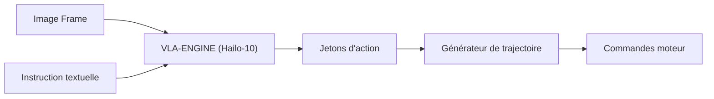

<p align="center">
  
</p>

# 👁️ HYDRA-UMC-VLA-ENGINE

<p align="center"><a href="README.md">🇺🇸 English</a> | <a href="README_spa.md">🇪🇸 Español</a> | 🇫🇷 <b>Français</b> | <a href="README_ita.md">🇮🇹 Italiano</a> | <a href="README_deu.md">🇩🇪 Deutsch</a> | <a href="README_zho.md">🇨🇳 简体中文</a> | <a href="README_jpn.md">🇯🇵 日本語</a></p>

### 🤖 Framework Multimodal Vision-Language-Action pour la Robotique

<p align="left">
  
  
  
</p>

---

## 1. 🛠️ APERÇU TECHNIQUE

**HYDRA-UMC-VLA-ENGINE** est le pont multimodal qui traduit le contexte visuel et le langage naturel en actions robotiques directes. Il implémente des versions quantifiées de modèles VLA de pointe (comme OpenVLA ou des variantes RT-2 spécialisées) pour s'exécuter localement sur le NPU Hailo-10.

Ce moteur permet au robot de comprendre des commandes telles que « ramasser le composant bleu et le placer sur le plateau rouge » en analysant le flux de la caméra en direct et en générant la séquence cinématique correspondante.

### Caractéristiques principales :
* ✅ **Réel v0 - jetons d'action & trajectoire :** `action_tokens.py` implémente le schéma de discrétisation à 256 bins de style OpenVLA/RT-2 (action continue <-> jeton discret, selon l'espace d'action à 7 degrés de liberté - delta de pose + gripper), et `trajectory.py` intègre une séquence d'actions décodées en une trajectoire de poses absolues. Exposé via `tokens encode`/`tokens decode`/`trajectory integrate` ci-dessous - aucun modèle VLA ni NPU Hailo-10 nécessaire pour l'exécuter ou le tester.
* 📜 **Manifeste de modèle + validation de sortie :** Un contrat réel et versionné (`model_manifest.py`) que toute future intégration de modèle doit respecter - correspondant à la forme action/vocabulaire et à une famille de puce Hailo connue - ainsi que la validation de forme/confiance pour la sortie d'inférence brute d'un modèle. *(implémenté)*
* 🔌 **Limite d'intégration HailoRT, préparée en amont du module :** `hailo_runtime.py` est écrit contre l'API réelle et confirmée `hailo_platform` (`VDevice`, `HEF`, `ConfigureParams`, `InputVStreamParams`/`OutputVStreamParams`) - importée paresseusement afin que ce dépôt s'installe/se teste proprement sans le paquet `hailort` ni module Hailo-10 présent, et `hailo_output_to_tokens()` (la pièce qui adapte un résultat d'inférence réel vers le propre contrat de tokens de ce moteur) est aujourd'hui entièrement couverte par des tests unitaires. *(implémenté, limite d'intégration seulement - voir ci-dessous)*
* 🩺 **Sous-commande `status` honnête :** Rapporte la disponibilité réelle de l'accélérateur/des poids du modèle - `no_accelerator`, `no_model_weights`, ou `hardware_ready_no_inference` - jamais un faux état « prêt ». *(implémenté)*
* 🌉 **Contrôle sémantique (prévu) :** Mappage direct des pixels et du texte vers les positions des articulations ou les commandes d'outils. *(nécessite un vrai modèle VLA - travail futur.)*
* ⚡ **Raisonnement en temps réel (prévu) :** Inférence accélérée par Hailo-10 pour une génération d'actions à faible latence. *(nécessite le vrai NPU Hailo-10 que cet environnement n'a pas.)*
* 🔄 **Généralisation Zero-Shot (prévu) :** Capable de manipuler des objets non vus sur la base de descriptions sémantiques. *(nécessite un vrai modèle VLA entraîné.)*
* 🛠️ **Planification des tâches (prévu) :** Décompose les objectifs complexes en primitives robotiques atomiques. *(nécessite un vrai modèle VLA.)*
* 👨‍👩‍👧 **Enfant du Cognitive AI Node :** Fonctionne comme l'un des
  quatre services frères sous [HYDRA-UMC-COGNITIVE-NODE](https://github.com/JuanenRac/HYDRA-UMC-COGNITIVE-NODE)
  (aux côtés de Voice-UI, Semantic-Planner et Docs-QA), partageant
  l'image HydraOS et les poids de modèles de son parent au lieu de
  conserver ses propres copies.
* 📦 **Versionnage compteur kilométrique :** Chaque build réel incrémente
  automatiquement la version de `pyproject.toml` (`bump_version.py`) - pas
  de modification manuelle de version.

---

## 2. 🔄 FLUX D'INFÉRENCE VLA



---

## 3. 🧱 ARCHITECTURE & DÉCISIONS DE CONCEPTION

Ce dépôt est un **enfant** de la famille Cognitive AI Node - son parent,
[HYDRA-UMC-COGNITIVE-NODE](https://github.com/JuanenRac/HYDRA-UMC-COGNITIVE-NODE),
détient l'image HydraOS partagée et les poids de modèles quantifiés, et
relie ce service dans son `docker-compose.yml` aux côtés de ses trois
frères (Voice-UI, Semantic-Planner, Docs-QA) :

* **Pourquoi cet enfant n'a pas de matériel/firmware/`os/`/`models/`
  propres.** Il fonctionne entièrement sur le module CM5 + Hailo-10 M.2
  déjà détenu par le parent - centraliser les poids de modèles et
  l'image HydraOS à un seul endroit évite quatre copies divergentes de
  plusieurs gigaoctets au sein de la famille.
* **Pourquoi une structure `src/`.** Sépare le paquet installable
  (`hydra_umc_vla_engine`) de l'outillage à la racine du dépôt
  (`bump_version.py`), conformément au reste des projets Python de
  l'écosystème.
* **Pourquoi la tokenisation d'actions arrive avant l'inférence du modèle.**
  Transformer une action continue en jetons discrets (et inversement) est
  de la mathématique fixe définie par les bornes de l'espace d'action et
  la taille du vocabulaire - inutile d'avoir un modèle VLA ou un NPU
  Hailo-10 pour l'écrire ou la tester, donc v0 livre cette pièce
  (`action_tokens.py`, `trajectory.py`) en premier. La vraie inférence VLA
  nécessite les poids du modèle et le matériel Hailo-10 que cet
  environnement n'a pas, et arrivera plus tard.
* **Pourquoi `hailo_runtime.py` importe `hailo_platform` paresseusement, à l'intérieur de seulement deux fonctions.** `hailort` n'est pas sur PyPI et n'est pas installé sur cette machine de développement - l'importer au chargement du module ferait échouer l'installation/l'import de tout ce paquet partout sauf sur une machine avec un vrai module Hailo branché. Seules `open_vdevice()` et `load_hailo_vla_model()` (les deux fonctions qui ont réellement besoin du vrai HailoRT) l'importent, et paresseusement ; toutes deux lèvent une `HailoNotAvailableError` claire plutôt qu'un simple `ImportError` quand il manque. Même schéma déjà utilisé dans cet écosystème pour tout autre transport matériel réel (série GRBL, MAVLink, SPI-OTA, ...).
* **Comment cela s'intègre dans le reste de l'écosystème.** Ce moteur
  convertit la perception brute (images caméra, conceptuellement
  transmises depuis HYDRA-UMC-VISION-NODE en amont) et les instructions
  en langage naturel en jetons d'action que son frère
  HYDRA-UMC-SEMANTIC-PLANNER transforme en décisions de mission pour
  HYDRA-UMC-ORCHESTRATOR.
* **Pourquoi `model_manifest.py` ne nomme pas une variante spécifique
  d'OpenVLA/RT-2.** Aucun modèle n'a encore été réellement choisi (voir
  la Roadmap de ce README) - `EXPECTED_MODEL_MANIFEST` est honnêtement
  un contrat de forme/cible dérivé directement des constantes réelles de
  `action_tokens.py`, pas un chargeur pour un modèle qui n'existe pas.
  `hailo_arch` réutilise le même ensemble réel et fermé de familles de
  puces que `HYDRA-UMC-DETECTION-HEF` utilise déjà pour valider son
  propre registre de modèles.
* **Pourquoi `status` rapporte `hardware_ready_no_inference` plutôt que
  « prêt ».** Même une fois qu'un vrai périphérique Hailo-10 et de vrais
  poids de modèle sont tous deux présents, ce v0 n'a toujours pas de
  code d'inférence réel - prétendre être prêt à ce stade serait un vrai
  mensonge sur une capacité qui n'existe pas encore. `determine_mode()`
  de `hardware.py` vérifie d'abord l'accélérateur (un test bon marché de
  nœud de périphérique) avant les poids du modèle, le même ordre de
  précondition-la-moins-coûteuse-d'abord que `safe_load()` de
  `HYDRA-UMC-DETECTION-HEF` utilise déjà.
* **Pourquoi `model_weights_available()` vérifie le `models/` du
  parent, pas un `models/` local.** Cet enfant n'a pas son propre
  `models/` (supprimé - voir le point ci-dessus) - les vrais poids
  partagés se trouvent dans le `models/` du parent
  `HYDRA-UMC-COGNITIVE-NODE`, un niveau d'espace de travail frère plus
  haut, le même répertoire réel que `check_shared_models()` de ce dépôt
  vérifie déjà.

---

## 📂 STRUCTURE DES RÉPERTOIRES

```text
HYDRA-UMC-VLA-ENGINE/
├── src/hydra_umc_vla_engine/   # Code source
│   ├── action_tokens.py        # Discrétisation action <-> jeton (style OpenVLA/RT-2)
│   ├── trajectory.py           # Intégration séquence d'actions -> trajectoire de poses
│   ├── model_manifest.py       # Contrat réel de forme du modèle + validation de sortie d'inférence
│   ├── hardware.py             # Sondes réelles de disponibilité accélérateur/poids de modèle
│   ├── hailo_runtime.py        # Véritable limite d'intégration HailoRT (hailo_platform), importée paresseusement
│   ├── api.py                  # Surface JSON/HTTP simple (http.server de stdlib) sur tokens/trajectoire/statut
│   └── main.py                 # Point d'entrée CLI (invocation nue + `tokens`/`trajectory`/`status`)
├── tests/                      # Suite pytest réelle (action_tokens, trajectory, manifest, hardware, hailo_runtime, api, CLI)
├── docs/                       # Documentation et benchmarks
├── images/                     # Médias et diagrammes
├── systemd/
│   └── hydra-umc-vla-engine.service  # Unité systemd de l'API locale de tokenisation/trajectoire sur la CM5
├── build/                      # Sortie de build locale (ignorée par git)
├── bump_manifest_version.py    # Synchronise la version de hydra-umc.project.json avec la version native (--sync)
├── pyproject.toml              # Métadonnées du paquet (version à incrément compteur kilométrique)
├── bump_version.py             # Incrément de version type compteur kilométrique (utilisé par build.sh/.bat)
├── build.sh / build.bat        # Crée le venv, installe (avec extras dev), vérifie l'import, exécute les tests
└── run.sh / run.bat            # Exécute le point d'entrée
```

> **Remarque :** `hardware/` et `firmware/` ont été supprimés - ce nœud
> fonctionne sur un module CM5 + Hailo-10 M.2 déjà existant, sans
> conception matérielle/firmware propre. `os/` et `models/` ont également
> été supprimés - l'image HydraOS et les poids de modèles Hailo-10
> partagés se trouvent dans le projet parent
> `HYDRA-UMC-COGNITIVE-NODE`, auquel ce projet se rattache en tant que
> service (voir son `docker-compose.yml`).

---

## ⚙️ BUILD ET EXÉCUTION

Nécessite Python >= 3.10.

```bash
# Linux / macOS / Git Bash
./build.sh   # crée .venv, installe le paquet (éditable, avec extras dev),
             # vérifie l'import, exécute la suite de tests réelle
./run.sh     # exécute le point d'entrée

# Windows (cmd)
build.bat
run.bat
```

`build.sh`/`build.bat` incrémentent la version (type compteur
kilométrique, voir `bump_version.py`) avant chaque build réel. Sortie
attendue de `run.sh` (invocation nue) :

```text
HYDRA-UMC-VLA-ENGINE v0.1.0
Vision-Language-Action engine (Hailo-10) - translates camera frames and text instructions into robotic action sequences.
```

Exemple réel - encoder une action en jetons, la décoder, et intégrer une courte séquence d'actions en une trajectoire :

```bash
./run.sh tokens encode --action "0.02,-0.03,0.01,0.05,-0.04,0.02,0.7"
# 179,51,153,192,76,153,179

./run.sh tokens decode --tokens "179,51,153,192,76,153,179"
# 0.020117,-0.030273,0.005273,0.050977,-0.037891,0.019922,0.699219

./run.sh trajectory integrate --start "0,0,0,0,0,0" --actions actions.json
# step 0: x=0.000000 y=0.000000 z=0.000000 roll=0.000000 pitch=0.000000 yaw=0.000000 gripper=0.000000
# step 1: x=0.010000 y=0.000000 z=0.000000 roll=0.000000 pitch=0.000000 yaw=0.000000 gripper=0.500000
# step 2: x=0.010000 y=0.010000 z=0.000000 roll=0.000000 pitch=0.000000 yaw=0.000000 gripper=1.000000
```

`status` rapporte la disponibilité réelle et honnête de l'accélérateur/des
poids du modèle - jamais un faux état « prêt » :

```text
$ ./run.sh status
accelerator (Hailo-10):    MISSING
model weights (parent):    MISSING
mode: no_accelerator - no Hailo-10 NPU device node on this machine - real inference cannot run here.
```

### 🩺 Dépannage

* **`python : commande introuvable` / le build échoue à l'étape 1.**
  Nécessite Python >= 3.10 dans le `PATH`. Sous Windows, installez-le
  depuis [python.org](https://python.org) et cochez "Add to PATH" lors de
  l'installation ; sous Linux/macOS, c'est généralement `python3`.
* **`build.sh` n'arrive pas à activer le venv.** `python3 -m venv .venv`
  place le script d'activation à un emplacement différent selon la
  plateforme : `.venv/bin/activate` sous Linux/macOS,
  `.venv/Scripts/activate` sous Windows (également pour un venv Python
  Windows utilisé depuis Git Bash). `build.sh` vérifie déjà les deux
  chemins - si cela échoue toujours, supprimez `.venv/` et relancez
  `./build.sh` pour le reconstruire entièrement.
* **`pip install -e .` échoue.** Généralement dû à un `.venv/` obsolète.
  Supprimez le dossier `.venv/` et relancez `./build.sh`/`build.bat` pour
  le recréer.
* **`import OK` ne s'affiche jamais.** Signifie que `python -c "import
  hydra_umc_vla_engine"` a lui-même échoué - relancez avec le venv actif
  pour voir la vraie trace d'erreur.

---

## ✅ État Actuel et Prochaines Étapes

**Réel aujourd'hui :** l'encodage/décodage des jetons d'action et la génération de trajectoire (`action_tokens.py`, `trajectory.py`) - les étapes « Jetons d'action » et « Générateur de trajectoire » du diagramme de flux ci-dessus - plus une véritable limite d'intégration HailoRT (`hailo_runtime.py`) prête pour un vrai modèle `.hef` et un module Hailo-10 dès qu'ils existeront. 64 tests et un CLI réel.

**Encore à venir, et bloqué par du vrai matériel/un vrai modèle :** exécuter réellement l'inférence nécessite un vrai modèle VLA `.hef` compilé (OpenVLA/RT-2 quantifié pour Hailo-10 - aucun modèle spécifique choisi pour l'instant) et un module Hailo-10 physique branché, deux véritables blocages inévitables que `hailo_runtime.py` ne peut pas lever seul - mais charger et décoder un modèle, une fois qu'il existera, n'est plus du code non écrit.

---

## 🚀 FEUILLE DE ROUTE
* **Phase 1 :** Déploiement du moteur VLA et traitement des entrées multimodales sur Hailo-10.
* **Phase 2 :** Intégration du planificateur sémantique avec des modèles de comportement en essaim et une mémoire à long terme.
* **Phase 3 :** Exécution locale à faible latence de l'interface vocale et suppression du bruit industriel.
* **Phase 4 :** Prise en charge de la génération d'actions coordonnées à deux bras et audits de prise de décision autonomes.

---

## 🔗 Projets Liés

Ce projet fait partie de l'écosystème robotique HYDRA-UMC du même auteur (JuanenRac / Electro Hobby 3D). Bon à savoir, car une demande pourrait en réalité concerner l'un de ceux-ci plutôt que ce dépôt.

**Projet Parent**
- **[HYDRA-UMC-COGNITIVE-NODE](https://github.com/JuanenRac/HYDRA-UMC-COGNITIVE-NODE)** — hub d'intégration pour le pipeline cognitif Hailo-10 (orchestration LLM/VLA/voix) ; le parent dont ce dépôt est une étape ou un consommateur spécifique, au sein de son propre pipeline cognitif.

**Projets Frères** — les autres étapes/consommateurs du propre pipeline cognitif Hailo-10 de HYDRA-UMC-COGNITIVE-NODE
- **[HYDRA-UMC-VOICE-UI](https://github.com/JuanenRac/HYDRA-UMC-VOICE-UI)** — vrai front-end vocal (VAD + analyseur d'intention) avec un relais Watch borné et soumis à confirmation.
- **[HYDRA-UMC-SEMANTIC-PLANNER](https://github.com/JuanenRac/HYDRA-UMC-SEMANTIC-PLANNER)** — vraie décomposition de tâches basée sur des règles et récupération sémantique d'erreurs sur les codes d'erreur MCU.
- **[HYDRA-UMC-DOCS-QA](https://github.com/JuanenRac/HYDRA-UMC-DOCS-QA)** — vraie recherche documentaire TF-IDF (bibliothèque standard uniquement) sur les propres documents Markdown de cet écosystème.

**Fait Également Partie de l'Écosystème**

*Matériel & Plateforme de Base*
- **[HYDRA-UMC](https://github.com/JuanenRac/HYDRA-UMC)** — la carte mère physique du bras robotique : hôte CM5 + coprocesseur STM32H745 double cœur, coordonnant jusqu'à 8 bras-outils via CAN-OTA/SPI-OTA.
- **[HYDRA-UMC-OS](https://github.com/JuanenRac/HYDRA-UMC-OS)** — couche produit reproductible sur Raspberry Pi OS pour le CM5 : agent en lecture seule, config/profils validés, provisionnement WiFi de premier contact.
- **[HYDRA-UMC-SDK](https://github.com/JuanenRac/HYDRA-UMC-SDK)** — le contrat JSON-Schema partagé et la barrière de sécurité contre laquelle chaque bridge valide ses commandes.

*Backend Central & Clients*
- **[HYDRA-UMC-SERVER](https://github.com/JuanenRac/HYDRA-UMC-SERVER)** — le vrai backend headless (REST/WebSocket) auquel parle réellement chaque client de contrôle.
- **[HYDRA-UMC-STUDIO](https://github.com/JuanenRac/HYDRA-UMC-STUDIO)** — tableau de bord de contrôle web avec visualisation 3D multi-robot en temps réel.
- **[HYDRA-UMC-SUITE](https://github.com/JuanenRac/HYDRA-UMC-SUITE)** — centre de commande d'essaim de bureau (PySide6) pour plusieurs serveurs à la fois, empaqueté en exécutable autonome.
- **[HYDRA-UMC-ANDROID-CONTROL](https://github.com/JuanenRac/HYDRA-UMC-ANDROID-CONTROL)** — application de contrôle Android native avec connexion biométrique et un compagnon Wear OS jumelé.
- **[HYDRA-UMC-IOS-CONTROL](https://github.com/JuanenRac/HYDRA-UMC-IOS-CONTROL)** — application de contrôle iOS/iPadOS (Flutter) avec synchronisation WebSocket en temps réel.
- **[HYDRA-UMC-DSI](https://github.com/JuanenRac/HYDRA-UMC-DSI)** — interface tactile native pour l'écran tactile DSI 7" embarqué, intégrée directement sur le CM5.
- **[HYDRA-UMC-EDITOR-URDF](https://github.com/JuanenRac/HYDRA-UMC-EDITOR-URDF)** — créateur/éditeur graphique de bureau pour URDF qui envoie les modèles terminés vers le propre catalogue de STUDIO.
- **[HYDRA-UMC-BRIDGE-AMR](https://github.com/JuanenRac/HYDRA-UMC-BRIDGE-AMR)** — frontière de coordination pour les flottes AGV/AMR via un éditeur MQTT VDA 5050 réel.
- **[HYDRA-UMC-BRIDGE-CNC](https://github.com/JuanenRac/HYDRA-UMC-BRIDGE-CNC)** — coordinateur haut niveau pour cellules CNC avec accès réel au statut/octets de contrôle GRBL.
- **[HYDRA-UMC-BRIDGE-DROIDS](https://github.com/JuanenRac/HYDRA-UMC-BRIDGE-DROIDS)** — frontière de coordination pour droïdes à pattes/humanoïdes, avec un véritable émetteur de commandes Boston Dynamics Spot.
- **[HYDRA-UMC-BRIDGE-LASER](https://github.com/JuanenRac/HYDRA-UMC-BRIDGE-LASER)** — coordinateur de sécurité pour cellules laser lisant 3 vraies sécurités GPIO de clé/enceinte/verrouillage.
- **[HYDRA-UMC-BRIDGE-OPENPNP](https://github.com/JuanenRac/HYDRA-UMC-BRIDGE-OPENPNP)** — coordinateur haut niveau sûr pour le flux de cartes du pick-and-place OpenPnP.
- **[HYDRA-UMC-BRIDGE-PRINTER3D](https://github.com/JuanenRac/HYDRA-UMC-BRIDGE-PRINTER3D)** — frontière de coordination sûre pour imprimantes 3D Moonraker/Klipper, avec de vraies commandes de tâche contrôlées.
- **[HYDRA-UMC-BRIDGE-ROS2](https://github.com/JuanenRac/HYDRA-UMC-BRIDGE-ROS2)** — coordinateur de sécurité avec un vrai transport ROS 2 rclpy à importation paresseuse.
- **[HYDRA-UMC-BRIDGE-UAV](https://github.com/JuanenRac/HYDRA-UMC-BRIDGE-UAV)** — frontière de coordination pour UAV équipés de caméra, avec un véritable émetteur de commandes MAVLink.

*Plateforme d'Outils URTC*
- **[URTC](https://github.com/JuanenRac/URTC)** — firmware pour la carte physique Universal Robot Tool Controller, plus de 25 profils d'outil sur bus CAN.
- **[URTC-FLASHER](https://github.com/JuanenRac/URTC-FLASHER)** — outil de bureau à interface graphique pour flasher les cartes URTC, CAN-OTA plus SWD/JTAG puce complète.
- **[URTC-TESTER](https://github.com/JuanenRac/URTC-TESTER)** — outil de bureau de diagnostic CAN-bus en direct pour cartes URTC, un panneau par profil d'outil.
- **[URTC-WEB-STUDIO](https://github.com/JuanenRac/URTC-WEB-STUDIO)** — alternative basée navigateur à URTC-TESTER via la Web Serial API, sans installation locale.

*Nœud IA de Vision (Hailo-8)*
- **[HYDRA-UMC-VISION-NODE](https://github.com/JuanenRac/HYDRA-UMC-VISION-NODE)** — hub d'intégration pour le pipeline de vision Hailo-8, avec une vraie vérification de disponibilité matérielle par étape.
- **[HYDRA-UMC-DETECTION-HEF](https://github.com/JuanenRac/HYDRA-UMC-DETECTION-HEF)** — registre réel de modèles compilés avec vérification de chargement sécurisé par architecture Hailo/checksum.
- **[HYDRA-UMC-VISION-STREAMER](https://github.com/JuanenRac/HYDRA-UMC-VISION-STREAMER)** — générateur réel de pipeline GStreamer + config MediaMTX, avec une vraie frontière d'intégration HailoRT.
- **[HYDRA-UMC-VISUAL-SERVOING-API](https://github.com/JuanenRac/HYDRA-UMC-VISUAL-SERVOING-API)** — vraie loi de correction Position-Based Visual Servoing, verrouillée sur l'état de zone en amont.
- **[HYDRA-UMC-SAFETY-ZONES](https://github.com/JuanenRac/HYDRA-UMC-SAFETY-ZONES)** — vraie vérification de violation de zone et demande d'E-STOP, avec application de la fraîcheur de calibration.

*Orchestration & Essaim*
- **[HYDRA-UMC-ORCHESTRATOR](https://github.com/JuanenRac/HYDRA-UMC-ORCHESTRATOR)** — hub d'intégration avec un vrai contrat de rapport de santé gRPC/Protobuf et une machine à états de mission.
- **[HYDRA-UMC-JOB-DISPATCHER](https://github.com/JuanenRac/HYDRA-UMC-JOB-DISPATCHER)** — vraie file de tâches basée sur la priorité avec déduplication, via une vraie API HTTP.
- **[HYDRA-UMC-NODE-HEALING](https://github.com/JuanenRac/HYDRA-UMC-NODE-HEALING)** — vrai chien de garde de santé de flotte basé sur gRPC, avec retry/backoff et détection d'incohérence d'identité.
- **[HYDRA-UMC-PATH-PLANNER-3D](https://github.com/JuanenRac/HYDRA-UMC-PATH-PLANNER-3D)** — vrai planificateur de trajectoire 3D basé sur RRT, avec vraie validation des collisions obstacle/espace de travail.
- **[HYDRA-UMC-SWARM-SYNC](https://github.com/JuanenRac/HYDRA-UMC-SWARM-SYNC)** — vraie synchronisation d'état CRDT LWW-Element-Map, testée par propriétés pour la convergence multi-cellule.

*Jumeau Numérique & Simulation*
- **[HYDRA-UMC-TWIN](https://github.com/JuanenRac/HYDRA-UMC-TWIN)** — hub d'intégration pour le moteur de jumeau numérique, avec un vrai contrat de synchronisation par compatibilité de version.
- **[HYDRA-UMC-HIL-BRIDGE](https://github.com/JuanenRac/HYDRA-UMC-HIL-BRIDGE)** — vrai verrouillage de sécurité hardware-in-the-loop routant les commandes entre simulation et matériel réel.
- **[HYDRA-UMC-PHYSICS-REPLICA](https://github.com/JuanenRac/HYDRA-UMC-PHYSICS-REPLICA)** — vraie cinématique directe et validation des limites articulaires sur un vrai sous-ensemble URDF.
- **[HYDRA-UMC-SYNTHETIC-DATA-GEN](https://github.com/JuanenRac/HYDRA-UMC-SYNTHETIC-DATA-GEN)** — vrai générateur procédural de scènes 2D avec export d'annotations YOLO/COCO.

*Données & Analytique*
- **[HYDRA-UMC-DATALAKE](https://github.com/JuanenRac/HYDRA-UMC-DATALAKE)** — vrai magasin de séries temporelles basé sur sqlite3, avec une vraie API HTTP d'ingestion/requête.
- **[HYDRA-UMC-ANOMALY-DETECTOR](https://github.com/JuanenRac/HYDRA-UMC-ANOMALY-DETECTOR)** — vrai détecteur d'anomalies FFT + ligne de base statistique, avec surveillance de dérive.
- **[HYDRA-UMC-PRODUCTION-REPORTS](https://github.com/JuanenRac/HYDRA-UMC-PRODUCTION-REPORTS)** — vrai calcul OEE/disponibilité sur l'historique de DATALAKE, avec export CSV reproductible.
- **[HYDRA-UMC-TELEMETRY-COLLECTOR](https://github.com/JuanenRac/HYDRA-UMC-TELEMETRY-COLLECTOR)** — vrai pipeline d'ingestion CAN/WebSocket vers DATALAKE, avec déduplication par séquence.

*Passerelle Industrielle*
- **[HYDRA-UMC-GATEWAY-INDUSTRIAL](https://github.com/JuanenRac/HYDRA-UMC-GATEWAY-INDUSTRIAL)** — hub d'intégration relayant vers les protocoles industriels, avec une vraie couche de liste blanche de commandes/contre-pression.
- **[HYDRA-UMC-OPCUA-SERVER](https://github.com/JuanenRac/HYDRA-UMC-OPCUA-SERVER)** — vrai espace d'adressage OPC-UA, vérifié avec une vraie session client du protocole binaire.
- **[HYDRA-UMC-MQTT-BROKER](https://github.com/JuanenRac/HYDRA-UMC-MQTT-BROKER)** — vrai broker MQTT avec authentification par client optionnelle et ACL de sujets.
- **[HYDRA-UMC-MTCONNECT-ADAPTER](https://github.com/JuanenRac/HYDRA-UMC-MTCONNECT-ADAPTER)** — vrais points de terminaison XML MTConnect `/probe` et `/current`, avec sortie en mode dégradé.

*Outils Complémentaires & Opérations de l'Écosystème*
- **[HYDRA-UMC-DASHBOARD-AI](https://github.com/JuanenRac/HYDRA-UMC-DASHBOARD-AI)** — panneaux Smart Summaries et Anomaly Highlighting sur DATALAKE/ANOMALY-DETECTOR, avec un repli statistique honnête.
- **[HYDRA-UMC-TOOL-CLI](https://github.com/JuanenRac/HYDRA-UMC-TOOL-CLI)** — CLI de flotte avec un vrai contrat de codes de sortie stable, un vrai client en direct de la propre API de HYDRA-UMC-SERVER.
- **[HYDRA-UMC-WATCH](https://github.com/JuanenRac/HYDRA-UMC-WATCH)** — application compagnon WearOS avec de vraies alertes haptiques et un relais vocal vers le téléphone jumelé.
- **[URTC-SMART-RACK](https://github.com/JuanenRac/URTC-SMART-RACK)** — firmware pour un rack de montage de cartes avec décodage réel d'ID d'outil et logique de préchauffage Smart Idle.
- **[URTC-VISION-TOOL](https://github.com/JuanenRac/URTC-VISION-TOOL)** — firmware plus un vrai compagnon de vision Python pour une tête d'outil d'inspection thermique/RGB.
- **[HYDRA-UMC-UPDATER](https://github.com/JuanenRac/HYDRA-UMC-UPDATER)** — outil administratif de bureau qui découvre, clone et met à jour chaque dépôt de cet écosystème.

---

## 👤 AUTEUR
**JuanenRac** (Electro Hobby 3D)
📧 electrohobby3d@gmail.com
📺 [youtube.com/@electrohobby3d](https://youtube.com/@electrohobby3d)

## 📜 LICENCE
GPL-3.0 - Voir le fichier LICENSE pour plus de détails.
