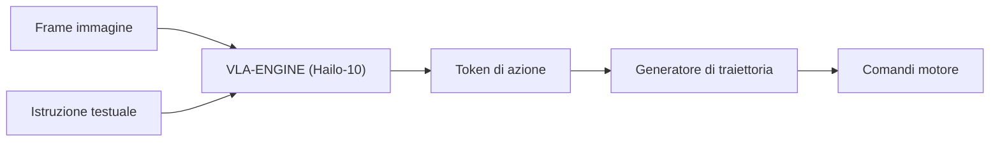

<p align="center">
  
</p>

# 👁️ HYDRA-UMC-VLA-ENGINE

<p align="center"><a href="README.md">🇺🇸 English</a> | <a href="README_spa.md">🇪🇸 Español</a> | <a href="README_fra.md">🇫🇷 Français</a> | 🇮🇹 <b>Italiano</b> | <a href="README_deu.md">🇩🇪 Deutsch</a> | <a href="README_zho.md">🇨🇳 简体中文</a> | <a href="README_jpn.md">🇯🇵 日本語</a></p>

### 🤖 Framework Multimodale Vision-Language-Action per la Robotica

<p align="left">
  
  
  
</p>

---

## 1. 🛠️ PANORAMICA TECNICA

**HYDRA-UMC-VLA-ENGINE** è il ponte multimodale che traduce il contesto visivo e il linguaggio naturale in azioni robotiche dirette. Implementa versioni quantizzate di modelli VLA all'avanguardia (come OpenVLA o varianti specializzate RT-2) da eseguire localmente sulla NPU Hailo-10.

Questo motore consente al robot di comprendere comandi come "prendi il componente blu e posizionalo sul vassoio rosso" analizzando il flusso video in diretta e generando la sequenza cinematica corrispondente.

### Caratteristiche principali:
* ✅ **Reale v0 - token di azione e traiettoria:** `action_tokens.py` implementa lo schema di discretizzazione a 256 bin in stile OpenVLA/RT-2 (azione continua <-> token discreto, secondo lo spazio di azione a 7 gradi di libertà - delta di posa + gripper), e `trajectory.py` integra una sequenza di azioni decodificate in una traiettoria di pose assolute. Esposto tramite `tokens encode`/`tokens decode`/`trajectory integrate` più sotto - non serve un modello VLA né una NPU Hailo-10 per eseguirlo o testarlo.
* 📜 **Manifest del modello + validazione dell'output:** Un contratto reale e versionato (`model_manifest.py`) che qualsiasi futura integrazione di modello deve soddisfare - facendo corrispondere la forma azione/vocabolario e una famiglia di chip Hailo nota - oltre alla validazione di forma/confidenza per l'output di inferenza grezzo di un modello. *(implementato)*
* 🔌 **Limite di integrazione HailoRT, preparato in anticipo sul modulo:** `hailo_runtime.py` è scritto contro l'API reale e confermata `hailo_platform` (`VDevice`, `HEF`, `ConfigureParams`, `InputVStreamParams`/`OutputVStreamParams`) - importata in modo lazy così che questo repository si installi/testi in modo pulito senza il pacchetto `hailort` né un modulo Hailo-10 presente, e `hailo_output_to_tokens()` (la parte che mappa un risultato di inferenza reale sul contratto di token proprio di questo motore) è oggi completamente coperta da test unitari. *(implementato, solo limite di integrazione - vedi sotto)*
* 🩺 **Sottocomando `status` onesto:** Riporta la disponibilità reale di acceleratore/pesi del modello - `no_accelerator`, `no_model_weights`, o `hardware_ready_no_inference` - mai un falso stato "pronto". *(implementato)*
* 🌉 **Controllo semantico (previsto):** Mappatura diretta da pixel e testo a posizioni dei giunti o comandi dello strumento. *(richiede un vero modello VLA - lavoro futuro.)*
* ⚡ **Ragionamento in tempo reale (previsto):** Inferenza accelerata da Hailo-10 per la generazione di azioni a bassa latenza. *(richiede la vera NPU Hailo-10 che questo ambiente non ha.)*
* 🔄 **Generalizzazione Zero-Shot (previsto):** In grado di gestire oggetti mai visti prima basandosi su descrizioni semantiche. *(richiede un vero modello VLA addestrato.)*
* 🛠️ **Pianificazione dei compiti (previsto):** Decompone obiettivi complessi in primitive robotiche atomiche. *(richiede un vero modello VLA.)*
* 👨‍👩‍👧 **Figlio del Cognitive AI Node:** Gira come uno dei quattro
  servizi fratelli sotto [HYDRA-UMC-COGNITIVE-NODE](https://github.com/JuanenRac/HYDRA-UMC-COGNITIVE-NODE)
  (insieme a Voice-UI, Semantic-Planner e Docs-QA), condividendo
  l'immagine HydraOS e i pesi dei modelli del padre invece di mantenere
  copie proprie.
* 📦 **Versionamento Contachilometri:** Ogni build reale incrementa
  automaticamente la versione di `pyproject.toml` (`bump_version.py`) -
  nessuna modifica manuale della versione.

---

## 2. 🔄 FLUSSO DI INFERENZA VLA



---

## 3. 🧱 ARCHITETTURA E DECISIONI DI PROGETTAZIONE

Questo repository è un **figlio** della famiglia Cognitive AI Node - il
suo padre, [HYDRA-UMC-COGNITIVE-NODE](https://github.com/JuanenRac/HYDRA-UMC-COGNITIVE-NODE),
possiede l'immagine HydraOS condivisa e i pesi dei modelli quantizzati, e
collega questo servizio nel suo `docker-compose.yml` insieme ai suoi tre
fratelli (Voice-UI, Semantic-Planner, Docs-QA):

* **Perché questo figlio non ha hardware/firmware/`os/`/`models/`
  propri.** Gira interamente sul modulo CM5 + Hailo-10 M.2 già posseduto
  dal padre - centralizzare i pesi dei modelli e l'immagine HydraOS in un
  unico posto evita quattro copie divergenti di più gigabyte all'interno
  della famiglia.
* **Perché una struttura `src/`.** Mantiene il pacchetto installabile
  (`hydra_umc_vla_engine`) separato dal tooling nella radice del repo
  (`bump_version.py`), coerentemente con il resto dei progetti Python
  dell'ecosistema.
* **Perché la tokenizzazione delle azioni arriva prima dell'inferenza del modello.**
  Trasformare un'azione continua in token discreti (e viceversa) è
  matematica fissa definita dai limiti dello spazio di azione e dalla
  dimensione del vocabolario - non serve un modello VLA né una NPU
  Hailo-10 per scriverla o testarla, quindi v0 consegna prima questo
  pezzo (`action_tokens.py`, `trajectory.py`). La vera inferenza VLA
  richiede i pesi del modello e l'hardware Hailo-10 che questo ambiente
  non ha, e arriverà più avanti.
* **Perché `hailo_runtime.py` importa `hailo_platform` in modo lazy, dentro solo due funzioni.** `hailort` non è su PyPI e non è installato su questa macchina di sviluppo - importarlo al momento del caricamento del modulo farebbe fallire l'installazione/importazione dell'intero pacchetto ovunque tranne che su una macchina con un vero modulo Hailo collegato. Solo `open_vdevice()` e `load_hailo_vla_model()` (le due funzioni che hanno davvero bisogno del vero HailoRT) lo importano, e in modo lazy; entrambe sollevano un chiaro `HailoNotAvailableError` invece di un semplice `ImportError` quando manca. Stesso schema già usato in questo ecosistema per ogni altro trasporto hardware reale (seriale GRBL, MAVLink, SPI-OTA, ...).
* **Come si inserisce nel resto dell'ecosistema.** Questo motore
  converte la percezione grezza (frame della camera, concettualmente
  inoltrati da HYDRA-UMC-VISION-NODE a monte) e le istruzioni in
  linguaggio naturale in token di azione che il suo fratello
  HYDRA-UMC-SEMANTIC-PLANNER trasforma in decisioni di missione per
  HYDRA-UMC-ORCHESTRATOR.
* **Perché `model_manifest.py` non nomina una variante specifica di
  OpenVLA/RT-2.** Nessun modello è stato ancora effettivamente scelto
  (vedi la Roadmap di questo stesso README) - `EXPECTED_MODEL_MANIFEST`
  è onestamente un contratto di forma/target derivato direttamente
  dalle costanti reali di `action_tokens.py`, non un loader per un
  modello che non esiste. `hailo_arch` riutilizza lo stesso insieme
  reale e chiuso di famiglie di chip che `HYDRA-UMC-DETECTION-HEF` già
  usa per validare il proprio registro dei modelli.
* **Perché `status` riporta `hardware_ready_no_inference` invece di
  "pronto".** Anche quando un vero dispositivo Hailo-10 e i veri pesi
  del modello sono entrambi presenti, questo v0 non ha ancora codice di
  inferenza reale - dichiararsi pronto a quel punto sarebbe una vera
  bugia su una capacità che non esiste ancora. `determine_mode()` di
  `hardware.py` controlla prima l'acceleratore (un controllo economico
  del nodo dispositivo) prima dei pesi del modello, lo stesso ordine
  precondizione-più-economica-prima già usato da `safe_load()` di
  `HYDRA-UMC-DETECTION-HEF`.
* **Perché `model_weights_available()` controlla il `models/` del
  padre, non uno locale.** Questo figlio non ha un proprio `models/`
  (potato - vedi il punto sopra) - i veri pesi condivisi risiedono nel
  `models/` del padre `HYDRA-UMC-COGNITIVE-NODE`, un livello di
  workspace fratello più in alto, la stessa directory reale che
  `check_shared_models()` di quel repository già controlla.

---

## 📂 STRUTTURA DELLE CARTELLE

```text
HYDRA-UMC-VLA-ENGINE/
├── src/hydra_umc_vla_engine/   # Codice sorgente
│   ├── action_tokens.py        # Discretizzazione azione <-> token (stile OpenVLA/RT-2)
│   ├── trajectory.py           # Integrazione sequenza di azioni -> traiettoria di pose
│   ├── model_manifest.py       # Contratto reale di forma del modello + validazione output di inferenza
│   ├── hardware.py             # Sonde reali di disponibilità acceleratore/pesi del modello
│   ├── hailo_runtime.py        # Vero limite di integrazione HailoRT (hailo_platform), importato in modo lazy
│   ├── api.py                  # Superficie JSON/HTTP semplice (http.server di stdlib) su tokens/traiettoria/stato
│   └── main.py                 # Entry point CLI (invocazione nuda + `tokens`/`trajectory`/`status`)
├── tests/                      # Suite pytest reale (action_tokens, trajectory, manifest, hardware, hailo_runtime, api, CLI)
├── docs/                       # Documentazione e benchmark
├── images/                     # Media e diagrammi
├── systemd/
│   └── hydra-umc-vla-engine.service  # Unità systemd della API locale di tokenizzazione/traiettoria sulla CM5
├── build/                      # Output di build locale (ignorato da git)
├── pyproject.toml              # Metadati del pacchetto (versione a incremento contachilometri)
├── bump_manifest_version.py    # Sincronizza la versione di hydra-umc.project.json con quella nativa (--sync)
├── bump_version.py             # Incremento versione stile contachilometri (usato da build.sh/.bat)
├── build.sh / build.bat        # Crea il venv, installa (con extra dev), verifica l'import, esegue i test
└── run.sh / run.bat            # Esegue il punto di ingresso
```

> **Nota:** `hardware/` e `firmware/` sono stati potati - questo nodo
> funziona su un modulo CM5 + Hailo-10 M.2 già esistente, senza un
> progetto hardware/firmware proprio. Sono stati potati anche `os/` e
> `models/` - l'immagine HydraOS e i pesi dei modelli Hailo-10 condivisi
> risiedono nel progetto padre `HYDRA-UMC-COGNITIVE-NODE`, a cui questo
> progetto si collega come servizio (vedi il suo `docker-compose.yml`).

---

## ⚙️ BUILD ED ESECUZIONE

Richiede Python >= 3.10.

```bash
# Linux / macOS / Git Bash
./build.sh   # crea .venv, installa il pacchetto (editable, con extra
             # dev), verifica l'import, esegue la suite di test reale
./run.sh     # esegue il punto di ingresso

# Windows (cmd)
build.bat
run.bat
```

`build.sh`/`build.bat` incrementano la versione (stile contachilometri,
vedi `bump_version.py`) prima di ogni build reale. Output atteso di
`run.sh` (invocazione nuda):

```text
HYDRA-UMC-VLA-ENGINE v0.1.0
Vision-Language-Action engine (Hailo-10) - translates camera frames and text instructions into robotic action sequences.
```

Esempio reale - codificare un'azione in token, decodificarla, e integrare una breve sequenza di azioni in una traiettoria:

```bash
./run.sh tokens encode --action "0.02,-0.03,0.01,0.05,-0.04,0.02,0.7"
# 179,51,153,192,76,153,179

./run.sh tokens decode --tokens "179,51,153,192,76,153,179"
# 0.020117,-0.030273,0.005273,0.050977,-0.037891,0.019922,0.699219

./run.sh trajectory integrate --start "0,0,0,0,0,0" --actions actions.json
# step 0: x=0.000000 y=0.000000 z=0.000000 roll=0.000000 pitch=0.000000 yaw=0.000000 gripper=0.000000
# step 1: x=0.010000 y=0.000000 z=0.000000 roll=0.000000 pitch=0.000000 yaw=0.000000 gripper=0.500000
# step 2: x=0.010000 y=0.010000 z=0.000000 roll=0.000000 pitch=0.000000 yaw=0.000000 gripper=1.000000
```

`status` riporta la disponibilità reale e onesta di acceleratore/pesi del
modello - mai un falso stato "pronto":

```text
$ ./run.sh status
accelerator (Hailo-10):    MISSING
model weights (parent):    MISSING
mode: no_accelerator - no Hailo-10 NPU device node on this machine - real inference cannot run here.
```

### 🩺 Risoluzione dei problemi

* **`python: comando non trovato` / il build fallisce al passo 1.**
  Richiede Python >= 3.10 nel `PATH`. Su Windows, installalo da
  [python.org](https://python.org) e spunta "Add to PATH" durante
  l'installazione; su Linux/macOS di solito si chiama `python3`.
* **`build.sh` non riesce ad attivare il venv.** `python3 -m venv .venv`
  posiziona lo script di attivazione in un percorso diverso a seconda
  della piattaforma: `.venv/bin/activate` su Linux/macOS,
  `.venv/Scripts/activate` su Windows (anche per un venv Python Windows
  usato da Git Bash). `build.sh` verifica già entrambi i percorsi - se
  continua a fallire, elimina `.venv/` e riesegui `./build.sh` per
  ricrearlo da zero.
* **`pip install -e .` fallisce.** Di solito per un `.venv/` obsoleto.
  Elimina la cartella `.venv/` e riesegui `./build.sh`/`build.bat` per
  ricrearla.
* **`import OK` non viene mai stampato.** Significa che `python -c
  "import hydra_umc_vla_engine"` è fallito - riesegui con il venv attivo
  per vedere il traceback reale.

---

## ✅ Stato Attuale e Prossimi Passi

**Reale oggi:** la codifica/decodifica dei token di azione e la generazione di traiettoria (`action_tokens.py`, `trajectory.py`) - i passaggi "Token di azione" e "Generatore di traiettoria" del diagramma di flusso sopra - più un vero limite di integrazione HailoRT (`hailo_runtime.py`) pronto per un vero modello `.hef` e un modulo Hailo-10 non appena esisteranno. 64 test e una CLI reale.

**Ancora da fare, e bloccato da vero hardware/un vero modello:** eseguire davvero l'inferenza richiede un vero modello VLA `.hef` realmente compilato (OpenVLA/RT-2 quantizzato per Hailo-10 - nessun modello specifico ancora scelto) e un modulo Hailo-10 fisico collegato, entrambi blocchi reali e inevitabili che `hailo_runtime.py` non può rimuovere da solo - ma caricare e decodificare un modello, una volta che esisterà, non è più codice non scritto.

---

## 🚀 TABELLA DI MARCIA
* **Fase 1:** Distribuzione del motore VLA e elaborazione dell'input multi-modale su Hailo-10.
* **Fase 2:** Integrazione del pianificatore semantico con modelli comportamentali di sciame e memoria a lungo termine.
* **Fase 3:** Esecuzione locale a bassa latenza dell'interfaccia vocale e cancellazione del rumore industriale.
* **Fase 4:** Supporto per la generazione di azioni coordinate a doppio braccio e audit del processo decisionale autonomo.

---

## 🔗 Progetti Correlati

Questo progetto fa parte dell'ecosistema robotico HYDRA-UMC dello stesso autore (JuanenRac / Electro Hobby 3D). Vale la pena conoscerlo, poiché una richiesta potrebbe in realtà riguardare uno di questi invece di questo repository.

**Progetto Padre**
- **[HYDRA-UMC-COGNITIVE-NODE](https://github.com/JuanenRac/HYDRA-UMC-COGNITIVE-NODE)** — hub di integrazione per la pipeline cognitiva Hailo-10 (orchestrazione LLM/VLA/voce); il genitore di cui questo repository è una fase o un consumatore specifico, all'interno della propria pipeline cognitiva.

**Progetti Fratelli** — le altre fasi/consumatori della pipeline cognitiva Hailo-10 propria di HYDRA-UMC-COGNITIVE-NODE
- **[HYDRA-UMC-VOICE-UI](https://github.com/JuanenRac/HYDRA-UMC-VOICE-UI)** — vero front-end vocale (VAD + parser di intenti) con un relay verso Watch limitato e soggetto a conferma.
- **[HYDRA-UMC-SEMANTIC-PLANNER](https://github.com/JuanenRac/HYDRA-UMC-SEMANTIC-PLANNER)** — vera scomposizione dei task basata su regole e recupero semantico degli errori sui codici errore MCU.
- **[HYDRA-UMC-DOCS-QA](https://github.com/JuanenRac/HYDRA-UMC-DOCS-QA)** — vera ricerca documentale TF-IDF (solo libreria standard) sui documenti Markdown di questo ecosistema.

**Fa Anche Parte dell'Ecosistema**

*Hardware e Piattaforma di Base*
- **[HYDRA-UMC](https://github.com/JuanenRac/HYDRA-UMC)** — la scheda madre fisica del braccio robotico: host CM5 + coprocessore STM32H745 dual-core, che coordina fino a 8 bracci utensile via CAN-OTA/SPI-OTA.
- **[HYDRA-UMC-OS](https://github.com/JuanenRac/HYDRA-UMC-OS)** — livello prodotto riproducibile su Raspberry Pi OS per il CM5: agente in sola lettura, config/profili validati, provisioning WiFi al primo contatto.
- **[HYDRA-UMC-SDK](https://github.com/JuanenRac/HYDRA-UMC-SDK)** — il contratto JSON-Schema condiviso e la barriera di sicurezza contro cui ogni bridge valida i propri comandi.

*Backend Centrale e Client*
- **[HYDRA-UMC-SERVER](https://github.com/JuanenRac/HYDRA-UMC-SERVER)** — il vero backend headless (REST/WebSocket) con cui parla davvero ogni client di controllo.
- **[HYDRA-UMC-STUDIO](https://github.com/JuanenRac/HYDRA-UMC-STUDIO)** — dashboard di controllo web con visualizzazione 3D multi-robot in tempo reale.
- **[HYDRA-UMC-SUITE](https://github.com/JuanenRac/HYDRA-UMC-SUITE)** — centro di comando sciame desktop (PySide6) per più server contemporaneamente, pacchettizzato come eseguibile standalone.
- **[HYDRA-UMC-ANDROID-CONTROL](https://github.com/JuanenRac/HYDRA-UMC-ANDROID-CONTROL)** — app di controllo nativa per Android con login biometrico e un companion Wear OS abbinato.
- **[HYDRA-UMC-IOS-CONTROL](https://github.com/JuanenRac/HYDRA-UMC-IOS-CONTROL)** — app di controllo per iOS/iPadOS (Flutter) con sincronizzazione WebSocket in tempo reale.
- **[HYDRA-UMC-DSI](https://github.com/JuanenRac/HYDRA-UMC-DSI)** — interfaccia touch nativa per il touchscreen DSI da 7" a bordo, incorporata direttamente nel CM5.
- **[HYDRA-UMC-EDITOR-URDF](https://github.com/JuanenRac/HYDRA-UMC-EDITOR-URDF)** — creatore/editor grafico desktop di URDF che invia i modelli finiti al catalogo di STUDIO.
- **[HYDRA-UMC-BRIDGE-AMR](https://github.com/JuanenRac/HYDRA-UMC-BRIDGE-AMR)** — barriera di coordinamento per flotte AGV/AMR tramite un publisher MQTT VDA 5050 reale.
- **[HYDRA-UMC-BRIDGE-CNC](https://github.com/JuanenRac/HYDRA-UMC-BRIDGE-CNC)** — coordinatore ad alto livello per celle CNC con accesso reale a stato/byte di controllo GRBL.
- **[HYDRA-UMC-BRIDGE-DROIDS](https://github.com/JuanenRac/HYDRA-UMC-BRIDGE-DROIDS)** — barriera di coordinamento per droidi con zampe/umanoidi, con un vero mittente di comandi per Boston Dynamics Spot.
- **[HYDRA-UMC-BRIDGE-LASER](https://github.com/JuanenRac/HYDRA-UMC-BRIDGE-LASER)** — coordinatore di sicurezza per celle laser che legge 3 salvaguardie GPIO reali di chiave/involucro/interblocco.
- **[HYDRA-UMC-BRIDGE-OPENPNP](https://github.com/JuanenRac/HYDRA-UMC-BRIDGE-OPENPNP)** — coordinatore ad alto livello sicuro per il flusso schede del pick-and-place OpenPnP.
- **[HYDRA-UMC-BRIDGE-PRINTER3D](https://github.com/JuanenRac/HYDRA-UMC-BRIDGE-PRINTER3D)** — barriera di coordinamento sicura per stampanti 3D Moonraker/Klipper, con comandi di lavoro reali e controllati.
- **[HYDRA-UMC-BRIDGE-ROS2](https://github.com/JuanenRac/HYDRA-UMC-BRIDGE-ROS2)** — coordinatore di sicurezza con un vero trasporto ROS 2 rclpy, importato in modo lazy.
- **[HYDRA-UMC-BRIDGE-UAV](https://github.com/JuanenRac/HYDRA-UMC-BRIDGE-UAV)** — barriera di coordinamento per UAV dotati di fotocamera, con un vero mittente di comandi MAVLink.

*Piattaforma Strumenti URTC*
- **[URTC](https://github.com/JuanenRac/URTC)** — firmware per la scheda fisica dell'Universal Robot Tool Controller, oltre 25 profili utensile su bus CAN.
- **[URTC-FLASHER](https://github.com/JuanenRac/URTC-FLASHER)** — strumento desktop con GUI per il flashing delle schede URTC, CAN-OTA più SWD/JTAG a chip intero.
- **[URTC-TESTER](https://github.com/JuanenRac/URTC-TESTER)** — strumento desktop di diagnostica CAN-bus dal vivo per schede URTC, un pannello per profilo utensile.
- **[URTC-WEB-STUDIO](https://github.com/JuanenRac/URTC-WEB-STUDIO)** — alternativa basata su browser a URTC-TESTER tramite la Web Serial API, senza installazione locale.

*Nodo IA Visione (Hailo-8)*
- **[HYDRA-UMC-VISION-NODE](https://github.com/JuanenRac/HYDRA-UMC-VISION-NODE)** — hub di integrazione per la pipeline di visione Hailo-8, con un vero controllo di prontezza hardware per fase.
- **[HYDRA-UMC-DETECTION-HEF](https://github.com/JuanenRac/HYDRA-UMC-DETECTION-HEF)** — registro reale di modelli compilati con verifica di caricamento sicuro per architettura Hailo/checksum.
- **[HYDRA-UMC-VISION-STREAMER](https://github.com/JuanenRac/HYDRA-UMC-VISION-STREAMER)** — generatore reale di pipeline GStreamer + config MediaMTX, con una vera barriera di integrazione HailoRT.
- **[HYDRA-UMC-VISUAL-SERVOING-API](https://github.com/JuanenRac/HYDRA-UMC-VISUAL-SERVOING-API)** — vera legge di correzione Position-Based Visual Servoing, con cancello di sicurezza sullo stato di zona a monte.
- **[HYDRA-UMC-SAFETY-ZONES](https://github.com/JuanenRac/HYDRA-UMC-SAFETY-ZONES)** — vero controllo di violazione zona e richiesta E-STOP, con imposizione della freschezza di calibrazione.

*Orchestrazione e Sciame*
- **[HYDRA-UMC-ORCHESTRATOR](https://github.com/JuanenRac/HYDRA-UMC-ORCHESTRATOR)** — hub di integrazione con un vero contratto di health-report gRPC/Protobuf e una macchina a stati di missione.
- **[HYDRA-UMC-JOB-DISPATCHER](https://github.com/JuanenRac/HYDRA-UMC-JOB-DISPATCHER)** — vera coda di lavori basata su priorità con deduplicazione, su una vera API HTTP.
- **[HYDRA-UMC-NODE-HEALING](https://github.com/JuanenRac/HYDRA-UMC-NODE-HEALING)** — vero watchdog di salute della flotta basato su gRPC, con retry/backoff e rilevamento di discrepanza d'identità.
- **[HYDRA-UMC-PATH-PLANNER-3D](https://github.com/JuanenRac/HYDRA-UMC-PATH-PLANNER-3D)** — vero pianificatore di percorsi 3D basato su RRT, con vera validazione delle collisioni ostacolo/spazio di lavoro.
- **[HYDRA-UMC-SWARM-SYNC](https://github.com/JuanenRac/HYDRA-UMC-SWARM-SYNC)** — vera sincronizzazione di stato CRDT LWW-Element-Map, con property test per la convergenza multi-cella.

*Gemello Digitale e Simulazione*
- **[HYDRA-UMC-TWIN](https://github.com/JuanenRac/HYDRA-UMC-TWIN)** — hub di integrazione per il motore di gemello digitale, con un vero contratto di sincronizzazione per compatibilità di versione.
- **[HYDRA-UMC-HIL-BRIDGE](https://github.com/JuanenRac/HYDRA-UMC-HIL-BRIDGE)** — vero interblocco di sicurezza hardware-in-the-loop che instrada i comandi tra simulazione e hardware reale.
- **[HYDRA-UMC-PHYSICS-REPLICA](https://github.com/JuanenRac/HYDRA-UMC-PHYSICS-REPLICA)** — vera cinematica diretta e validazione dei limiti articolari su un vero sottoinsieme URDF.
- **[HYDRA-UMC-SYNTHETIC-DATA-GEN](https://github.com/JuanenRac/HYDRA-UMC-SYNTHETIC-DATA-GEN)** — vero generatore procedurale di scene 2D con esportazione di annotazioni YOLO/COCO.

*Dati e Analisi*
- **[HYDRA-UMC-DATALAKE](https://github.com/JuanenRac/HYDRA-UMC-DATALAKE)** — vero archivio di serie temporali basato su sqlite3, con una vera API HTTP di ingestione/query.
- **[HYDRA-UMC-ANOMALY-DETECTOR](https://github.com/JuanenRac/HYDRA-UMC-ANOMALY-DETECTOR)** — vero rilevatore di anomalie FFT + baseline statistica, con monitoraggio della deriva.
- **[HYDRA-UMC-PRODUCTION-REPORTS](https://github.com/JuanenRac/HYDRA-UMC-PRODUCTION-REPORTS)** — vero calcolo OEE/disponibilità sullo storico di DATALAKE, con esportazione CSV riproducibile.
- **[HYDRA-UMC-TELEMETRY-COLLECTOR](https://github.com/JuanenRac/HYDRA-UMC-TELEMETRY-COLLECTOR)** — vera pipeline di ingestione CAN/WebSocket verso DATALAKE, con deduplicazione per sequenza.

*Gateway Industriale*
- **[HYDRA-UMC-GATEWAY-INDUSTRIAL](https://github.com/JuanenRac/HYDRA-UMC-GATEWAY-INDUSTRIAL)** — hub di integrazione che inoltra ai protocolli industriali, con un vero livello di allowlist dei comandi/backpressure.
- **[HYDRA-UMC-OPCUA-SERVER](https://github.com/JuanenRac/HYDRA-UMC-OPCUA-SERVER)** — vero spazio di indirizzi OPC-UA, verificato con una vera sessione client del protocollo binario.
- **[HYDRA-UMC-MQTT-BROKER](https://github.com/JuanenRac/HYDRA-UMC-MQTT-BROKER)** — vero broker MQTT con autenticazione opzionale per client e ACL sui topic.
- **[HYDRA-UMC-MTCONNECT-ADAPTER](https://github.com/JuanenRac/HYDRA-UMC-MTCONNECT-ADAPTER)** — veri endpoint XML `/probe` e `/current` di MTConnect, con output in modalità degradata.

*Strumenti Complementari e Operazioni dell'Ecosistema*
- **[HYDRA-UMC-DASHBOARD-AI](https://github.com/JuanenRac/HYDRA-UMC-DASHBOARD-AI)** — pannelli Smart Summaries e Anomaly Highlighting su DATALAKE/ANOMALY-DETECTOR, con un fallback statistico onesto.
- **[HYDRA-UMC-TOOL-CLI](https://github.com/JuanenRac/HYDRA-UMC-TOOL-CLI)** — CLI di flotta con un vero e stabile contratto di exit-code, un client live reale della stessa API di HYDRA-UMC-SERVER.
- **[HYDRA-UMC-WATCH](https://github.com/JuanenRac/HYDRA-UMC-WATCH)** — app companion WearOS con avvisi aptici reali e un relay vocale verso il telefono abbinato.
- **[URTC-SMART-RACK](https://github.com/JuanenRac/URTC-SMART-RACK)** — firmware per un rack di montaggio schede con decodifica reale dell'ID utensile e logica di preriscaldamento Smart Idle.
- **[URTC-VISION-TOOL](https://github.com/JuanenRac/URTC-VISION-TOOL)** — firmware più un vero companion di visione Python per una testa utensile di ispezione termica/RGB.
- **[HYDRA-UMC-UPDATER](https://github.com/JuanenRac/HYDRA-UMC-UPDATER)** — strumento amministrativo desktop che scopre, clona e aggiorna ogni repository di questo ecosistema.

---

## 👤 AUTORE
**JuanenRac** (Electro Hobby 3D)
📧 electrohobby3d@gmail.com
📺 [youtube.com/@electrohobby3d](https://youtube.com/@electrohobby3d)

## 📜 LICENZA
GPL-3.0 - Vedere LICENSE per i dettagli.
