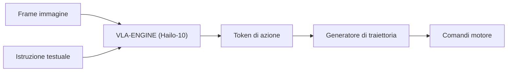

<p align="center">
  
</p>

# 👁️ HYDRA-UMC-VLA-ENGINE

<p align="center"><a href="README.md">🇺🇸 English</a> | <a href="README_spa.md">🇪🇸 Español</a> | <a href="README_fra.md">🇫🇷 Français</a> | 🇮🇹 <b>Italiano</b> | <a href="README_deu.md">🇩🇪 Deutsch</a> | <a href="README_zho.md">🇨🇳 简体中文</a> | <a href="README_jpn.md">🇯🇵 日本語</a></p>

### 🤖 Framework Multimodale Vision-Language-Action per la Robotica

<p align="left">
  
  
  
</p>

---

## 1. 🛠️ PANORAMICA TECNICA

**HYDRA-UMC-VLA-ENGINE** è il ponte multimodale che traduce il contesto visivo e il linguaggio naturale in azioni robotiche dirette. Implementa versioni quantizzate di modelli VLA all'avanguardia (come OpenVLA o varianti specializzate RT-2) da eseguire localmente sulla NPU Hailo-10.

Questo motore consente al robot di comprendere comandi come "prendi il componente blu e posizionalo sul vassoio rosso" analizzando il flusso video in diretta e generando la sequenza cinematica corrispondente.

### Caratteristiche principali:
* 🌉 **Controllo semantico:** Mappatura diretta da pixel e testo a posizioni dei giunti o comandi dello strumento.
* ⚡ **Ragionamento in tempo reale:** Inferenza accelerata da Hailo-10 per la generazione di azioni a bassa latenza.
* 🔄 **Generalizzazione Zero-Shot:** In grado di gestire oggetti mai visti prima basandosi su descrizioni semantiche.
* 🛠️ **Pianificazione dei compiti:** Decompone obiettivi complessi in primitive robotiche atomiche.
* 👨‍👩‍👧 **Figlio del Cognitive AI Node:** Gira come uno dei quattro
  servizi fratelli sotto [HYDRA-UMC-COGNITIVE-NODE](https://github.com/JuanenRac/HYDRA-UMC-COGNITIVE-NODE)
  (insieme a Voice-UI, Semantic-Planner e Docs-QA), condividendo
  l'immagine HydraOS e i pesi dei modelli del padre invece di mantenere
  copie proprie.
* 📦 **Versionamento Contachilometri:** Ogni build reale incrementa
  automaticamente la versione di `pyproject.toml` (`bump_version.py`) -
  nessuna modifica manuale della versione.

---

## 2. 🔄 FLUSSO DI INFERENZA VLA



---

## 3. 🧱 ARCHITETTURA E DECISIONI DI PROGETTAZIONE

Questo repository è un **figlio** della famiglia Cognitive AI Node - il
suo padre, [HYDRA-UMC-COGNITIVE-NODE](https://github.com/JuanenRac/HYDRA-UMC-COGNITIVE-NODE),
possiede l'immagine HydraOS condivisa e i pesi dei modelli quantizzati, e
collega questo servizio nel suo `docker-compose.yml` insieme ai suoi tre
fratelli (Voice-UI, Semantic-Planner, Docs-QA):

* **Perché questo figlio non ha hardware/firmware/`os/`/`models/`
  propri.** Gira interamente sul modulo CM5 + Hailo-10 M.2 già posseduto
  dal padre - centralizzare i pesi dei modelli e l'immagine HydraOS in un
  unico posto evita quattro copie divergenti di più gigabyte all'interno
  della famiglia.
* **Perché una struttura `src/`.** Mantiene il pacchetto installabile
  (`hydra_umc_vla_engine`) separato dal tooling nella radice del repo
  (`bump_version.py`), coerentemente con il resto dei progetti Python
  dell'ecosistema.
* **Perché il punto di ingresso oggi si limita a stampare
  identità/versione/ruolo.** Questa è la fase di andamiaje
  (impalcatura): dimostrare che il pacchetto si installa, compila e
  importa correttamente - sulla versione Python reale di destinazione -
  è un prerequisito prima di aggiungere la vera logica di inferenza VLA,
  e mantiene quel lavoro successivo isolato dalle questioni di packaging.
* **Come si inserisce nel resto dell'ecosistema.** Questo motore
  converte la percezione grezza (frame della camera, concettualmente
  inoltrati da HYDRA-UMC-VISION-NODE a monte) e le istruzioni in
  linguaggio naturale in token di azione che il suo fratello
  HYDRA-UMC-SEMANTIC-PLANNER trasforma in decisioni di missione per
  HYDRA-UMC-ORCHESTRATOR.

---

## 📂 STRUTTURA DELLE CARTELLE

```text
HYDRA-UMC-VLA-ENGINE/
├── src/hydra_umc_vla_engine/   # Codice sorgente (Tokenizer, Teste di azione, Modelli)
├── docs/                       # Documentazione e benchmark
├── images/                     # Media e diagrammi
├── scripts/                    # Script di utilità
├── build/                      # Output di build locale (ignorato da git)
├── pyproject.toml              # Metadati del pacchetto (versione 0.0.3, incremento stile contachilometri)
├── bump_version.py             # Incremento versione stile contachilometri (usato da build.sh/.bat)
├── build.sh / build.bat        # Crea il venv, installa, verifica l'import
└── run.sh / run.bat            # Esegue il punto di ingresso
```

> **Nota:** `hardware/` e `firmware/` sono stati potati - questo nodo
> funziona su un modulo CM5 + Hailo-10 M.2 già esistente, senza un
> progetto hardware/firmware proprio. Sono stati potati anche `os/` e
> `models/` - l'immagine HydraOS e i pesi dei modelli Hailo-10 condivisi
> risiedono nel progetto padre `HYDRA-UMC-COGNITIVE-NODE`, a cui questo
> progetto si collega come servizio (vedi il suo `docker-compose.yml`).

---

## ⚙️ BUILD ED ESECUZIONE

Richiede Python >= 3.10.

```bash
# Linux / macOS / Git Bash
./build.sh   # crea .venv, installa il pacchetto (editable), verifica l'import
./run.sh     # esegue il punto di ingresso

# Windows (cmd)
build.bat
run.bat
```

`build.sh`/`build.bat` incrementano la versione (stile contachilometri,
vedi `bump_version.py`) prima di ogni build reale. Output atteso di
`run.sh`:

```text
HYDRA-UMC-VLA-ENGINE v0.0.3
Vision-Language-Action engine (Hailo-10) - translates camera frames and text instructions into robotic action sequences.
```

### 🩺 Risoluzione dei problemi

* **`python: comando non trovato` / il build fallisce al passo 1.**
  Richiede Python >= 3.10 nel `PATH`. Su Windows, installalo da
  [python.org](https://python.org) e spunta "Add to PATH" durante
  l'installazione; su Linux/macOS di solito si chiama `python3`.
* **`build.sh` non riesce ad attivare il venv.** `python3 -m venv .venv`
  posiziona lo script di attivazione in un percorso diverso a seconda
  della piattaforma: `.venv/bin/activate` su Linux/macOS,
  `.venv/Scripts/activate` su Windows (anche per un venv Python Windows
  usato da Git Bash). `build.sh` verifica già entrambi i percorsi - se
  continua a fallire, elimina `.venv/` e riesegui `./build.sh` per
  ricrearlo da zero.
* **`pip install -e .` fallisce.** Di solito per un `.venv/` obsoleto.
  Elimina la cartella `.venv/` e riesegui `./build.sh`/`build.bat` per
  ricrearla.
* **`import OK` non viene mai stampato.** Significa che `python -c
  "import hydra_umc_vla_engine"` è fallito - riesegui con il venv attivo
  per vedere il traceback reale.

---

## 🚀 ROADMAP
* **Fase 1:** Distribuzione del motore VLA e elaborazione dell'input multi-modale su Hailo-10.
* **Fase 2:** Integrazione del pianificatore semantico con modelli comportamentali di sciame e memoria a lungo termine.
* **Fase 3:** Esecuzione locale a bassa latenza dell'interfaccia vocale e cancellazione del rumore industriale.
* **Fase 4:** Supporto per la generazione di azioni coordinate a doppio braccio e audit del processo decisionale autonomo.

---

## 🔗 PROGETTI CORRELATI

Questo progetto fa parte di un ecosistema robotico più ampio dello stesso autore (JuanenRac / Electro Hobby 3D), che copre firmware, software di controllo, nodi AI e strumenti di flotta. Questo motore non ha relazioni al di fuori della propria famiglia (padre HYDRA-UMC-COGNITIVE-NODE e fratelli HYDRA-UMC-VOICE-UI, HYDRA-UMC-SEMANTIC-PLANNER, HYDRA-UMC-DOCS-QA) oltre a quanto già descritto sopra.

### Resto dell'ecosistema

**Piattaforma HYDRA-UMC** — la micro-fabbrica multi-robot
- **[HYDRA-UMC](https://github.com/JuanenRac/HYDRA-UMC)** — la scheda madre stessa: host Raspberry Pi CM5 + coprocessore real-time STM32H745 dual-core, che orchestra fino a 8 bracci robotici distribuiti via CAN-OTA/SPI-OTA.
- **[HYDRA-UMC SERVER](https://github.com/JuanenRac/HYDRA-UMC-SERVER)** — backend Express/WebSocket headless che possiede lo stato dei robot.
- **[HYDRA-UMC STUDIO](https://github.com/JuanenRac/HYDRA-UMC-STUDIO)** — dashboard di controllo web.
- **[HYDRA-UMC-ANDROID-CONTROL](https://github.com/JuanenRac/HYDRA-UMC-ANDROID-CONTROL)** — app Android di controllo per HYDRA-UMC.
- **[HYDRA-UMC-IOS-CONTROL](https://github.com/JuanenRac/HYDRA-UMC-IOS-CONTROL)** — app iOS/iPadOS di controllo per HYDRA-UMC.
- **[HYDRA-UMC-SUITE](https://github.com/JuanenRac/HYDRA-UMC-SUITE)** — centro di comando desktop per lo sciame.
- **[HYDRA-UMC-EDITOR-URDF](https://github.com/JuanenRac/HYDRA-UMC-EDITOR-URDF)** — creatore/editor grafico desktop per modelli URDF.
- **[HYDRA-UMC-DSI](https://github.com/JuanenRac/HYDRA-UMC-DSI)** — UI touch nativa per HYDRA-UMC.

**Piattaforma URTC** — il controller della testa utensile che ogni braccio HYDRA-UMC porta
- **[URTC](https://github.com/JuanenRac/URTC)** — Universal Robot Tool Controller, firmware.
- **[URTC Flasher](https://github.com/JuanenRac/URTC-FLASHER)** — strumento desktop di flashing CAN-OTA + SWD/JTAG.
- **[URTC Tester](https://github.com/JuanenRac/URTC-TESTER)** — strumento desktop di diagnostica CAN live.
- **[URTC Web Studio](https://github.com/JuanenRac/URTC-WEB-STUDIO)** — alternativa basata su browser ai 2 strumenti desktop sopra.

**👁️ Vision AI Node (Hailo-8)**
- [HYDRA-UMC-VISION-NODE](https://github.com/JuanenRac/HYDRA-UMC-VISION-NODE)
- [HYDRA-UMC-VISION-STREAMER](https://github.com/JuanenRac/HYDRA-UMC-VISION-STREAMER)
- [HYDRA-UMC-DETECTION-HEF](https://github.com/JuanenRac/HYDRA-UMC-DETECTION-HEF)
- [HYDRA-UMC-SAFETY-ZONES](https://github.com/JuanenRac/HYDRA-UMC-SAFETY-ZONES)
- [HYDRA-UMC-VISUAL-SERVOING-API](https://github.com/JuanenRac/HYDRA-UMC-VISUAL-SERVOING-API)

**🐝 Orchestration & Swarm**
- [HYDRA-UMC-ORCHESTRATOR](https://github.com/JuanenRac/HYDRA-UMC-ORCHESTRATOR)
- [HYDRA-UMC-SWARM-SYNC](https://github.com/JuanenRac/HYDRA-UMC-SWARM-SYNC)
- [HYDRA-UMC-PATH-PLANNER-3D](https://github.com/JuanenRac/HYDRA-UMC-PATH-PLANNER-3D)
- [HYDRA-UMC-JOB-DISPATCHER](https://github.com/JuanenRac/HYDRA-UMC-JOB-DISPATCHER)
- [HYDRA-UMC-NODE-HEALING](https://github.com/JuanenRac/HYDRA-UMC-NODE-HEALING)

**🎮 Digital Twin & Simulation**
- [HYDRA-UMC-TWIN](https://github.com/JuanenRac/HYDRA-UMC-TWIN)
- [HYDRA-UMC-PHYSICS-REPLICA](https://github.com/JuanenRac/HYDRA-UMC-PHYSICS-REPLICA)
- [HYDRA-UMC-HIL-BRIDGE](https://github.com/JuanenRac/HYDRA-UMC-HIL-BRIDGE)
- [HYDRA-UMC-SYNTHETIC-DATA-GEN](https://github.com/JuanenRac/HYDRA-UMC-SYNTHETIC-DATA-GEN)

**📊 Data & Analytics**
- [HYDRA-UMC-DATALAKE](https://github.com/JuanenRac/HYDRA-UMC-DATALAKE)
- [HYDRA-UMC-TELEMETRY-COLLECTOR](https://github.com/JuanenRac/HYDRA-UMC-TELEMETRY-COLLECTOR)
- [HYDRA-UMC-ANOMALY-DETECTOR](https://github.com/JuanenRac/HYDRA-UMC-ANOMALY-DETECTOR)
- [HYDRA-UMC-PRODUCTION-REPORTS](https://github.com/JuanenRac/HYDRA-UMC-PRODUCTION-REPORTS)

**🏭 Industrial Gateway**
- [HYDRA-UMC-GATEWAY-INDUSTRIAL](https://github.com/JuanenRac/HYDRA-UMC-GATEWAY-INDUSTRIAL)
- [HYDRA-UMC-OPCUA-SERVER](https://github.com/JuanenRac/HYDRA-UMC-OPCUA-SERVER)
- [HYDRA-UMC-MQTT-BROKER](https://github.com/JuanenRac/HYDRA-UMC-MQTT-BROKER)
- [HYDRA-UMC-MTCONNECT-ADAPTER](https://github.com/JuanenRac/HYDRA-UMC-MTCONNECT-ADAPTER)

**🛠️ Complementary Tools**
- [URTC-SMART-RACK](https://github.com/JuanenRac/URTC-SMART-RACK)
- [URTC-VISION-TOOL](https://github.com/JuanenRac/URTC-VISION-TOOL)
- [HYDRA-UMC-WATCH](https://github.com/JuanenRac/HYDRA-UMC-WATCH)
- [HYDRA-UMC-TOOL-CLI](https://github.com/JuanenRac/HYDRA-UMC-TOOL-CLI)
- [HYDRA-UMC-DASHBOARD-AI](https://github.com/JuanenRac/HYDRA-UMC-DASHBOARD-AI)

---

## 👤 AUTORE
**JuanenRac** (Electro Hobby 3D)
📧 electrohobby3d@gmail.com

## 📜 LICENZA
GPL-3.0 - Vedere LICENSE per i dettagli.

## Progetti correlati

> Canonical public ecosystem relationship map.

**Direct integrations:**
[HYDRA-UMC-OS](https://github.com/JuanenRac/HYDRA-UMC-OS) · [HYDRA-UMC-SDK](https://github.com/JuanenRac/HYDRA-UMC-SDK) · [HYDRA-UMC-SERVER](https://github.com/JuanenRac/HYDRA-UMC-SERVER) · [URTC](https://github.com/JuanenRac/URTC) · [HYDRA-UMC-COGNITIVE-NODE](https://github.com/JuanenRac/HYDRA-UMC-COGNITIVE-NODE) · [HYDRA-UMC-SEMANTIC-PLANNER](https://github.com/JuanenRac/HYDRA-UMC-SEMANTIC-PLANNER) · [HYDRA-UMC-PATH-PLANNER-3D](https://github.com/JuanenRac/HYDRA-UMC-PATH-PLANNER-3D)

**Platform and contracts:**
[HYDRA-UMC-OS](https://github.com/JuanenRac/HYDRA-UMC-OS) · [HYDRA-UMC-SDK](https://github.com/JuanenRac/HYDRA-UMC-SDK)

**Rest of the ecosystem:**
All remaining public repositories are grouped by the seven ecosystem layers in the [JuanenRac ecosystem dashboard](https://juanenrac.github.io/JuanenRac/).
