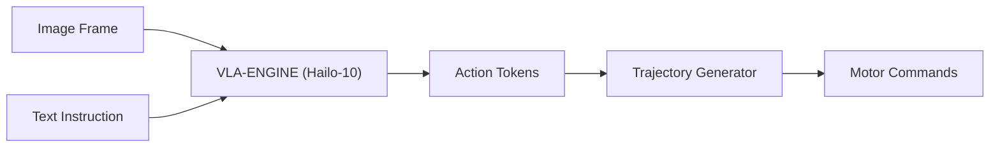

<p align="center">
  
</p>

# 👁️ HYDRA-UMC-VLA-ENGINE

<p align="center"><a href="README.md">🇺🇸 English</a> | <a href="README_spa.md">🇪🇸 Español</a> | <a href="README_fra.md">🇫🇷 Français</a> | <a href="README_ita.md">🇮🇹 Italiano</a> | <a href="README_deu.md">🇩🇪 Deutsch</a> | <a href="README_zho.md">🇨🇳 简体中文</a> | 🇯🇵 <b>日本語</b></p>

### 🤖 ロボティクス向けマルチモーダル視覚言語行動フレームワーク

<p align="left">
  
  
  
</p>

---

## 1. 🛠️ 技術概要

**HYDRA-UMC-VLA-ENGINE** は、視覚的コンテキストと自然言語を直接的な
ロボットの動作へと変換するマルチモーダルブリッジです。最先端の VLA
モデル（OpenVLA や専用の RT-2 バリアントなど）の量子化版を実装し、
Hailo-10 NPU 上でローカルに動作します。

このエンジンにより、ロボットはライブカメラフィードを解析し、対応する
運動学的シーケンスを生成することで、「青い部品を取って赤いトレイに置いて」
といった指示を理解できるようになります。

### 主な機能：
* 🌉 **セマンティック制御：** ピクセルとテキストから関節位置や工具コマンドへの直接マッピング。
* ⚡ **リアルタイム推論：** 低遅延の動作生成を実現する Hailo-10 アクセラレーション推論。
* 🔄 **ゼロショット汎化：** 意味的な記述に基づいて未知の物体を扱うことが可能。
* 🛠️ **タスクプランニング：** 複雑な目標を原子レベルのロボットプリミティブへと分解。
* 👨‍👩‍👧 **認知 AI ノードの子プロジェクト：**
  [HYDRA-UMC-COGNITIVE-NODE](https://github.com/JuanenRac/HYDRA-UMC-COGNITIVE-NODE) の下で 4 つの兄弟サービスの 1 つとして動作します（Voice-UI、Semantic-Planner、Docs-QA と並んで）。独自のコピーを保持するのではなく、親プロジェクトの HydraOS イメージとモデルの重みを共有します。
* 📦 **オドメーター式バージョン管理：** 実際のビルドのたびに
  `pyproject.toml` 自身のバージョンが自動的に増加します
  （`bump_version.py`）——手動でのバージョン編集は不要です。

---

## 2. 🔄 VLA 推論フロー



---

## 3. 🧱 アーキテクチャと設計上の決定

本リポジトリは Cognitive AI Node ファミリーの**子プロジェクト**です——
親プロジェクトである [HYDRA-UMC-COGNITIVE-NODE](https://github.com/JuanenRac/HYDRA-UMC-COGNITIVE-NODE) が共有の HydraOS イメージと量子化モデルの重みを保持し、本サービスを他の 3 つの兄弟プロジェクト（Voice-UI、Semantic-Planner、Docs-QA）とともに `docker-compose.yml` に接続します：

* **本子プロジェクトに独自のハードウェア/ファームウェア/`os/`/`models/` がない理由。** 親プロジェクトが既に保有する CM5 + Hailo-10 M.2 モジュール上で完全に動作します——モデルの重みと HydraOS イメージを 1 か所に集約することで、ファミリー全体で数 GB にも及ぶモデルの重みが 4 つの食い違ったコピーとして存在することを避けられます。
* **`src/` レイアウトを採用した理由。** インストール可能なパッケージ（`hydra_umc_vla_engine`）をリポジトリルートのツール（`bump_version.py`）から分離し、エコシステム内の他のすべての Python プロジェクトで使用されているレイアウトと一致させるためです。
* **エントリポイントが今日は身元/バージョン/役割のみを表示する理由。** これは足場（スキャフォールディング）段階です：実際のターゲット Python バージョン上で、本パッケージが正しくインストール・コンパイルされ、問題なくインポートできることを証明することが、後で実際の VLA 推論ロジックを追加するための前提条件であり、その後の作業をパッケージングの懸念から切り離しておきます。
* **エコシステムの他の部分との関係。** 本エンジンは、生の知覚データ（概念上は上流の HYDRA-UMC-VISION-NODE から転送されるカメラフレーム）と自然言語による指示を動作トークンへと変換し、その兄弟プロジェクトである HYDRA-UMC-SEMANTIC-PLANNER がこれを HYDRA-UMC-ORCHESTRATOR 向けのミッションレベルの決定へと変換します。

---

## 📂 リポジトリ構成

```text
HYDRA-UMC-VLA-ENGINE/
├── src/hydra_umc_vla_engine/   # ソースコード（トークナイザー、アクションヘッド、モデル）
├── docs/                       # ドキュメントとベンチマーク
├── images/                     # メディアと図表
├── scripts/                    # ユーティリティスクリプト
├── build/                      # ローカルビルド出力（git 管理外）
├── pyproject.toml              # パッケージメタデータ（バージョン 0.0.3、オドメーター式増加）
├── bump_version.py             # オドメーター式バージョンインクリメント（build.sh/.bat が使用）
├── build.sh / build.bat        # venv 作成、インストール、インポート検証
└── run.sh / run.bat            # エントリポイントを実行
```

> **注：** `hardware/` と `firmware/` は省略されています——本ノードは
> 既存の CM5 + Hailo-10 M.2 モジュール上で動作し、独自のハードウェア/
> ファームウェア設計を持ちません。`os/` と `models/` も省略されています
> ——HydraOS イメージと共有される Hailo-10 モデルの重みは、親プロジェクト
> `HYDRA-UMC-COGNITIVE-NODE` に存在し、本プロジェクトはサービスとして
> それに接続します（その `docker-compose.yml` を参照）。

---

## ⚙️ ビルドと実行

Python >= 3.10 が必要です。

```bash
# Linux / macOS / Git Bash
./build.sh   # .venv を作成し、パッケージを（editable モードで）インストールし、インポートを検証します
./run.sh     # エントリポイントを実行します

# Windows (cmd)
build.bat
run.bat
```

`build.sh`/`build.bat` は、実際の各ビルドの前にバージョンを増加させます
（オドメーター方式、`bump_version.py` を参照）。`run.sh` の予期される
出力：

```text
HYDRA-UMC-VLA-ENGINE v0.0.3
Vision-Language-Action engine (Hailo-10) - translates camera frames and text instructions into robotic action sequences.
```

### 🩺 トラブルシューティング

* **`python: command not found` / ビルドがステップ 1 で失敗する。** `PATH` 上に Python >= 3.10 が必要です。Windows では [python.org](https://python.org) からインストールし、セットアップ中に「Add to PATH」がチェックされていることを確認してください。Linux/macOS では通常 `python3` という名前が使われます。
* **`build.sh` が venv をアクティブ化できない。** `python3 -m venv .venv` は、プラットフォームごとに異なる場所にアクティベートスクリプトを配置します：Linux/macOS では `.venv/bin/activate`、Windows（Git Bash から使用される Windows Python venv でも同様）では `.venv/Scripts/activate`。`build.sh` は既に両方のパスをチェックしています——それでも失敗する場合は、`.venv/` を削除して `./build.sh` を再実行し、ゼロから再構築してください。
* **`pip install -e .` が失敗する。** 通常は `.venv/` が古くなっていることが原因です。`.venv/` フォルダを削除して `./build.sh`/`build.bat` を再実行し、再作成してください。
* **`import OK` が一度も表示されない。** `python -c "import hydra_umc_vla_engine"` 自体が失敗したことを意味します——venv がアクティブな状態で再実行し、実際のトレースバックを確認してください。

---

## 🚀 ロードマップ
* **フェーズ 1：** Hailo-10 上での VLA エンジンのデプロイとマルチモーダル入力処理。
* **フェーズ 2：** 意味プランナーと群行動モデルおよび長期記憶の統合。
* **フェーズ 3：** 音声 UI の低遅延ローカル実行と産業用ノイズキャンセリング。
* **フェーズ 4：** デュアルアーム協調動作生成のサポートと自律的意思決定の監査。

---

## 🔗 関連プロジェクト

本プロジェクトは、同一著者（JuanenRac / Electro Hobby 3D）による、
ファームウェア、制御ソフトウェア、AI ノード、フリート管理ツールにまたがる、
より大きなロボティクスエコシステムの一部です。上記で既に説明した内容を
超えて、本エンジンは自身のファミリー（親プロジェクト
HYDRA-UMC-COGNITIVE-NODE および兄弟プロジェクトである
HYDRA-UMC-VOICE-UI、HYDRA-UMC-SEMANTIC-PLANNER、HYDRA-UMC-DOCS-QA）の
外に他の関連を持ちません。

### エコシステムのその他のプロジェクト

**HYDRA-UMC プラットフォーム** — マルチロボット・マイクロファクトリーセル
- **[HYDRA-UMC](https://github.com/JuanenRac/HYDRA-UMC)** — マザーボード本体：Raspberry Pi CM5 ホスト + デュアルコア STM32H745 リアルタイムコプロセッサ、CAN-OTA/SPI-OTA 経由で最大 8 台の分散ロボットアームを統括。
- **[HYDRA-UMC SERVER](https://github.com/JuanenRac/HYDRA-UMC-SERVER)** — ロボットの状態を保持するヘッドレス Express/WebSocket バックエンド。
- **[HYDRA-UMC STUDIO](https://github.com/JuanenRac/HYDRA-UMC-STUDIO)** — Web ベースの制御ダッシュボード。
- **[HYDRA-UMC-ANDROID-CONTROL](https://github.com/JuanenRac/HYDRA-UMC-ANDROID-CONTROL)** — HYDRA-UMC 向け Android 制御アプリ。
- **[HYDRA-UMC-IOS-CONTROL](https://github.com/JuanenRac/HYDRA-UMC-IOS-CONTROL)** — HYDRA-UMC 向け iOS/iPadOS 制御アプリ。
- **[HYDRA-UMC-SUITE](https://github.com/JuanenRac/HYDRA-UMC-SUITE)** — デスクトップ版群制御コマンドセンター。
- **[HYDRA-UMC-EDITOR-URDF](https://github.com/JuanenRac/HYDRA-UMC-EDITOR-URDF)** — デスクトップ版グラフィカル URDF 作成/編集ツール。
- **[HYDRA-UMC-DSI](https://github.com/JuanenRac/HYDRA-UMC-DSI)** — HYDRA-UMC のネイティブタッチスクリーン UI。

**URTC プラットフォーム** — すべての HYDRA-UMC ロボットアームが搭載するツールヘッドコントローラー
- **[URTC](https://github.com/JuanenRac/URTC)** — Universal Robot Tool Controller、ファームウェア。
- **[URTC Flasher](https://github.com/JuanenRac/URTC-FLASHER)** — デスクトップ版 CAN-OTA + SWD/JTAG フラッシュツール。
- **[URTC Tester](https://github.com/JuanenRac/URTC-TESTER)** — デスクトップ版ライブ CAN バス診断ツール。
- **[URTC Web Studio](https://github.com/JuanenRac/URTC-WEB-STUDIO)** — 上記 2 つのデスクトップツールのブラウザベースの代替版。

**👁️ ビジョン AI ノード（Hailo-8）**
- [HYDRA-UMC-VISION-NODE](https://github.com/JuanenRac/HYDRA-UMC-VISION-NODE)
- [HYDRA-UMC-VISION-STREAMER](https://github.com/JuanenRac/HYDRA-UMC-VISION-STREAMER)
- [HYDRA-UMC-DETECTION-HEF](https://github.com/JuanenRac/HYDRA-UMC-DETECTION-HEF)
- [HYDRA-UMC-SAFETY-ZONES](https://github.com/JuanenRac/HYDRA-UMC-SAFETY-ZONES)
- [HYDRA-UMC-VISUAL-SERVOING-API](https://github.com/JuanenRac/HYDRA-UMC-VISUAL-SERVOING-API)

**🐝 オーケストレーションと群制御**
- [HYDRA-UMC-ORCHESTRATOR](https://github.com/JuanenRac/HYDRA-UMC-ORCHESTRATOR)
- [HYDRA-UMC-SWARM-SYNC](https://github.com/JuanenRac/HYDRA-UMC-SWARM-SYNC)
- [HYDRA-UMC-PATH-PLANNER-3D](https://github.com/JuanenRac/HYDRA-UMC-PATH-PLANNER-3D)
- [HYDRA-UMC-JOB-DISPATCHER](https://github.com/JuanenRac/HYDRA-UMC-JOB-DISPATCHER)
- [HYDRA-UMC-NODE-HEALING](https://github.com/JuanenRac/HYDRA-UMC-NODE-HEALING)

**🎮 デジタルツインとシミュレーション**
- [HYDRA-UMC-TWIN](https://github.com/JuanenRac/HYDRA-UMC-TWIN)
- [HYDRA-UMC-PHYSICS-REPLICA](https://github.com/JuanenRac/HYDRA-UMC-PHYSICS-REPLICA)
- [HYDRA-UMC-HIL-BRIDGE](https://github.com/JuanenRac/HYDRA-UMC-HIL-BRIDGE)
- [HYDRA-UMC-SYNTHETIC-DATA-GEN](https://github.com/JuanenRac/HYDRA-UMC-SYNTHETIC-DATA-GEN)

**📊 データと分析**
- [HYDRA-UMC-DATALAKE](https://github.com/JuanenRac/HYDRA-UMC-DATALAKE)
- [HYDRA-UMC-TELEMETRY-COLLECTOR](https://github.com/JuanenRac/HYDRA-UMC-TELEMETRY-COLLECTOR)
- [HYDRA-UMC-ANOMALY-DETECTOR](https://github.com/JuanenRac/HYDRA-UMC-ANOMALY-DETECTOR)
- [HYDRA-UMC-PRODUCTION-REPORTS](https://github.com/JuanenRac/HYDRA-UMC-PRODUCTION-REPORTS)

**🏭 産業用ゲートウェイ**
- [HYDRA-UMC-GATEWAY-INDUSTRIAL](https://github.com/JuanenRac/HYDRA-UMC-GATEWAY-INDUSTRIAL)
- [HYDRA-UMC-OPCUA-SERVER](https://github.com/JuanenRac/HYDRA-UMC-OPCUA-SERVER)
- [HYDRA-UMC-MQTT-BROKER](https://github.com/JuanenRac/HYDRA-UMC-MQTT-BROKER)
- [HYDRA-UMC-MTCONNECT-ADAPTER](https://github.com/JuanenRac/HYDRA-UMC-MTCONNECT-ADAPTER)

**🛠️ 補完ツール**
- [URTC-SMART-RACK](https://github.com/JuanenRac/URTC-SMART-RACK)
- [URTC-VISION-TOOL](https://github.com/JuanenRac/URTC-VISION-TOOL)
- [HYDRA-UMC-WATCH](https://github.com/JuanenRac/HYDRA-UMC-WATCH)
- [HYDRA-UMC-TOOL-CLI](https://github.com/JuanenRac/HYDRA-UMC-TOOL-CLI)
- [HYDRA-UMC-DASHBOARD-AI](https://github.com/JuanenRac/HYDRA-UMC-DASHBOARD-AI)

---

## 👤 作者
**JuanenRac**（Electro Hobby 3D）
📧 electrohobby3d@gmail.com

## 📜 ライセンス
GPL-3.0 —— 詳細は LICENSE を参照してください。
