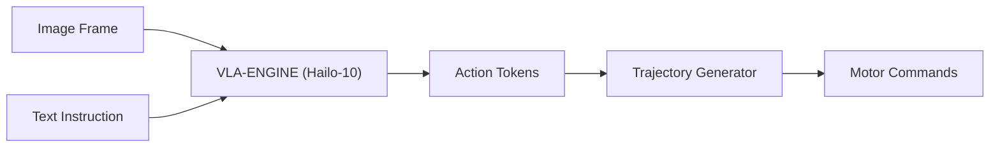

<p align="center">
  
</p>

# 👁️ HYDRA-UMC-VLA-ENGINE

<p align="center"><a href="README.md">🇺🇸 English</a> | <a href="README_spa.md">🇪🇸 Español</a> | <a href="README_fra.md">🇫🇷 Français</a> | <a href="README_ita.md">🇮🇹 Italiano</a> | <a href="README_deu.md">🇩🇪 Deutsch</a> | <a href="README_zho.md">🇨🇳 简体中文</a> | 🇯🇵 <b>日本語</b></p>

### 🤖 ロボティクス向けマルチモーダル視覚言語行動フレームワーク

<p align="left">
  
  
  
</p>

---

## 1. 🛠️ 技術概要

**HYDRA-UMC-VLA-ENGINE** は、視覚的コンテキストと自然言語を直接的な
ロボットの動作へと変換するマルチモーダルブリッジです。最先端の VLA
モデル（OpenVLA や専用の RT-2 バリアントなど）の量子化版を実装し、
Hailo-10 NPU 上でローカルに動作します。

このエンジンにより、ロボットはライブカメラフィードを解析し、対応する
運動学的シーケンスを生成することで、「青い部品を取って赤いトレイに置いて」
といった指示を理解できるようになります。

### 主な機能：
* ✅ **実装済み v0 —— アクショントークンと軌道：** `action_tokens.py` は OpenVLA/RT-2 スタイルの 256 ビン離散化スキーム（連続アクション <-> 離散トークン、7 自由度のアクション空間——姿勢差分 + グリッパー——に基づく）を実装し、`trajectory.py` はデコードされたアクションシーケンスを絶対姿勢の軌道へと積分します。下記の `tokens encode`/`tokens decode`/`trajectory integrate` から利用可能で、実行にもテストにも VLA モデルや Hailo-10 NPU は不要です。
* 📜 **モデルマニフェストと出力検証：** 将来のあらゆるモデル統合が満たすべき、実際にバージョン管理された契約（`model_manifest.py`）——アクション/語彙の形状と既知の Hailo チップファミリーに一致すること——に加え、モデルの生の推論出力に対する形状/信頼度の検証を提供します。*(実装済み)*
* 🔌 **モジュールに先立って準備されたHailoRT統合境界：** `hailo_runtime.py` は、実際の確認済み `hailo_platform` API(`VDevice`、`HEF`、`ConfigureParams`、`InputVStreamParams`/`OutputVStreamParams`)に対して書かれています —— `hailort` パッケージやHailo-10モジュールが存在しなくてもこのリポジトリがクリーンにインストール/テストできるよう遅延インポートされており、`hailo_output_to_tokens()`(実際の推論結果を本エンジン自身のトークン契約にマッピングする部分)は現時点で完全にユニットテスト済みです。*(実装済み、統合境界のみ —— 詳細は下記)*
* 🩺 **正直な `status` サブコマンド：** 実際のアクセラレータ/モデルの重みの可用性を報告します——`no_accelerator`、`no_model_weights`、または `hardware_ready_no_inference`——偽の「準備完了」状態を返すことは決してありません。*(実装済み)*
* 🌉 **セマンティック制御（計画中）：** ピクセルとテキストから関節位置や工具コマンドへの直接マッピング。*（実際の VLA モデルが必要——将来の作業。）*
* ⚡ **リアルタイム推論（計画中）：** 低遅延の動作生成を実現する Hailo-10 アクセラレーション推論。*（この環境にはない実際の Hailo-10 NPU が必要です。）*
* 🔄 **ゼロショット汎化（計画中）：** 意味的な記述に基づいて未知の物体を扱うことが可能。*（実際に学習済みの VLA モデルが必要です。）*
* 🛠️ **タスクプランニング（計画中）：** 複雑な目標を原子レベルのロボットプリミティブへと分解。*（実際の VLA モデルが必要です。）*
* 👨‍👩‍👧 **認知 AI ノードの子プロジェクト：**
  [HYDRA-UMC-COGNITIVE-NODE](https://github.com/JuanenRac/HYDRA-UMC-COGNITIVE-NODE) の下で 4 つの兄弟サービスの 1 つとして動作します（Voice-UI、Semantic-Planner、Docs-QA と並んで）。独自のコピーを保持するのではなく、親プロジェクトの HydraOS イメージとモデルの重みを共有します。
* 📦 **オドメーター式バージョン管理：** 実際のビルドのたびに
  `pyproject.toml` 自身のバージョンが自動的に増加します
  （`bump_version.py`）——手動でのバージョン編集は不要です。

---

## 2. 🔄 VLA 推論フロー



---

## 3. 🧱 アーキテクチャと設計上の決定

本リポジトリは Cognitive AI Node ファミリーの**子プロジェクト**です——
親プロジェクトである [HYDRA-UMC-COGNITIVE-NODE](https://github.com/JuanenRac/HYDRA-UMC-COGNITIVE-NODE) が共有の HydraOS イメージと量子化モデルの重みを保持し、本サービスを他の 3 つの兄弟プロジェクト（Voice-UI、Semantic-Planner、Docs-QA）とともに `docker-compose.yml` に接続します：

* **本子プロジェクトに独自のハードウェア/ファームウェア/`os/`/`models/` がない理由。** 親プロジェクトが既に保有する CM5 + Hailo-10 M.2 モジュール上で完全に動作します——モデルの重みと HydraOS イメージを 1 か所に集約することで、ファミリー全体で数 GB にも及ぶモデルの重みが 4 つの食い違ったコピーとして存在することを避けられます。
* **`src/` レイアウトを採用した理由。** インストール可能なパッケージ（`hydra_umc_vla_engine`）をリポジトリルートのツール（`bump_version.py`）から分離し、エコシステム内の他のすべての Python プロジェクトで使用されているレイアウトと一致させるためです。
* **アクショントークン化がモデル推論より先に実装される理由。** 連続アクションを離散トークンに変換する（そしてその逆を行う）ことは、アクション空間の境界とボキャブラリサイズによって定義される固定の数学であり、記述にもテストにも VLA モデルや Hailo-10 NPU は不要です。そのため v0 ではこの部分（`action_tokens.py`、`trajectory.py`）が先に実装されます。実際の VLA 推論にはこの環境にないモデルの重みと Hailo-10 ハードウェアが必要で、後で実装されます。
* **`hailo_runtime.py` が `hailo_platform` を、わずか2つの関数の中でのみ遅延インポートする理由。** `hailort` は PyPI に存在せず、この開発マシンにもインストールされていません —— モジュールの読み込み時にインポートすると、実際のHailoモジュールが接続されたマシン以外のあらゆる場所で、このパッケージ全体がインストール/インポートに失敗してしまいます。実際にHailoRTを必要とする2つの関数、`open_vdevice()` と `load_hailo_vla_model()` だけがそれを、しかも遅延的にインポートします。両方とも、欠落している場合には単なる `ImportError` ではなく明確な `HailoNotAvailableError` を送出します。これは、このエコシステムがすでに他のあらゆる実際のハードウェアトランスポート(GRBLシリアル、MAVLink、SPI-OTA……)に対して使用しているのと同じパターンです。
* **エコシステムの他の部分との関係。** 本エンジンは、生の知覚データ（概念上は上流の HYDRA-UMC-VISION-NODE から転送されるカメラフレーム）と自然言語による指示を動作トークンへと変換し、その兄弟プロジェクトである HYDRA-UMC-SEMANTIC-PLANNER がこれを HYDRA-UMC-ORCHESTRATOR 向けのミッションレベルの決定へと変換します。
* **`model_manifest.py` が特定の OpenVLA/RT-2 バリアントを指定しない理由。** 実際にはまだどのモデルも選定されていません（本 README 自身のロードマップを参照）——`EXPECTED_MODEL_MANIFEST` は、`action_tokens.py` 自身の実際の定数から直接導出された、正直なところ形状/ターゲットの契約であり、存在しないモデルのためのローダーではありません。`hailo_arch` は、`HYDRA-UMC-DETECTION-HEF` が自身のモデルレジストリの検証に既に使用しているのと同じ、実際の閉じたチップファミリーの集合を再利用します。
* **`status` が「準備完了」ではなく `hardware_ready_no_inference` を報告する理由。** 実際の Hailo-10 デバイスと実際のモデルの重みの両方が揃ったとしても、この v0 にはまだ実際の推論コードがありません——その時点で準備完了だと主張することは、まだ存在しない能力についての本当の嘘になってしまいます。`hardware.py` の `determine_mode()` は、モデルの重みより先にアクセラレータ（安価なデバイスノードのプローブ）を確認します。これは `HYDRA-UMC-DETECTION-HEF` の `safe_load()` が既に採用しているのと同じ、「最も安価な前提条件を最初に確認する」という順序です。
* **`model_weights_available()` がローカルの `models/` ではなく親プロジェクトの `models/` を確認する理由。** この子プロジェクトには独自の `models/` がありません（省略されています——上記の項目を参照）——実際の共有された重みは、兄弟ワークスペースを 1 段階上がった親プロジェクト `HYDRA-UMC-COGNITIVE-NODE` 自身の `models/` に存在します。これは、そのリポジトリ自身の `check_shared_models()` が既に確認しているのと同じ実際のディレクトリです。

---

## 📂 リポジトリ構成

```text
HYDRA-UMC-VLA-ENGINE/
├── src/hydra_umc_vla_engine/   # ソースコード
│   ├── action_tokens.py        # アクション <-> トークン離散化（OpenVLA/RT-2 スタイル）
│   ├── trajectory.py           # アクションシーケンス -> 姿勢軌道の積分
│   ├── model_manifest.py       # 実際のモデル形状契約 + 推論出力検証
│   ├── hardware.py             # 実際のアクセラレータ/モデルの重みの可用性プローブ
│   ├── hailo_runtime.py        # 実際のHailoRT(hailo_platform)統合境界、遅延インポート
│   └── main.py                 # CLI エントリポイント（素の呼び出し + `tokens`/`trajectory`/`status`）
├── tests/                      # 実際の pytest スイート（action_tokens、trajectory、manifest、hardware、CLI）
├── docs/                       # ドキュメントとベンチマーク
├── images/                     # メディアと図表
├── scripts/                    # ユーティリティスクリプト
├── build/                      # ローカルビルド出力（git 管理外）
├── pyproject.toml              # パッケージメタデータ（オドメーター式バージョン）
├── bump_version.py             # オドメーター式バージョンインクリメント（build.sh/.bat が使用）
├── build.sh / build.bat        # venv 作成、インストール（dev エクストラ付き）、インポート検証、テスト実行
└── run.sh / run.bat            # エントリポイントを実行
```

> **注：** `hardware/` と `firmware/` は省略されています——本ノードは
> 既存の CM5 + Hailo-10 M.2 モジュール上で動作し、独自のハードウェア/
> ファームウェア設計を持ちません。`os/` と `models/` も省略されています
> ——HydraOS イメージと共有される Hailo-10 モデルの重みは、親プロジェクト
> `HYDRA-UMC-COGNITIVE-NODE` に存在し、本プロジェクトはサービスとして
> それに接続します（その `docker-compose.yml` を参照）。

---

## ⚙️ ビルドと実行

Python >= 3.10 が必要です。

```bash
# Linux / macOS / Git Bash
./build.sh   # .venv を作成し、パッケージを（editable モード、dev
             # エクストラ付きで）インストールし、インポートを検証し、
             # 実際のテストスイートを実行します
./run.sh     # エントリポイントを実行します

# Windows (cmd)
build.bat
run.bat
```

`build.sh`/`build.bat` は、実際の各ビルドの前にバージョンを増加させます
（オドメーター方式、`bump_version.py` を参照）。`run.sh`（素の呼び出し）
の予期される出力：

```text
HYDRA-UMC-VLA-ENGINE v0.1.0
Vision-Language-Action engine (Hailo-10) - translates camera frames and text instructions into robotic action sequences.
```

実際の例 —— アクションをトークンにエンコードし、デコードして戻し、短いアクションシーケンスを軌道に積分する：

```bash
./run.sh tokens encode --action "0.02,-0.03,0.01,0.05,-0.04,0.02,0.7"
# 179,51,153,192,76,153,179

./run.sh tokens decode --tokens "179,51,153,192,76,153,179"
# 0.020117,-0.030273,0.005273,0.050977,-0.037891,0.019922,0.699219

./run.sh trajectory integrate --start "0,0,0,0,0,0" --actions actions.json
# step 0: x=0.000000 y=0.000000 z=0.000000 roll=0.000000 pitch=0.000000 yaw=0.000000 gripper=0.000000
# step 1: x=0.010000 y=0.000000 z=0.000000 roll=0.000000 pitch=0.000000 yaw=0.000000 gripper=0.500000
# step 2: x=0.010000 y=0.010000 z=0.000000 roll=0.000000 pitch=0.000000 yaw=0.000000 gripper=1.000000
```

`status` は、実際の、正直なアクセラレータ/モデルの重みの可用性を報告します——偽の準備完了状態を返すことは決してありません：

```text
$ ./run.sh status
accelerator (Hailo-10):    MISSING
model weights (parent):    MISSING
mode: no_accelerator - no Hailo-10 NPU device node on this machine - real inference cannot run here.
```

### 🩺 トラブルシューティング

* **`python: command not found` / ビルドがステップ 1 で失敗する。** `PATH` 上に Python >= 3.10 が必要です。Windows では [python.org](https://python.org) からインストールし、セットアップ中に「Add to PATH」がチェックされていることを確認してください。Linux/macOS では通常 `python3` という名前が使われます。
* **`build.sh` が venv をアクティブ化できない。** `python3 -m venv .venv` は、プラットフォームごとに異なる場所にアクティベートスクリプトを配置します：Linux/macOS では `.venv/bin/activate`、Windows（Git Bash から使用される Windows Python venv でも同様）では `.venv/Scripts/activate`。`build.sh` は既に両方のパスをチェックしています——それでも失敗する場合は、`.venv/` を削除して `./build.sh` を再実行し、ゼロから再構築してください。
* **`pip install -e .` が失敗する。** 通常は `.venv/` が古くなっていることが原因です。`.venv/` フォルダを削除して `./build.sh`/`build.bat` を再実行し、再作成してください。
* **`import OK` が一度も表示されない。** `python -c "import hydra_umc_vla_engine"` 自体が失敗したことを意味します——venv がアクティブな状態で再実行し、実際のトレースバックを確認してください。

---

## ✅ 現在の状況と次のステップ

**現在実装済み：** アクショントークンのエンコード/デコードと軌道生成(`action_tokens.py`、`trajectory.py`)——上のフロー図の「アクショントークン」と「軌道生成器」のステップ——に加えて、実際の `.hef` モデルとHailo-10モジュールが存在し次第使えるように準備された実際のHailoRT統合境界(`hailo_runtime.py`)。テストは64個と実際のCLI。

**まだ先で、実際のハードウェア/実際のモデルに阻まれている：** 実際に推論を実行するには、実際にコンパイルされたVLA `.hef` モデル(Hailo-10向けに量子化されたOpenVLA/RT-2——まだ具体的なモデルは選定されていません)と、接続された物理的なHailo-10モジュールが必要です。どちらも `hailo_runtime.py` 単体では取り除けない、実在する避けられないブロッカーです——しかし、モデルが存在するようになれば、それを読み込んでデコードすること自体はもはや未実装のコードではありません。

---

## 🚀 ロードマップ
* **フェーズ 1：** Hailo-10 上での VLA エンジンのデプロイとマルチモーダル入力処理。
* **フェーズ 2：** 意味プランナーと群行動モデルおよび長期記憶の統合。
* **フェーズ 3：** 音声 UI の低遅延ローカル実行と産業用ノイズキャンセリング。
* **フェーズ 4：** デュアルアーム協調動作生成のサポートと自律的意思決定の監査。

---

## 🔗 関連プロジェクト

本プロジェクトは、同一著者（JuanenRac / Electro Hobby 3D）による、
ファームウェア、制御ソフトウェア、AI ノード、フリート管理ツールにまたがる、
より大きなロボティクスエコシステムの一部です。

### ファミリー

**親:** **[HYDRA-UMC-COGNITIVE-NODE](https://github.com/JuanenRac/HYDRA-UMC-COGNITIVE-NODE)** —— このエンジンの共有 HydraOS イメージ/重みを所有し、認知ワークフローに組み込む統合ハブ。

**兄弟:**
- **[HYDRA-UMC-VOICE-UI](https://github.com/JuanenRac/HYDRA-UMC-VOICE-UI)** —— このエンジンも供給する同じプランナー向けの STT/TTS ゲートウェイ。
- **[HYDRA-UMC-SEMANTIC-PLANNER](https://github.com/JuanenRac/HYDRA-UMC-SEMANTIC-PLANNER)** —— このエンジンのアクショントークンが供給される LLM プランナー。
- **[HYDRA-UMC-DOCS-QA](https://github.com/JuanenRac/HYDRA-UMC-DOCS-QA)** —— 同じプランナーを技術マニュアルに基づかせる RAG アシスタント。

本エンジンは、上記で既に説明した自身のファミリーの外に他の関連を持ちません。

### エコシステムのその他のプロジェクト

**HYDRA-UMC プラットフォーム** — マルチロボット・マイクロファクトリーセル
- **[HYDRA-UMC](https://github.com/JuanenRac/HYDRA-UMC)** — マザーボード本体：Raspberry Pi CM5 ホスト + デュアルコア STM32H745 リアルタイムコプロセッサ、CAN-OTA/SPI-OTA 経由で最大 8 台の分散ロボットアームを統括。
- **[HYDRA-UMC SERVER](https://github.com/JuanenRac/HYDRA-UMC-SERVER)** — ロボットの状態を保持するヘッドレス Express/WebSocket バックエンド。
- **[HYDRA-UMC STUDIO](https://github.com/JuanenRac/HYDRA-UMC-STUDIO)** — Web ベースの制御ダッシュボード。
- **[HYDRA-UMC-ANDROID-CONTROL](https://github.com/JuanenRac/HYDRA-UMC-ANDROID-CONTROL)** — HYDRA-UMC 向け Android 制御アプリ。
- **[HYDRA-UMC-IOS-CONTROL](https://github.com/JuanenRac/HYDRA-UMC-IOS-CONTROL)** — HYDRA-UMC 向け iOS/iPadOS 制御アプリ。
- **[HYDRA-UMC-SUITE](https://github.com/JuanenRac/HYDRA-UMC-SUITE)** — デスクトップ版群制御コマンドセンター。
- **[HYDRA-UMC-EDITOR-URDF](https://github.com/JuanenRac/HYDRA-UMC-EDITOR-URDF)** — デスクトップ版グラフィカル URDF 作成/編集ツール。
- **[HYDRA-UMC-DSI](https://github.com/JuanenRac/HYDRA-UMC-DSI)** — HYDRA-UMC のネイティブタッチスクリーン UI。

**URTC プラットフォーム** — すべての HYDRA-UMC ロボットアームが搭載するツールヘッドコントローラー
- **[URTC](https://github.com/JuanenRac/URTC)** — Universal Robot Tool Controller、ファームウェア。
- **[URTC Flasher](https://github.com/JuanenRac/URTC-FLASHER)** — デスクトップ版 CAN-OTA + SWD/JTAG フラッシュツール。
- **[URTC Tester](https://github.com/JuanenRac/URTC-TESTER)** — デスクトップ版ライブ CAN バス診断ツール。
- **[URTC Web Studio](https://github.com/JuanenRac/URTC-WEB-STUDIO)** — 上記 2 つのデスクトップツールのブラウザベースの代替版。

**👁️ ビジョン AI ノード（Hailo-8）**
- [HYDRA-UMC-VISION-NODE](https://github.com/JuanenRac/HYDRA-UMC-VISION-NODE)
- [HYDRA-UMC-VISION-STREAMER](https://github.com/JuanenRac/HYDRA-UMC-VISION-STREAMER)
- [HYDRA-UMC-DETECTION-HEF](https://github.com/JuanenRac/HYDRA-UMC-DETECTION-HEF)
- [HYDRA-UMC-SAFETY-ZONES](https://github.com/JuanenRac/HYDRA-UMC-SAFETY-ZONES)
- [HYDRA-UMC-VISUAL-SERVOING-API](https://github.com/JuanenRac/HYDRA-UMC-VISUAL-SERVOING-API)

**🐝 オーケストレーションと群制御**
- [HYDRA-UMC-ORCHESTRATOR](https://github.com/JuanenRac/HYDRA-UMC-ORCHESTRATOR)
- [HYDRA-UMC-SWARM-SYNC](https://github.com/JuanenRac/HYDRA-UMC-SWARM-SYNC)
- [HYDRA-UMC-PATH-PLANNER-3D](https://github.com/JuanenRac/HYDRA-UMC-PATH-PLANNER-3D)
- [HYDRA-UMC-JOB-DISPATCHER](https://github.com/JuanenRac/HYDRA-UMC-JOB-DISPATCHER)
- [HYDRA-UMC-NODE-HEALING](https://github.com/JuanenRac/HYDRA-UMC-NODE-HEALING)

**🎮 デジタルツインとシミュレーション**
- [HYDRA-UMC-TWIN](https://github.com/JuanenRac/HYDRA-UMC-TWIN)
- [HYDRA-UMC-PHYSICS-REPLICA](https://github.com/JuanenRac/HYDRA-UMC-PHYSICS-REPLICA)
- [HYDRA-UMC-HIL-BRIDGE](https://github.com/JuanenRac/HYDRA-UMC-HIL-BRIDGE)
- [HYDRA-UMC-SYNTHETIC-DATA-GEN](https://github.com/JuanenRac/HYDRA-UMC-SYNTHETIC-DATA-GEN)

**📊 データと分析**
- [HYDRA-UMC-DATALAKE](https://github.com/JuanenRac/HYDRA-UMC-DATALAKE)
- [HYDRA-UMC-TELEMETRY-COLLECTOR](https://github.com/JuanenRac/HYDRA-UMC-TELEMETRY-COLLECTOR)
- [HYDRA-UMC-ANOMALY-DETECTOR](https://github.com/JuanenRac/HYDRA-UMC-ANOMALY-DETECTOR)
- [HYDRA-UMC-PRODUCTION-REPORTS](https://github.com/JuanenRac/HYDRA-UMC-PRODUCTION-REPORTS)

**🏭 産業用ゲートウェイ**
- [HYDRA-UMC-GATEWAY-INDUSTRIAL](https://github.com/JuanenRac/HYDRA-UMC-GATEWAY-INDUSTRIAL)
- [HYDRA-UMC-OPCUA-SERVER](https://github.com/JuanenRac/HYDRA-UMC-OPCUA-SERVER)
- [HYDRA-UMC-MQTT-BROKER](https://github.com/JuanenRac/HYDRA-UMC-MQTT-BROKER)
- [HYDRA-UMC-MTCONNECT-ADAPTER](https://github.com/JuanenRac/HYDRA-UMC-MTCONNECT-ADAPTER)

**🛠️ 補完ツール**
- [URTC-SMART-RACK](https://github.com/JuanenRac/URTC-SMART-RACK)
- [URTC-VISION-TOOL](https://github.com/JuanenRac/URTC-VISION-TOOL)
- [HYDRA-UMC-WATCH](https://github.com/JuanenRac/HYDRA-UMC-WATCH)
- [HYDRA-UMC-TOOL-CLI](https://github.com/JuanenRac/HYDRA-UMC-TOOL-CLI)
- [HYDRA-UMC-DASHBOARD-AI](https://github.com/JuanenRac/HYDRA-UMC-DASHBOARD-AI)

---

## 👤 作者
**JuanenRac** (Electro Hobby 3D)
📧 electrohobby3d@gmail.com
📺 [youtube.com/@electrohobby3d](https://youtube.com/@electrohobby3d)

## 📜 ライセンス
GPL-3.0 —— 詳細は LICENSE を参照してください。
