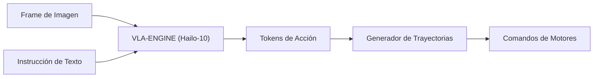

<p align="center">
  
</p>

# 👁️ HYDRA-UMC-VLA-ENGINE

<p align="center"><a href="README.md">🇺🇸 English</a> | 🇪🇸 <b>Español</b> | <a href="README_fra.md">🇫🇷 Français</a> | <a href="README_ita.md">🇮🇹 Italiano</a> | <a href="README_deu.md">🇩🇪 Deutsch</a> | <a href="README_zho.md">🇨🇳 简体中文</a> | <a href="README_jpn.md">🇯🇵 日本語</a></p>

### 🤖 Framework Multimodal Vision-Language-Action para Robótica

<p align="left">
  
  
  
</p>

---

## 1. 🛠️ VISIÓN GENERAL TÉCNICA

**HYDRA-UMC-VLA-ENGINE** es el puente multimodal que traduce el contexto visual y el lenguaje natural en acciones robóticas directas. Implementa versiones cuantizadas de modelos VLA de vanguardia (como OpenVLA o variantes especializadas de RT-2) para ejecutarse localmente en la NPU Hailo-10.

Este motor permite que el robot comprenda comandos como "recoge el componente azul y colócalo en la bandeja roja" analizando el flujo de cámara en vivo y generando la secuencia cinemática correspondiente.

### Características Clave:
* ✅ **Real v0 - tokens de acción y trayectoria:** `action_tokens.py` implementa el esquema de discretización de 256 bins estilo OpenVLA/RT-2 (acción continua <-> token discreto, según el espacio de acción de 7 grados de libertad - delta de pose + gripper), y `trajectory.py` integra una secuencia de acciones decodificadas en una trayectoria de poses absolutas. Expuesto vía `tokens encode`/`tokens decode`/`trajectory integrate` más abajo - no hace falta modelo VLA ni NPU Hailo-10 para ejecutarlo ni testearlo.
* 📜 **Manifiesto de modelo + validación de salida:** Un contrato real y versionado (`model_manifest.py`) que cualquier futura integración de modelo debe cumplir - haciendo coincidir la forma de acción/vocabulario y una familia de chip Hailo conocida - además de validación de forma/confianza para la salida cruda de inferencia de un modelo. *(implementado)*
* 🩺 **Subcomando `status` honesto:** Reporta la disponibilidad real de acelerador/pesos de modelo - `no_accelerator`, `no_model_weights`, o `hardware_ready_no_inference` - nunca un falso estado "listo". *(implementado)*
* 🌉 **Control Semántico (previsto):** Mapeo directo desde píxeles y texto a posiciones de articulaciones o comandos de herramienta. *(necesita un modelo VLA real - trabajo futuro.)*
* ⚡ **Razonamiento en Tiempo Real (previsto):** Inferencia acelerada por Hailo-10 para generación de acciones de baja latencia. *(necesita la NPU Hailo-10 real que este entorno no tiene.)*
* 🔄 **Generalización Zero-Shot (previsto):** Capaz de manejar objetos no vistos basados en descripciones semánticas. *(necesita un modelo VLA real entrenado.)*
* 🛠️ **Planificación de Tareas (previsto):** Descompone objetivos complejos en primitivas robóticas atómicas. *(necesita un modelo VLA real.)*
* 👨‍👩‍👧 **Hijo del Cognitive AI Node:** Corre como uno de los cuatro
  servicios hermanos bajo [HYDRA-UMC-COGNITIVE-NODE](https://github.com/JuanenRac/HYDRA-UMC-COGNITIVE-NODE)
  (junto a Voice-UI, Semantic-Planner y Docs-QA), compartiendo la imagen
  HydraOS y los pesos de modelos de su padre en vez de mantener copias
  propias.
* 📦 **Versionado Cuentakilómetros:** Cada build real incrementa
  automáticamente la versión de `pyproject.toml` (`bump_version.py`) - sin
  ediciones manuales de versión.

---

## 2. 🔄 FLUJO DE INFERENCIA VLA



---

## 3. 🧱 ARQUITECTURA Y DECISIONES DE DISEÑO

Este repositorio es un **hijo** de la familia Cognitive AI Node - su
padre, [HYDRA-UMC-COGNITIVE-NODE](https://github.com/JuanenRac/HYDRA-UMC-COGNITIVE-NODE),
posee la imagen HydraOS compartida y los pesos de modelos cuantizados, y
conecta este servicio en su `docker-compose.yml` junto a sus tres
hermanos (Voice-UI, Semantic-Planner, Docs-QA):

* **Por qué este hijo no tiene hardware/firmware/`os/`/`models/`
  propios.** Corre por completo sobre el módulo CM5 + Hailo-10 M.2 que ya
  posee el padre - centralizar los pesos de modelos y la imagen HydraOS
  en un solo lugar evita cuatro copias divergentes de varios gigabytes
  dentro de la familia.
* **Por qué una estructura `src/`.** Mantiene el paquete instalable
  (`hydra_umc_vla_engine`) separado del tooling en la raíz del repo
  (`bump_version.py`), igual que el resto de proyectos Python del
  ecosistema.
* **Por qué la tokenización de acciones llega antes que la inferencia del modelo.**
  Convertir una acción continua en tokens discretos (y viceversa) es
  matemática fija definida por los límites del espacio de acción y el
  tamaño del vocabulario - no necesita modelo VLA ni NPU Hailo-10 para
  escribirse ni testearse, así que v0 entrega esa pieza (`action_tokens.py`,
  `trajectory.py`) primero. La inferencia VLA real necesita los pesos del
  modelo y el hardware Hailo-10 que este entorno no tiene, y llega después.
* **Cómo encaja en el resto del ecosistema.** Este motor convierte la
  percepción bruta (frames de cámara, conceptualmente reenviados desde
  HYDRA-UMC-VISION-NODE aguas arriba) e instrucciones en lenguaje natural
  en tokens de acción que su hermano HYDRA-UMC-SEMANTIC-PLANNER convierte
  en decisiones de misión para HYDRA-UMC-ORCHESTRATOR.
* **Por qué `model_manifest.py` no nombra una variante específica de
  OpenVLA/RT-2.** Todavía no se ha elegido ningún modelo (ver la Hoja de
  Ruta de este mismo README) - `EXPECTED_MODEL_MANIFEST` es honestamente
  un contrato de forma/objetivo derivado directamente de las constantes
  reales de `action_tokens.py`, no un cargador para un modelo que no
  existe. `hailo_arch` reutiliza el mismo conjunto real y cerrado de
  familias de chip que `HYDRA-UMC-DETECTION-HEF` ya usa para validar su
  propio registro de modelos.
* **Por qué `status` reporta `hardware_ready_no_inference` en vez de
  "listo".** Incluso una vez que un dispositivo Hailo-10 real y los
  pesos de modelo reales estén ambos presentes, este v0 todavía no
  tiene código de inferencia real - afirmar que está listo en ese punto
  sería una mentira real sobre una capacidad que aún no existe.
  `determine_mode()` de `hardware.py` comprueba primero el acelerador
  (una prueba barata de nodo de dispositivo) antes que los pesos del
  modelo, el mismo orden de precondición-más-barata-primero que ya usa
  `safe_load()` de `HYDRA-UMC-DETECTION-HEF`.
* **Por qué `model_weights_available()` comprueba el `models/` del
  padre, no uno local.** Este hijo no tiene su propio `models/` (podado
  - ver el punto anterior) - los pesos compartidos reales viven en el
  propio `models/` del padre `HYDRA-UMC-COGNITIVE-NODE`, un nivel de
  espacio de trabajo hermano más arriba, el mismo directorio real que ya
  comprueba `check_shared_models()` de ese repositorio.

---

## 📂 ESTRUCTURA DE DIRECTORIOS

```text
HYDRA-UMC-VLA-ENGINE/
├── src/hydra_umc_vla_engine/   # Código fuente
│   ├── action_tokens.py        # Discretizacion accion <-> token (estilo OpenVLA/RT-2)
│   ├── trajectory.py           # Integracion de secuencia de acciones -> trayectoria de poses
│   ├── model_manifest.py       # Contrato real de forma de modelo + validación de salida de inferencia
│   ├── hardware.py             # Sondas reales de disponibilidad de acelerador/pesos de modelo
│   └── main.py                 # Entry point CLI (invocacion desnuda + `tokens`/`trajectory`/`status`)
├── tests/                      # Suite pytest real (action_tokens, trajectory, manifest, hardware, CLI)
├── docs/                       # Documentación y benchmarks
├── images/                     # Medios y diagramas
├── scripts/                    # Scripts de utilidad
├── build/                      # Salida de build local (ignorada por git)
├── pyproject.toml              # Metadatos del paquete (versión con incremento cuentakilómetros)
├── bump_version.py             # Incremento de versión estilo cuentakilómetros (usado por build.sh/.bat)
├── build.sh / build.bat        # Crea el venv, instala (con extras dev), verifica la importación, ejecuta tests
└── run.sh / run.bat            # Ejecuta el punto de entrada
```

> **Nota:** se podaron `hardware/` y `firmware/` - este nodo corre sobre un
> módulo CM5 + Hailo-10 M.2 ya existente, sin diseño de hardware/firmware
> propio. También se podaron `os/` y `models/` - la imagen HydraOS y los
> pesos de modelos Hailo-10 compartidos viven en el proyecto padre
> `HYDRA-UMC-COGNITIVE-NODE`, al que este proyecto se conecta como
> servicio (ver su `docker-compose.yml`).

---

## ⚙️ BUILD Y EJECUCIÓN

Requiere Python >= 3.10.

```bash
# Linux / macOS / Git Bash
./build.sh   # crea .venv, instala el paquete (editable, con extras dev),
             # verifica la importación, ejecuta la suite de tests real
./run.sh     # ejecuta el punto de entrada

# Windows (cmd)
build.bat
run.bat
```

`build.sh`/`build.bat` incrementan la versión (estilo cuentakilómetros, ver
`bump_version.py`) antes de cada build real. Salida esperada de `run.sh`
(invocación desnuda):

```text
HYDRA-UMC-VLA-ENGINE v0.0.4
Vision-Language-Action engine (Hailo-10) - translates camera frames and text instructions into robotic action sequences.
```

Ejemplo real - codificar una acción en tokens, decodificarla de vuelta, e integrar una secuencia corta de acciones en una trayectoria:

```bash
./run.sh tokens encode --action "0.02,-0.03,0.01,0.05,-0.04,0.02,0.7"
# 179,51,153,192,76,153,179

./run.sh tokens decode --tokens "179,51,153,192,76,153,179"
# 0.020117,-0.030273,0.005273,0.050977,-0.037891,0.019922,0.699219

./run.sh trajectory integrate --start "0,0,0,0,0,0" --actions actions.json
# step 0: x=0.000000 y=0.000000 z=0.000000 roll=0.000000 pitch=0.000000 yaw=0.000000 gripper=0.000000
# step 1: x=0.010000 y=0.000000 z=0.000000 roll=0.000000 pitch=0.000000 yaw=0.000000 gripper=0.500000
# step 2: x=0.010000 y=0.010000 z=0.000000 roll=0.000000 pitch=0.000000 yaw=0.000000 gripper=1.000000
```

`status` reporta la disponibilidad real y honesta de acelerador/pesos de
modelo - nunca un estado "listo" falso:

```text
$ ./run.sh status
accelerator (Hailo-10):    MISSING
model weights (parent):    MISSING
mode: no_accelerator - no Hailo-10 NPU device node on this machine - real inference cannot run here.
```

### 🩺 Solución de problemas

* **`python: comando no encontrado` / el build falla en el paso 1.**
  Requiere Python >= 3.10 en el `PATH`. En Windows, instálalo desde
  [python.org](https://python.org) y marca "Add to PATH" durante la
  instalación; en Linux/macOS suele llamarse `python3`.
* **`build.sh` no consigue activar el venv.** `python3 -m venv .venv`
  coloca el script de activación en una ruta distinta según la
  plataforma: `.venv/bin/activate` en Linux/macOS, `.venv/Scripts/activate`
  en Windows (también con un venv de Python de Windows usado desde Git
  Bash). `build.sh` ya comprueba ambas rutas - si sigue fallando, borra
  `.venv/` y vuelve a ejecutar `./build.sh` para reconstruirlo desde cero.
* **`pip install -e .` falla.** Normalmente por un `.venv/` obsoleto.
  Borra la carpeta `.venv/` y vuelve a ejecutar `./build.sh`/`build.bat`
  para recrearla.
* **`import OK` nunca se imprime.** Significa que `python -c "import
  hydra_umc_vla_engine"` falló - vuelve a ejecutarlo con el venv activo
  para ver el traceback real.

---

## ✅ Estado Actual y Próximos Pasos

**Real hoy:** la codificación/decodificación de tokens de acción y la generación de trayectoria (`action_tokens.py`, `trajectory.py`) - los pasos "Tokens de Acción" y "Generador de Trayectorias" del diagrama de flujo de arriba - con 19 tests y un CLI real.

**Todavía por delante, bloqueado por hardware real/pesos de modelo:** la inferencia real del modelo VLA (OpenVLA/RT-2 cuantizado para Hailo-10) que produciría los tokens que este v0 ya sabe decodificar.

---

## 🚀 HOJA DE RUTA
* **Fase 1:** Despliegue del motor VLA y procesamiento de entrada multi-modal en Hailo-10.
* **Fase 2:** Integración del planificador semántico con modelos de comportamiento de enjambre y memoria a largo plazo.
* **Fase 3:** Ejecución local de baja latencia de Voice UI y cancelación de ruido industrial.
* **Fase 4:** Soporte para generación de acciones coordinadas de doble brazo y auditorías de toma de decisiones autónomas.

---

## 🔗 PROYECTOS RELACIONADOS

Este proyecto forma parte de un ecosistema de robótica más amplio del mismo autor (JuanenRac / Electro Hobby 3D), que abarca firmware, software de control, nodos de IA y herramientas de flota. Este motor no tiene relaciones fuera de su propia familia (padre HYDRA-UMC-COGNITIVE-NODE y hermanos HYDRA-UMC-VOICE-UI, HYDRA-UMC-SEMANTIC-PLANNER, HYDRA-UMC-DOCS-QA) más allá de lo ya descrito arriba.

### Resto del ecosistema

**Plataforma HYDRA-UMC** — la micro-fábrica multi-robot
- **[HYDRA-UMC](https://github.com/JuanenRac/HYDRA-UMC)** — la placa base: host Raspberry Pi CM5 + coprocesador de tiempo real STM32H745 de doble núcleo, orquestando hasta 8 brazos robóticos distribuidos vía CAN-OTA/SPI-OTA.
- **[HYDRA-UMC SERVER](https://github.com/JuanenRac/HYDRA-UMC-SERVER)** — backend Express/WebSocket headless que posee el estado de los robots.
- **[HYDRA-UMC STUDIO](https://github.com/JuanenRac/HYDRA-UMC-STUDIO)** — dashboard de control web.
- **[HYDRA-UMC-ANDROID-CONTROL](https://github.com/JuanenRac/HYDRA-UMC-ANDROID-CONTROL)** — app Android de control para HYDRA-UMC.
- **[HYDRA-UMC-IOS-CONTROL](https://github.com/JuanenRac/HYDRA-UMC-IOS-CONTROL)** — app iOS/iPadOS de control para HYDRA-UMC.
- **[HYDRA-UMC-SUITE](https://github.com/JuanenRac/HYDRA-UMC-SUITE)** — centro de mando de escritorio para el enjambre.
- **[HYDRA-UMC-EDITOR-URDF](https://github.com/JuanenRac/HYDRA-UMC-EDITOR-URDF)** — creador/editor gráfico de escritorio para modelos URDF.
- **[HYDRA-UMC-DSI](https://github.com/JuanenRac/HYDRA-UMC-DSI)** — UI táctil nativa para HYDRA-UMC.

**Plataforma URTC** — el controlador de cabezal de herramienta que lleva cada brazo HYDRA-UMC
- **[URTC](https://github.com/JuanenRac/URTC)** — Universal Robot Tool Controller, firmware.
- **[URTC Flasher](https://github.com/JuanenRac/URTC-FLASHER)** — herramienta de escritorio de flasheo CAN-OTA + SWD/JTAG.
- **[URTC Tester](https://github.com/JuanenRac/URTC-TESTER)** — herramienta de escritorio de diagnóstico CAN en vivo.
- **[URTC Web Studio](https://github.com/JuanenRac/URTC-WEB-STUDIO)** — alternativa basada en navegador a las 2 herramientas de escritorio anteriores.

**👁️ Vision AI Node (Hailo-8)**
- [HYDRA-UMC-VISION-NODE](https://github.com/JuanenRac/HYDRA-UMC-VISION-NODE)
- [HYDRA-UMC-VISION-STREAMER](https://github.com/JuanenRac/HYDRA-UMC-VISION-STREAMER)
- [HYDRA-UMC-DETECTION-HEF](https://github.com/JuanenRac/HYDRA-UMC-DETECTION-HEF)
- [HYDRA-UMC-SAFETY-ZONES](https://github.com/JuanenRac/HYDRA-UMC-SAFETY-ZONES)
- [HYDRA-UMC-VISUAL-SERVOING-API](https://github.com/JuanenRac/HYDRA-UMC-VISUAL-SERVOING-API)

**🐝 Orchestration & Swarm**
- [HYDRA-UMC-ORCHESTRATOR](https://github.com/JuanenRac/HYDRA-UMC-ORCHESTRATOR)
- [HYDRA-UMC-SWARM-SYNC](https://github.com/JuanenRac/HYDRA-UMC-SWARM-SYNC)
- [HYDRA-UMC-PATH-PLANNER-3D](https://github.com/JuanenRac/HYDRA-UMC-PATH-PLANNER-3D)
- [HYDRA-UMC-JOB-DISPATCHER](https://github.com/JuanenRac/HYDRA-UMC-JOB-DISPATCHER)
- [HYDRA-UMC-NODE-HEALING](https://github.com/JuanenRac/HYDRA-UMC-NODE-HEALING)

**🎮 Digital Twin & Simulation**
- [HYDRA-UMC-TWIN](https://github.com/JuanenRac/HYDRA-UMC-TWIN)
- [HYDRA-UMC-PHYSICS-REPLICA](https://github.com/JuanenRac/HYDRA-UMC-PHYSICS-REPLICA)
- [HYDRA-UMC-HIL-BRIDGE](https://github.com/JuanenRac/HYDRA-UMC-HIL-BRIDGE)
- [HYDRA-UMC-SYNTHETIC-DATA-GEN](https://github.com/JuanenRac/HYDRA-UMC-SYNTHETIC-DATA-GEN)

**📊 Data & Analytics**
- [HYDRA-UMC-DATALAKE](https://github.com/JuanenRac/HYDRA-UMC-DATALAKE)
- [HYDRA-UMC-TELEMETRY-COLLECTOR](https://github.com/JuanenRac/HYDRA-UMC-TELEMETRY-COLLECTOR)
- [HYDRA-UMC-ANOMALY-DETECTOR](https://github.com/JuanenRac/HYDRA-UMC-ANOMALY-DETECTOR)
- [HYDRA-UMC-PRODUCTION-REPORTS](https://github.com/JuanenRac/HYDRA-UMC-PRODUCTION-REPORTS)

**🏭 Industrial Gateway**
- [HYDRA-UMC-GATEWAY-INDUSTRIAL](https://github.com/JuanenRac/HYDRA-UMC-GATEWAY-INDUSTRIAL)
- [HYDRA-UMC-OPCUA-SERVER](https://github.com/JuanenRac/HYDRA-UMC-OPCUA-SERVER)
- [HYDRA-UMC-MQTT-BROKER](https://github.com/JuanenRac/HYDRA-UMC-MQTT-BROKER)
- [HYDRA-UMC-MTCONNECT-ADAPTER](https://github.com/JuanenRac/HYDRA-UMC-MTCONNECT-ADAPTER)

**🛠️ Complementary Tools**
- [URTC-SMART-RACK](https://github.com/JuanenRac/URTC-SMART-RACK)
- [URTC-VISION-TOOL](https://github.com/JuanenRac/URTC-VISION-TOOL)
- [HYDRA-UMC-WATCH](https://github.com/JuanenRac/HYDRA-UMC-WATCH)
- [HYDRA-UMC-TOOL-CLI](https://github.com/JuanenRac/HYDRA-UMC-TOOL-CLI)
- [HYDRA-UMC-DASHBOARD-AI](https://github.com/JuanenRac/HYDRA-UMC-DASHBOARD-AI)

---

## 👤 AUTOR
**JuanenRac** (Electro Hobby 3D)
📧 electrohobby3d@gmail.com

## 📜 LICENCIA
GPL-3.0 - Ver archivo LICENSE para más detalles.

## 🛠️ BUILD & RUN

Usa la comprobación de compilación sin versionado antes de una compilación de publicación:

| Acción | Windows | Linux / macOS |
|---|---|---|
| Comprobación de compilación (sin cambiar versión ni CHANGELOG) | `build-test.bat` | `./build-test.sh` |
| Ejecución / desarrollo (cuando exista) | `run*.bat` o `dev*.bat` | `./run*.sh` o `./dev*.sh` |

`build-test.bat` y `build-test.sh` compilan o validan el stack del proyecto sin incrementar `hydra-umc.project.json` ni modificar `CHANGELOG.md`. Solo pueden crear salidas normales del compilador. Los scripts existentes `build*.bat`, `build*.sh`, `run*` y `dev*` conservan su comportamiento específico de versión o ejecución; úsalos cuando necesites ese comportamiento.