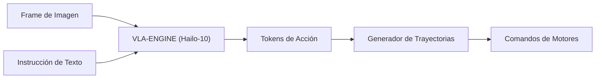

<p align="center">
  
</p>

# 👁️ HYDRA-UMC-VLA-ENGINE

<p align="center"><a href="README.md">🇺🇸 English</a> | 🇪🇸 <b>Español</b> | <a href="README_fra.md">🇫🇷 Français</a> | <a href="README_ita.md">🇮🇹 Italiano</a> | <a href="README_deu.md">🇩🇪 Deutsch</a> | <a href="README_zho.md">🇨🇳 简体中文</a> | <a href="README_jpn.md">🇯🇵 日本語</a></p>

### 🤖 Framework Multimodal Vision-Language-Action para Robótica

<p align="left">
  
  
  
</p>

---

## 1. 🛠️ VISIÓN GENERAL TÉCNICA

**HYDRA-UMC-VLA-ENGINE** es el puente multimodal que traduce el contexto visual y el lenguaje natural en acciones robóticas directas. Implementa versiones cuantizadas de modelos VLA de vanguardia (como OpenVLA o variantes especializadas de RT-2) para ejecutarse localmente en la NPU Hailo-10.

Este motor permite que el robot comprenda comandos como "recoge el componente azul y colócalo en la bandeja roja" analizando el flujo de cámara en vivo y generando la secuencia cinemática correspondiente.

### Características Clave:
* ✅ **Real v0 - tokens de acción y trayectoria:** `action_tokens.py` implementa el esquema de discretización de 256 bins estilo OpenVLA/RT-2 (acción continua <-> token discreto, según el espacio de acción de 7 grados de libertad - delta de pose + gripper), y `trajectory.py` integra una secuencia de acciones decodificadas en una trayectoria de poses absolutas. Expuesto vía `tokens encode`/`tokens decode`/`trajectory integrate` más abajo - no hace falta modelo VLA ni NPU Hailo-10 para ejecutarlo ni testearlo.
* 📜 **Manifiesto de modelo + validación de salida:** Un contrato real y versionado (`model_manifest.py`) que cualquier futura integración de modelo debe cumplir - haciendo coincidir la forma de acción/vocabulario y una familia de chip Hailo conocida - además de validación de forma/confianza para la salida cruda de inferencia de un modelo. *(implementado)*
* 🔌 **Límite de integración con HailoRT, preparado antes que el módulo:** `hailo_runtime.py` está escrito contra la API real y confirmada de `hailo_platform` (`VDevice`, `HEF`, `ConfigureParams`, `InputVStreamParams`/`OutputVStreamParams`) - importada de forma perezosa para que este repositorio se instale/testee limpiamente sin el paquete `hailort` ni un módulo Hailo-10 presente, y `hailo_output_to_tokens()` (la pieza que mapea un resultado de inferencia real al propio contrato de tokens de este motor) está completamente cubierta por tests unitarios hoy. *(implementado, solo límite de integración - ver más abajo)*
* 🩺 **Subcomando `status` honesto:** Reporta la disponibilidad real de acelerador/pesos de modelo - `no_accelerator`, `no_model_weights`, o `hardware_ready_no_inference` - nunca un falso estado "listo". *(implementado)*
* 🌉 **Control Semántico (previsto):** Mapeo directo desde píxeles y texto a posiciones de articulaciones o comandos de herramienta. *(necesita un modelo VLA real - trabajo futuro.)*
* ⚡ **Razonamiento en Tiempo Real (previsto):** Inferencia acelerada por Hailo-10 para generación de acciones de baja latencia. *(necesita la NPU Hailo-10 real que este entorno no tiene.)*
* 🔄 **Generalización Zero-Shot (previsto):** Capaz de manejar objetos no vistos basados en descripciones semánticas. *(necesita un modelo VLA real entrenado.)*
* 🛠️ **Planificación de Tareas (previsto):** Descompone objetivos complejos en primitivas robóticas atómicas. *(necesita un modelo VLA real.)*
* 👨‍👩‍👧 **Hijo del Cognitive AI Node:** Corre como uno de los cuatro
  servicios hermanos bajo [HYDRA-UMC-COGNITIVE-NODE](https://github.com/JuanenRac/HYDRA-UMC-COGNITIVE-NODE)
  (junto a Voice-UI, Semantic-Planner y Docs-QA), compartiendo la imagen
  HydraOS y los pesos de modelos de su padre en vez de mantener copias
  propias.
* 📦 **Versionado Cuentakilómetros:** Cada build real incrementa
  automáticamente la versión de `pyproject.toml` (`bump_version.py`) - sin
  ediciones manuales de versión.

---

## 2. 🔄 FLUJO DE INFERENCIA VLA



---

## 3. 🧱 ARQUITECTURA Y DECISIONES DE DISEÑO

Este repositorio es un **hijo** de la familia Cognitive AI Node - su
padre, [HYDRA-UMC-COGNITIVE-NODE](https://github.com/JuanenRac/HYDRA-UMC-COGNITIVE-NODE),
posee la imagen HydraOS compartida y los pesos de modelos cuantizados, y
conecta este servicio en su `docker-compose.yml` junto a sus tres
hermanos (Voice-UI, Semantic-Planner, Docs-QA):

* **Por qué este hijo no tiene hardware/firmware/`os/`/`models/`
  propios.** Corre por completo sobre el módulo CM5 + Hailo-10 M.2 que ya
  posee el padre - centralizar los pesos de modelos y la imagen HydraOS
  en un solo lugar evita cuatro copias divergentes de varios gigabytes
  dentro de la familia.
* **Por qué una estructura `src/`.** Mantiene el paquete instalable
  (`hydra_umc_vla_engine`) separado del tooling en la raíz del repo
  (`bump_version.py`), igual que el resto de proyectos Python del
  ecosistema.
* **Por qué la tokenización de acciones llega antes que la inferencia del modelo.**
  Convertir una acción continua en tokens discretos (y viceversa) es
  matemática fija definida por los límites del espacio de acción y el
  tamaño del vocabulario - no necesita modelo VLA ni NPU Hailo-10 para
  escribirse ni testearse, así que v0 entrega esa pieza (`action_tokens.py`,
  `trajectory.py`) primero. La inferencia VLA real necesita los pesos del
  modelo y el hardware Hailo-10 que este entorno no tiene, y llega después.
* **Por qué `hailo_runtime.py` importa `hailo_platform` de forma perezosa, dentro de solo dos funciones.** `hailort` no está en PyPI y no está instalado en esta máquina de desarrollo - importarlo en el momento de cargar el módulo haría que todo este paquete fallara al instalarse/importarse en cualquier lugar excepto en una máquina con un módulo Hailo real conectado. Solo `open_vdevice()` y `load_hailo_vla_model()` (las dos funciones que realmente necesitan HailoRT real) lo importan, y de forma perezosa; ambas lanzan un `HailoNotAvailableError` claro en vez de un `ImportError` a secas cuando falta. Mismo patrón que este ecosistema ya usa para cualquier otro transporte de hardware real (serial GRBL, MAVLink, SPI-OTA, ...).
* **Cómo encaja en el resto del ecosistema.** Este motor convierte la
  percepción bruta (frames de cámara, conceptualmente reenviados desde
  HYDRA-UMC-VISION-NODE aguas arriba) e instrucciones en lenguaje natural
  en tokens de acción que su hermano HYDRA-UMC-SEMANTIC-PLANNER convierte
  en decisiones de misión para HYDRA-UMC-ORCHESTRATOR.
* **Por qué `model_manifest.py` no nombra una variante específica de
  OpenVLA/RT-2.** Todavía no se ha elegido ningún modelo (ver la Hoja de
  Ruta de este mismo README) - `EXPECTED_MODEL_MANIFEST` es honestamente
  un contrato de forma/objetivo derivado directamente de las constantes
  reales de `action_tokens.py`, no un cargador para un modelo que no
  existe. `hailo_arch` reutiliza el mismo conjunto real y cerrado de
  familias de chip que `HYDRA-UMC-DETECTION-HEF` ya usa para validar su
  propio registro de modelos.
* **Por qué `status` reporta `hardware_ready_no_inference` en vez de
  "listo".** Incluso una vez que un dispositivo Hailo-10 real y los
  pesos de modelo reales estén ambos presentes, este v0 todavía no
  tiene código de inferencia real - afirmar que está listo en ese punto
  sería una mentira real sobre una capacidad que aún no existe.
  `determine_mode()` de `hardware.py` comprueba primero el acelerador
  (una prueba barata de nodo de dispositivo) antes que los pesos del
  modelo, el mismo orden de precondición-más-barata-primero que ya usa
  `safe_load()` de `HYDRA-UMC-DETECTION-HEF`.
* **Por qué `model_weights_available()` comprueba el `models/` del
  padre, no uno local.** Este hijo no tiene su propio `models/` (podado
  - ver el punto anterior) - los pesos compartidos reales viven en el
  propio `models/` del padre `HYDRA-UMC-COGNITIVE-NODE`, un nivel de
  espacio de trabajo hermano más arriba, el mismo directorio real que ya
  comprueba `check_shared_models()` de ese repositorio.

---

## 📂 ESTRUCTURA DE DIRECTORIOS

```text
HYDRA-UMC-VLA-ENGINE/
├── src/hydra_umc_vla_engine/   # Código fuente
│   ├── action_tokens.py        # Discretizacion accion <-> token (estilo OpenVLA/RT-2)
│   ├── trajectory.py           # Integracion de secuencia de acciones -> trayectoria de poses
│   ├── model_manifest.py       # Contrato real de forma de modelo + validación de salida de inferencia
│   ├── hardware.py             # Sondas reales de disponibilidad de acelerador/pesos de modelo
│   ├── hailo_runtime.py        # Limite real de integracion HailoRT (hailo_platform), importada de forma perezosa
│   ├── api.py                  # Superficie JSON/HTTP plana (http.server de stdlib) sobre tokens/trayectoria/estado
│   └── main.py                 # Entry point CLI (invocacion desnuda + `tokens`/`trajectory`/`status`)
├── tests/                      # Suite pytest real (action_tokens, trajectory, manifest, hardware, hailo_runtime, api, CLI)
├── docs/                       # Documentación y benchmarks
├── images/                     # Medios y diagramas
├── systemd/
│   └── hydra-umc-vla-engine.service  # Unidad systemd de la API local de tokenización/trayectoria en la CM5
├── build/                      # Salida de build local (ignorada por git)
├── pyproject.toml              # Metadatos del paquete (versión con incremento cuentakilómetros)
├── bump_version.py             # Incremento de versión nativa estilo cuentakilómetros (usado por build.sh/.bat)
├── bump_manifest_version.py    # Sincroniza la versión de hydra-umc.project.json con la nativa (--sync)
├── build.sh / build.bat        # Crea el venv, instala (con extras dev), verifica la importación, ejecuta tests
└── run.sh / run.bat            # Ejecuta el punto de entrada
```

> **Nota:** se podaron `hardware/` y `firmware/` - este nodo corre sobre un
> módulo CM5 + Hailo-10 M.2 ya existente, sin diseño de hardware/firmware
> propio. También se podaron `os/` y `models/` - la imagen HydraOS y los
> pesos de modelos Hailo-10 compartidos viven en el proyecto padre
> `HYDRA-UMC-COGNITIVE-NODE`, al que este proyecto se conecta como
> servicio (ver su `docker-compose.yml`).

---

## ⚙️ BUILD Y EJECUCIÓN

Requiere Python >= 3.10.

```bash
# Linux / macOS / Git Bash
./build.sh   # crea .venv, instala el paquete (editable, con extras dev),
             # verifica la importación, ejecuta la suite de tests real
./run.sh     # ejecuta el punto de entrada

# Windows (cmd)
build.bat
run.bat
```

`build.sh`/`build.bat` incrementan la versión (estilo cuentakilómetros, ver
`bump_version.py`) antes de cada build real. Salida esperada de `run.sh`
(invocación desnuda):

```text
HYDRA-UMC-VLA-ENGINE v0.1.0
Vision-Language-Action engine (Hailo-10) - translates camera frames and text instructions into robotic action sequences.
```

Ejemplo real - codificar una acción en tokens, decodificarla de vuelta, e integrar una secuencia corta de acciones en una trayectoria:

```bash
./run.sh tokens encode --action "0.02,-0.03,0.01,0.05,-0.04,0.02,0.7"
# 179,51,153,192,76,153,179

./run.sh tokens decode --tokens "179,51,153,192,76,153,179"
# 0.020117,-0.030273,0.005273,0.050977,-0.037891,0.019922,0.699219

./run.sh trajectory integrate --start "0,0,0,0,0,0" --actions actions.json
# step 0: x=0.000000 y=0.000000 z=0.000000 roll=0.000000 pitch=0.000000 yaw=0.000000 gripper=0.000000
# step 1: x=0.010000 y=0.000000 z=0.000000 roll=0.000000 pitch=0.000000 yaw=0.000000 gripper=0.500000
# step 2: x=0.010000 y=0.010000 z=0.000000 roll=0.000000 pitch=0.000000 yaw=0.000000 gripper=1.000000
```

`status` reporta la disponibilidad real y honesta de acelerador/pesos de
modelo - nunca un estado "listo" falso:

```text
$ ./run.sh status
accelerator (Hailo-10):    MISSING
model weights (parent):    MISSING
mode: no_accelerator - no Hailo-10 NPU device node on this machine - real inference cannot run here.
```

### 🩺 Solución de problemas

* **`python: comando no encontrado` / el build falla en el paso 1.**
  Requiere Python >= 3.10 en el `PATH`. En Windows, instálalo desde
  [python.org](https://python.org) y marca "Add to PATH" durante la
  instalación; en Linux/macOS suele llamarse `python3`.
* **`build.sh` no consigue activar el venv.** `python3 -m venv .venv`
  coloca el script de activación en una ruta distinta según la
  plataforma: `.venv/bin/activate` en Linux/macOS, `.venv/Scripts/activate`
  en Windows (también con un venv de Python de Windows usado desde Git
  Bash). `build.sh` ya comprueba ambas rutas - si sigue fallando, borra
  `.venv/` y vuelve a ejecutar `./build.sh` para reconstruirlo desde cero.
* **`pip install -e .` falla.** Normalmente por un `.venv/` obsoleto.
  Borra la carpeta `.venv/` y vuelve a ejecutar `./build.sh`/`build.bat`
  para recrearla.
* **`import OK` nunca se imprime.** Significa que `python -c "import
  hydra_umc_vla_engine"` falló - vuelve a ejecutarlo con el venv activo
  para ver el traceback real.

---

## ✅ Estado Actual y Próximos Pasos

**Real hoy:** la codificación/decodificación de tokens de acción y la generación de trayectoria (`action_tokens.py`, `trajectory.py`) - los pasos "Tokens de Acción" y "Generador de Trayectorias" del diagrama de flujo de arriba - más un límite de integración con HailoRT real (`hailo_runtime.py`) listo para un modelo `.hef` real y un módulo Hailo-10 en el momento en que existan. 64 tests y un CLI real.

**Todavía por delante, bloqueado por hardware real/un modelo real:** ejecutar de verdad la inferencia necesita un modelo VLA `.hef` realmente compilado (OpenVLA/RT-2 cuantizado para Hailo-10 - aún no se ha elegido un modelo concreto) y un módulo Hailo-10 físico conectado, ambos bloqueadores reales e inevitables que `hailo_runtime.py` no puede eliminar por sí solo - pero cargar y decodificar uno, una vez que exista, ya no es código sin escribir.

---

## 🚀 HOJA DE RUTA
* **Fase 1:** Despliegue del motor VLA y procesamiento de entrada multi-modal en Hailo-10.
* **Fase 2:** Integración del planificador semántico con modelos de comportamiento de enjambre y memoria a largo plazo.
* **Fase 3:** Ejecución local de baja latencia de Voice UI y cancelación de ruido industrial.
* **Fase 4:** Soporte para generación de acciones coordinadas de doble brazo y auditorías de toma de decisiones autónomas.

---

## 🔗 Proyectos Relacionados

Este proyecto es parte del ecosistema de robótica HYDRA-UMC del mismo autor (JuanenRac / Electro Hobby 3D). Vale la pena conocerlo, ya que una petición podría en realidad ser sobre alguno de estos en vez de sobre este repositorio.

**Proyecto Padre**
- **[HYDRA-UMC-COGNITIVE-NODE](https://github.com/JuanenRac/HYDRA-UMC-COGNITIVE-NODE)** — nodo de integración para el pipeline cognitivo Hailo-10 (orquestación de LLM/VLA/voz); el padre del que este repositorio es una etapa o consumidor específico, dentro de su propio pipeline cognitivo.

**Proyectos Hermanos** — las demás etapas/consumidores del propio pipeline cognitivo Hailo-10 de HYDRA-UMC-COGNITIVE-NODE
- **[HYDRA-UMC-VOICE-UI](https://github.com/JuanenRac/HYDRA-UMC-VOICE-UI)** — front-end de voz real (VAD + analizador de intención) con un relé a Watch acotado y con confirmación.
- **[HYDRA-UMC-SEMANTIC-PLANNER](https://github.com/JuanenRac/HYDRA-UMC-SEMANTIC-PLANNER)** — descomposición real de tareas basada en reglas y recuperación semántica de errores sobre códigos de error del MCU.
- **[HYDRA-UMC-DOCS-QA](https://github.com/JuanenRac/HYDRA-UMC-DOCS-QA)** — búsqueda real de documentos TF-IDF (solo librería estándar) sobre los propios documentos Markdown de este ecosistema.

**También Forma Parte del Ecosistema**

*Hardware y Plataforma Base*
- **[HYDRA-UMC](https://github.com/JuanenRac/HYDRA-UMC)** — la placa madre física del brazo robótico: host CM5 + coprocesador STM32H745 de doble núcleo, coordinando hasta 8 brazos herramienta por CAN-OTA/SPI-OTA.
- **[HYDRA-UMC-OS](https://github.com/JuanenRac/HYDRA-UMC-OS)** — capa de producto reproducible sobre Raspberry Pi OS para el CM5: agente de solo lectura, config/perfiles validados, aprovisionamiento WiFi de primer contacto.
- **[HYDRA-UMC-SDK](https://github.com/JuanenRac/HYDRA-UMC-SDK)** — el contrato JSON-Schema compartido y la barrera de seguridad contra la que cada bridge valida sus comandos.

*Backend Central y Clientes*
- **[HYDRA-UMC-SERVER](https://github.com/JuanenRac/HYDRA-UMC-SERVER)** — el backend headless real (REST/WebSocket) con el que habla de verdad cada cliente de control.
- **[HYDRA-UMC-STUDIO](https://github.com/JuanenRac/HYDRA-UMC-STUDIO)** — panel de control web con visualización 3D multi-robot en tiempo real.
- **[HYDRA-UMC-SUITE](https://github.com/JuanenRac/HYDRA-UMC-SUITE)** — centro de mando de enjambre de escritorio (PySide6) para varios servidores a la vez, empaquetado como ejecutable independiente.
- **[HYDRA-UMC-ANDROID-CONTROL](https://github.com/JuanenRac/HYDRA-UMC-ANDROID-CONTROL)** — app nativa de control para Android con inicio de sesión biométrico y un compañero Wear OS emparejado.
- **[HYDRA-UMC-IOS-CONTROL](https://github.com/JuanenRac/HYDRA-UMC-IOS-CONTROL)** — app de control para iOS/iPadOS (Flutter) con sincronización en tiempo real por WebSocket.
- **[HYDRA-UMC-DSI](https://github.com/JuanenRac/HYDRA-UMC-DSI)** — interfaz táctil nativa para la pantalla táctil DSI de 7" a bordo, embebida en el propio CM5.
- **[HYDRA-UMC-EDITOR-URDF](https://github.com/JuanenRac/HYDRA-UMC-EDITOR-URDF)** — creador/editor gráfico de URDF de escritorio que envía los modelos terminados al propio catálogo de STUDIO.
- **[HYDRA-UMC-BRIDGE-AMR](https://github.com/JuanenRac/HYDRA-UMC-BRIDGE-AMR)** — barrera de coordinación para flotas AGV/AMR mediante un publicador MQTT VDA 5050 real.
- **[HYDRA-UMC-BRIDGE-CNC](https://github.com/JuanenRac/HYDRA-UMC-BRIDGE-CNC)** — coordinador de alto nivel para celdas CNC con acceso real a estado/bytes de control GRBL.
- **[HYDRA-UMC-BRIDGE-DROIDS](https://github.com/JuanenRac/HYDRA-UMC-BRIDGE-DROIDS)** — barrera de coordinación para droides con patas/humanoides, con un emisor de comandos real para Boston Dynamics Spot.
- **[HYDRA-UMC-BRIDGE-LASER](https://github.com/JuanenRac/HYDRA-UMC-BRIDGE-LASER)** — coordinador de seguridad para celdas láser que lee 3 salvaguardas GPIO reales de llave/carcasa/enclavamiento.
- **[HYDRA-UMC-BRIDGE-OPENPNP](https://github.com/JuanenRac/HYDRA-UMC-BRIDGE-OPENPNP)** — coordinador de alto nivel seguro para el flujo de placas de pick-and-place OpenPnP.
- **[HYDRA-UMC-BRIDGE-PRINTER3D](https://github.com/JuanenRac/HYDRA-UMC-BRIDGE-PRINTER3D)** — barrera de coordinación segura para impresoras 3D Moonraker/Klipper, con comandos de trabajo reales y controlados.
- **[HYDRA-UMC-BRIDGE-ROS2](https://github.com/JuanenRac/HYDRA-UMC-BRIDGE-ROS2)** — coordinador de seguridad con un transporte ROS 2 rclpy real, importado de forma perezosa.
- **[HYDRA-UMC-BRIDGE-UAV](https://github.com/JuanenRac/HYDRA-UMC-BRIDGE-UAV)** — barrera de coordinación para UAV equipados con cámara, con un emisor de comandos MAVLink real.

*Plataforma de Herramientas URTC*
- **[URTC](https://github.com/JuanenRac/URTC)** — firmware para la placa física del Universal Robot Tool Controller, más de 25 perfiles de herramienta por bus CAN.
- **[URTC-FLASHER](https://github.com/JuanenRac/URTC-FLASHER)** — herramienta de escritorio con GUI para flashear placas URTC, CAN-OTA más SWD/JTAG de chip completo.
- **[URTC-TESTER](https://github.com/JuanenRac/URTC-TESTER)** — herramienta de escritorio de diagnóstico CAN-bus en vivo para placas URTC, un panel por perfil de herramienta.
- **[URTC-WEB-STUDIO](https://github.com/JuanenRac/URTC-WEB-STUDIO)** — alternativa basada en navegador a URTC-TESTER mediante la Web Serial API, sin instalación local.

*Nodo IA de Visión (Hailo-8)*
- **[HYDRA-UMC-VISION-NODE](https://github.com/JuanenRac/HYDRA-UMC-VISION-NODE)** — nodo de integración para el pipeline de visión Hailo-8, con una comprobación real de disponibilidad de hardware por etapa.
- **[HYDRA-UMC-DETECTION-HEF](https://github.com/JuanenRac/HYDRA-UMC-DETECTION-HEF)** — registro real de modelos compilados con verificación de carga segura por arquitectura Hailo/checksum.
- **[HYDRA-UMC-VISION-STREAMER](https://github.com/JuanenRac/HYDRA-UMC-VISION-STREAMER)** — generador real de pipeline GStreamer + config MediaMTX, con una frontera de integración HailoRT real.
- **[HYDRA-UMC-VISUAL-SERVOING-API](https://github.com/JuanenRac/HYDRA-UMC-VISUAL-SERVOING-API)** — ley de corrección real de Position-Based Visual Servoing, con puerta de seguridad según el estado de zona previo.
- **[HYDRA-UMC-SAFETY-ZONES](https://github.com/JuanenRac/HYDRA-UMC-SAFETY-ZONES)** — comprobación real de invasión de zona y solicitud de E-STOP, con exigencia de vigencia de calibración.

*Orquestación y Enjambre*
- **[HYDRA-UMC-ORCHESTRATOR](https://github.com/JuanenRac/HYDRA-UMC-ORCHESTRATOR)** — nodo de integración con un contrato real de informe de salud gRPC/Protobuf y una máquina de estados de misión.
- **[HYDRA-UMC-JOB-DISPATCHER](https://github.com/JuanenRac/HYDRA-UMC-JOB-DISPATCHER)** — cola de trabajos real basada en prioridad con deduplicación, sobre una API HTTP real.
- **[HYDRA-UMC-NODE-HEALING](https://github.com/JuanenRac/HYDRA-UMC-NODE-HEALING)** — watchdog de salud de flota real basado en gRPC, con reintento/backoff y detección de discrepancia de identidad.
- **[HYDRA-UMC-PATH-PLANNER-3D](https://github.com/JuanenRac/HYDRA-UMC-PATH-PLANNER-3D)** — planificador de rutas 3D real basado en RRT, con validación real de colisión de obstáculos/espacio de trabajo.
- **[HYDRA-UMC-SWARM-SYNC](https://github.com/JuanenRac/HYDRA-UMC-SWARM-SYNC)** — sincronización de estado real mediante CRDT LWW-Element-Map, con pruebas de propiedades para convergencia multi-celda.

*Gemelo Digital y Simulación*
- **[HYDRA-UMC-TWIN](https://github.com/JuanenRac/HYDRA-UMC-TWIN)** — nodo de integración para el motor de gemelo digital, con un contrato real de sincronización por compatibilidad de versión.
- **[HYDRA-UMC-HIL-BRIDGE](https://github.com/JuanenRac/HYDRA-UMC-HIL-BRIDGE)** — enclavamiento de seguridad real hardware-in-the-loop que enruta comandos entre simulación y hardware real.
- **[HYDRA-UMC-PHYSICS-REPLICA](https://github.com/JuanenRac/HYDRA-UMC-PHYSICS-REPLICA)** — cinemática directa real y validación de límites articulares sobre un subconjunto real de URDF.
- **[HYDRA-UMC-SYNTHETIC-DATA-GEN](https://github.com/JuanenRac/HYDRA-UMC-SYNTHETIC-DATA-GEN)** — generador real de escenas 2D procedurales con exportación de anotaciones YOLO/COCO.

*Datos y Analítica*
- **[HYDRA-UMC-DATALAKE](https://github.com/JuanenRac/HYDRA-UMC-DATALAKE)** — almacén de series temporales real respaldado por sqlite3, con una API HTTP real de ingesta/consulta.
- **[HYDRA-UMC-ANOMALY-DETECTOR](https://github.com/JuanenRac/HYDRA-UMC-ANOMALY-DETECTOR)** — detector de anomalías real basado en FFT + línea base estadística, con monitorización de deriva.
- **[HYDRA-UMC-PRODUCTION-REPORTS](https://github.com/JuanenRac/HYDRA-UMC-PRODUCTION-REPORTS)** — cálculo real de OEE/disponibilidad sobre el histórico de DATALAKE, con exportación CSV reproducible.
- **[HYDRA-UMC-TELEMETRY-COLLECTOR](https://github.com/JuanenRac/HYDRA-UMC-TELEMETRY-COLLECTOR)** — pipeline real de ingesta CAN/WebSocket hacia DATALAKE, con deduplicación por secuencia.

*Pasarela Industrial*
- **[HYDRA-UMC-GATEWAY-INDUSTRIAL](https://github.com/JuanenRac/HYDRA-UMC-GATEWAY-INDUSTRIAL)** — nodo de integración que retransmite a protocolos industriales, con una capa real de lista blanca de comandos/contrapresión.
- **[HYDRA-UMC-OPCUA-SERVER](https://github.com/JuanenRac/HYDRA-UMC-OPCUA-SERVER)** — espacio de direcciones OPC-UA real, verificado con una sesión de cliente real del protocolo binario.
- **[HYDRA-UMC-MQTT-BROKER](https://github.com/JuanenRac/HYDRA-UMC-MQTT-BROKER)** — broker MQTT real con autenticación por cliente opcional y ACL de tópicos.
- **[HYDRA-UMC-MTCONNECT-ADAPTER](https://github.com/JuanenRac/HYDRA-UMC-MTCONNECT-ADAPTER)** — endpoints XML reales `/probe` y `/current` de MTConnect, con salida en modo degradado.

*Herramientas Complementarias y Operaciones del Ecosistema*
- **[HYDRA-UMC-DASHBOARD-AI](https://github.com/JuanenRac/HYDRA-UMC-DASHBOARD-AI)** — paneles de Resúmenes Inteligentes y Resaltado de Anomalías sobre DATALAKE/ANOMALY-DETECTOR, con un respaldo estadístico honesto.
- **[HYDRA-UMC-TOOL-CLI](https://github.com/JuanenRac/HYDRA-UMC-TOOL-CLI)** — CLI de flota con un contrato real y estable de códigos de salida, cliente real y en vivo de la propia API de HYDRA-UMC-SERVER.
- **[HYDRA-UMC-WATCH](https://github.com/JuanenRac/HYDRA-UMC-WATCH)** — app compañera de WearOS con alertas hápticas reales y un relé de voz al teléfono emparejado.
- **[URTC-SMART-RACK](https://github.com/JuanenRac/URTC-SMART-RACK)** — firmware para un rack de montaje de placas con decodificación real de ID de herramienta y lógica de precalentamiento Smart Idle.
- **[URTC-VISION-TOOL](https://github.com/JuanenRac/URTC-VISION-TOOL)** — firmware más un compañero de visión real en Python para un cabezal de inspección térmica/RGB.
- **[HYDRA-UMC-UPDATER](https://github.com/JuanenRac/HYDRA-UMC-UPDATER)** — herramienta administrativa de escritorio que descubre, clona y actualiza cada repositorio de este ecosistema.

---

## 📚 Documentación y Comunidad

- **[CONTRIBUTING.md](CONTRIBUTING.md)** — stack tecnológico y pautas de codificación para un pull request.
- **[CODE_OF_CONDUCT.md](CODE_OF_CONDUCT.md)** — los estándares de comportamiento esperados en esta comunidad.
- **[SECURITY.md](SECURITY.md)** — cómo reportar una vulnerabilidad, y las áreas reales de enfoque en seguridad de este proyecto.
- **[SUPPORT.md](SUPPORT.md)** — dónde hacer preguntas y reportar errores.
- **[LICENSE.md](LICENSE.md)** — la licencia propia de este proyecto.

## 👤 AUTOR
**JuanenRac** (Electro Hobby 3D)
📧 electrohobby3d@gmail.com
📺 [youtube.com/@electrohobby3d](https://youtube.com/@electrohobby3d)

## 📜 LICENCIA
GPL-3.0 - Ver archivo LICENSE para más detalles.
