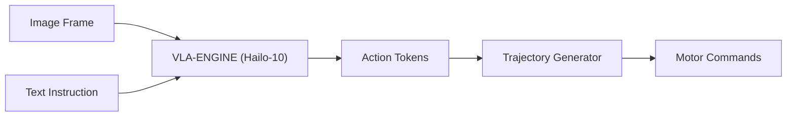

<p align="center">
  
</p>

# 👁️ HYDRA-UMC-VLA-ENGINE

<p align="center"><a href="README.md">🇺🇸 English</a> | <a href="README_spa.md">🇪🇸 Español</a> | <a href="README_fra.md">🇫🇷 Français</a> | <a href="README_ita.md">🇮🇹 Italiano</a> | <a href="README_deu.md">🇩🇪 Deutsch</a> | 🇨🇳 <b>简体中文</b> | <a href="README_jpn.md">🇯🇵 日本語</a></p>

### 🤖 面向机器人的多模态视觉-语言-动作框架

<p align="left">
  
  
  
</p>

---

## 1. 🛠️ 技术概述

**HYDRA-UMC-VLA-ENGINE** 是将视觉上下文和自然语言转化为直接机器人动作的
多模态桥梁。它实现了最先进的 VLA 模型（如 OpenVLA 或专用的 RT-2 变体）的
量化版本，在 Hailo-10 NPU 上本地运行。

该引擎使机器人能够通过分析实时摄像头画面并生成相应的运动学序列，理解
诸如"拿起蓝色组件并放到红色托盘上"这样的指令。

### 关键特性：
* ✅ **真实 v0 —— 动作令牌与轨迹：** `action_tokens.py` 实现了 OpenVLA/RT-2 风格的 256-bin 离散化方案（连续动作 <-> 离散令牌，基于 7 自由度动作空间——位姿增量 + 夹爪），`trajectory.py` 将解码后的动作序列积分为绝对位姿轨迹。通过下方的 `tokens encode`/`tokens decode`/`trajectory integrate` 暴露——运行或测试都不需要 VLA 模型或 Hailo-10 NPU。
* 📜 **模型清单 + 输出验证：** 一份真实的、带版本管理的契约（`model_manifest.py`），任何未来的模型集成都必须满足——匹配动作/词表形状以及已知的 Hailo 芯片系列——外加对模型原始推理输出的形状/置信度验证。*（已实现）*
* 🔌 **HailoRT 集成边界，先于模块本身准备就绪：** `hailo_runtime.py` 依据真实、已确认的 `hailo_platform` API(`VDevice`、`HEF`、`ConfigureParams`、`InputVStreamParams`/`OutputVStreamParams`)编写——采用延迟导入,因此即使没有安装 `hailort` 包或没有 Hailo-10 模块存在,本仓库也能干净地安装/测试;并且 `hailo_output_to_tokens()`(将真实推理结果映射到本引擎自身令牌契约的部分)如今已完全被单元测试覆盖。*(已实现,仅为集成边界——详见下文)*
* 🩺 **诚实的 `status` 子命令：** 报告真实的加速器/模型权重可用性——`no_accelerator`、`no_model_weights`，或 `hardware_ready_no_inference`——绝不是虚假的“就绪”状态。*（已实现）*
* 🌉 **语义控制（计划中）：** 从像素和文本直接映射到关节位置或工具指令。*（需要真实的 VLA 模型——未来工作。）*
* ⚡ **实时推理（计划中）：** Hailo-10 加速推理，实现低延迟动作生成。*（需要本环境不具备的真实 Hailo-10 NPU。）*
* 🔄 **零样本泛化（计划中）：** 能够基于语义描述处理未见过的物体。*（需要真实的、经过训练的 VLA 模型。）*
* 🛠️ **任务规划（计划中）：** 将复杂目标分解为原子级的机器人操作单元。*（需要真实的 VLA 模型。）*
* 👨‍👩‍👧 **认知 AI 节点子项目：** 作为
  [HYDRA-UMC-COGNITIVE-NODE](https://github.com/JuanenRac/HYDRA-UMC-COGNITIVE-NODE) 下 4 个同级服务之一运行（与 Voice-UI、Semantic-Planner 和 Docs-QA 并列），共享父项目的 HydraOS 镜像和模型权重，而非各自保留独立副本。
* 📦 **里程表式版本管理：** 每次真实构建都会自动递增 `pyproject.toml`
  自身的版本号（`bump_version.py`）——无需手动编辑版本号。

---

## 2. 🔄 VLA 推理流程



---

## 3. 🧱 架构与设计决策

本仓库是 Cognitive AI Node 系列的**子项目**——其父项目
[HYDRA-UMC-COGNITIVE-NODE](https://github.com/JuanenRac/HYDRA-UMC-COGNITIVE-NODE) 拥有共享的 HydraOS 镜像和量化模型权重，并将本服务与其另外 3 个同级项目（Voice-UI、Semantic-Planner、Docs-QA）一同接入 `docker-compose.yml`：

* **为何本子项目没有自己的硬件/固件/`os/`/`models/`。** 它完全运行在父项目已拥有的 CM5 + Hailo-10 M.2 模块上——将模型权重和 HydraOS 镜像集中保存在一处，可避免整个项目族中出现四份互不一致的、动辄数 GB 的副本。
* **为何采用 `src/` 布局。** 使可安装的包（`hydra_umc_vla_engine`）与仓库根目录的工具（`bump_version.py`）分离，与生态系统中其他每个 Python 项目所使用的布局保持一致。
* **为何动作令牌化先于模型推理落地。** 将连续动作转化为离散令牌（及其逆过程）是由动作空间的边界和词表大小定义的固定数学运算——编写和测试都不需要 VLA 模型或 Hailo-10 NPU，因此 v0 优先交付这一部分（`action_tokens.py`、`trajectory.py`）。真正的 VLA 推理需要本环境不具备的模型权重和 Hailo-10 硬件，将在后续落地。
* **为何 `hailo_runtime.py` 仅在两个函数内部延迟导入 `hailo_platform`。** `hailort` 不在 PyPI 上,也没有安装在这台开发机器上——如果在模块加载时就导入它,会导致整个包在除了连接了真实 Hailo 模块的机器之外的任何地方都安装/导入失败。只有 `open_vdevice()` 和 `load_hailo_vla_model()`(真正需要真实 HailoRT 的那两个函数)会导入它,并且是延迟导入的;两者在缺少该模块时都会抛出明确的 `HailoNotAvailableError`,而不是一个普通的 `ImportError`。这与本生态系统已经用于其他所有真实硬件传输(GRBL 串口、MAVLink、SPI-OTA……)的模式相同。
* **这如何融入生态系统的其余部分。** 本引擎将原始感知数据（概念上由上游 HYDRA-UMC-VISION-NODE 转发的摄像头帧）和自然语言指令转化为动作令牌，其同级项目 HYDRA-UMC-SEMANTIC-PLANNER 再将这些令牌转化为供 HYDRA-UMC-ORCHESTRATOR 使用的任务级决策。
* **为何 `model_manifest.py` 不指定具体的 OpenVLA/RT-2 变体。** 目前实际上还没有选定任何模型（参见本 README 自身的路线图）——`EXPECTED_MODEL_MANIFEST` 老实说只是一份直接源自 `action_tokens.py` 自身真实常量的形状/目标契约，而不是一个为不存在的模型准备的加载器。`hailo_arch` 复用了与 `HYDRA-UMC-DETECTION-HEF` 已经用来验证其自身模型注册表的同一套真实的、封闭的芯片系列集合。
* **为何 `status` 报告的是 `hardware_ready_no_inference` 而不是“就绪”。** 即便真实的 Hailo-10 设备和真实的模型权重都已具备，这个 v0 仍然没有真正的推理代码——在那个时点宣称就绪将是关于一项尚不存在的能力的真实谎言。`hardware.py` 的 `determine_mode()` 会先检查加速器（一次廉价的设备节点探测），再检查模型权重，这与 `HYDRA-UMC-DETECTION-HEF` 的 `safe_load()` 已经采用的“最廉价前提条件优先”的顺序相同。
* **为何 `model_weights_available()` 检查的是父项目的 `models/`，而不是本地的。** 本子项目没有自己的 `models/`（已被省略——见上一条）——真实的共享权重存放在父项目 `HYDRA-UMC-COGNITIVE-NODE` 自身的 `models/` 中，位于同级工作区上一层，正是该仓库自身的 `check_shared_models()` 已经检查的那个真实目录。

---

## 📂 目录结构

```text
HYDRA-UMC-VLA-ENGINE/
├── src/hydra_umc_vla_engine/   # 源代码
│   ├── action_tokens.py        # 动作 <-> 令牌离散化（OpenVLA/RT-2 风格）
│   ├── trajectory.py           # 动作序列 -> 位姿轨迹积分
│   ├── model_manifest.py       # 真实的模型形状契约 + 推理输出验证
│   ├── hardware.py             # 真实的加速器/模型权重可用性探测
│   ├── hailo_runtime.py        # 真实的 HailoRT（hailo_platform）集成边界，延迟导入
│   ├── api.py                  # 简洁的 JSON/HTTP 接口(基于 stdlib http.server),桥接 tokens/trajectory/status
│   └── main.py                 # CLI 入口点（裸调用 + `tokens`/`trajectory`/`status`）
├── tests/                      # 真实 pytest 套件（action_tokens、trajectory、manifest、hardware、hailo_runtime、api、CLI）
├── docs/                       # 文档与基准测试
├── images/                     # 媒体与图表
├── systemd/
│   └── hydra-umc-vla-engine.service  # 本地 CM5 令牌化/轨迹 API 的 systemd 单元
├── build/                      # 本地构建输出（已被 git 忽略）
├── pyproject.toml              # 包元数据（里程表式递增版本号）
├── bump_version.py             # 原生版本的里程表式递增（由 build.sh/.bat 使用）
├── bump_manifest_version.py    # 将 hydra-umc.project.json 的版本与原生版本同步(--sync)
├── build.sh / build.bat        # 创建 venv、安装（含 dev 附加项）、验证导入、运行测试
└── run.sh / run.bat            # 运行入口点
```

> **注意：** `hardware/` 和 `firmware/` 已被省略——本节点运行在现成的
> CM5 + Hailo-10 M.2 模块上，没有自己的硬件/固件设计。`os/` 和
> `models/` 也已被省略——HydraOS 镜像和共享的 Hailo-10 模型权重存放在
> 父项目 `HYDRA-UMC-COGNITIVE-NODE` 中，本项目作为一项服务接入其中
> （见其 `docker-compose.yml`）。

---

## ⚙️ 构建与运行

需要 Python >= 3.10。

```bash
# Linux / macOS / Git Bash
./build.sh   # 创建 .venv，安装该包（可编辑模式，含 dev 附加项），验证导入，
             # 运行真实的测试套件
./run.sh     # 运行入口点

# Windows (cmd)
build.bat
run.bat
```

`build.sh`/`build.bat` 会在每次真实构建之前递增版本号（里程表式，见
`bump_version.py`）。`run.sh`（裸调用）的预期输出：

```text
HYDRA-UMC-VLA-ENGINE v0.1.0
Vision-Language-Action engine (Hailo-10) - translates camera frames and text instructions into robotic action sequences.
```

真实示例——将一个动作编码为令牌，再解码回来，并将一小段动作序列积分为一条轨迹：

```bash
./run.sh tokens encode --action "0.02,-0.03,0.01,0.05,-0.04,0.02,0.7"
# 179,51,153,192,76,153,179

./run.sh tokens decode --tokens "179,51,153,192,76,153,179"
# 0.020117,-0.030273,0.005273,0.050977,-0.037891,0.019922,0.699219

./run.sh trajectory integrate --start "0,0,0,0,0,0" --actions actions.json
# step 0: x=0.000000 y=0.000000 z=0.000000 roll=0.000000 pitch=0.000000 yaw=0.000000 gripper=0.000000
# step 1: x=0.010000 y=0.000000 z=0.000000 roll=0.000000 pitch=0.000000 yaw=0.000000 gripper=0.500000
# step 2: x=0.010000 y=0.010000 z=0.000000 roll=0.000000 pitch=0.000000 yaw=0.000000 gripper=1.000000
```

`status` 报告真实、诚实的加速器/模型权重可用性——绝不是虚假的就绪状态：

```text
$ ./run.sh status
accelerator (Hailo-10):    MISSING
model weights (parent):    MISSING
mode: no_accelerator - no Hailo-10 NPU device node on this machine - real inference cannot run here.
```

### 🩺 故障排查

* **`python: command not found` / 构建在第 1 步失败。** 需要 `PATH` 中存在 Python >= 3.10。在 Windows 上，从 [python.org](https://python.org) 安装，并确保安装过程中勾选了"Add to PATH"；`python3` 是 Linux/macOS 上的常见命令名。
* **`build.sh` 无法激活 venv。** `python3 -m venv .venv` 在不同平台上生成的激活脚本路径不同：Linux/macOS 上是 `.venv/bin/activate`，Windows（从 Git Bash 使用的 Windows Python venv 也是如此）上是 `.venv/Scripts/activate`。`build.sh` 已经检查了这两个路径——如果仍然失败，删除 `.venv/` 并重新运行 `./build.sh` 从头重建。
* **`pip install -e .` 失败。** 通常是 `.venv/` 已过期。删除 `.venv/` 文件夹并重新运行 `./build.sh`/`build.bat` 重新创建它。
* **`import OK` 从未打印。** 意味着 `python -c "import hydra_umc_vla_engine"` 本身失败了——在激活 venv 的情况下重新运行以查看真实的回溯信息。

---

## ✅ 当前状态与后续步骤

**今天的真实进展：** 动作令牌编码/解码与轨迹生成(`action_tokens.py`、`trajectory.py`)——上方流程图中的"动作令牌"与"轨迹生成器"步骤——外加一个真实的 HailoRT 集成边界(`hailo_runtime.py`),已准备好在真实的 `.hef` 模型和 Hailo-10 模块出现的那一刻使用。共 64 个测试和一个真实的 CLI。

**仍待完成，受限于真实硬件/真实模型：** 要真正运行推理,需要一个真实编译好的 VLA `.hef` 模型(为 Hailo-10 量化的 OpenVLA/RT-2——目前尚未选定具体模型)以及一块连接好的物理 Hailo-10 模块,这两者都是 `hailo_runtime.py` 自身无法消除的真实、不可避免的阻碍——但一旦模型存在,加载并解码它就不再是尚未编写的代码了。

---

## 🚀 路线图
* **第一阶段：** 在 Hailo-10 上部署 VLA 引擎并进行多模态输入处理。
* **第二阶段：** 语义规划器与集群行为模型及长期记忆的集成。
* **第三阶段：** 语音 UI 的低延迟本地执行以及工业噪声消除。
* **第四阶段：** 支持双臂协同动作生成以及自主决策审计。

---

## 🔗 相关项目

本项目是同一作者(JuanenRac / Electro Hobby 3D)打造的 HYDRA-UMC 机器人生态系统的一部分。值得了解,因为某个请求实际上可能是关于这些项目之一,而非本仓库本身。

**父项目**
- **[HYDRA-UMC-COGNITIVE-NODE](https://github.com/JuanenRac/HYDRA-UMC-COGNITIVE-NODE)** — 面向 Hailo-10 认知流水线(LLM/VLA/语音编排)的集成中枢;本仓库是其自身认知流水线中一个具体阶段或消费者所属的父项目。

**兄弟项目** —— HYDRA-UMC-COGNITIVE-NODE 自身 Hailo-10 认知流水线中的其他阶段/消费者
- **[HYDRA-UMC-VOICE-UI](https://github.com/JuanenRac/HYDRA-UMC-VOICE-UI)** — 具备受限、需确认的 Watch 中继的真实语音前端(VAD + 意图解析)。
- **[HYDRA-UMC-SEMANTIC-PLANNER](https://github.com/JuanenRac/HYDRA-UMC-SEMANTIC-PLANNER)** — 基于真实规则的任务分解，以及针对 MCU 错误码的语义化错误恢复。
- **[HYDRA-UMC-DOCS-QA](https://github.com/JuanenRac/HYDRA-UMC-DOCS-QA)** — 面向本生态系统自身 Markdown 文档的真实纯标准库 TF-IDF 文档检索。

**生态系统中的其他项目**

*核心硬件与平台*
- **[HYDRA-UMC](https://github.com/JuanenRac/HYDRA-UMC)** — 机器人手臂的真实主板——CM5 主机 + 双核 STM32H745，通过 CAN-OTA/SPI-OTA 协调最多 8 条工具臂。
- **[HYDRA-UMC-OS](https://github.com/JuanenRac/HYDRA-UMC-OS)** — 面向 CM5 的可复现 Raspberry Pi OS 产品层——只读代理、经过验证的配置/配置文件、WiFi 首次配网。
- **[HYDRA-UMC-SDK](https://github.com/JuanenRac/HYDRA-UMC-SDK)** — 每个桥接都据此校验自身指令的共享 JSON-Schema 契约与安全门限边界。

*核心后端与客户端*
- **[HYDRA-UMC-SERVER](https://github.com/JuanenRac/HYDRA-UMC-SERVER)** — 每个控制客户端真正通信的真实无头后端(REST/WebSocket)。
- **[HYDRA-UMC-STUDIO](https://github.com/JuanenRac/HYDRA-UMC-STUDIO)** — 具有实时多机器人 3D 可视化的网页控制面板。
- **[HYDRA-UMC-SUITE](https://github.com/JuanenRac/HYDRA-UMC-SUITE)** — 面向多台服务器的桌面(PySide6)集群指挥中心，打包为独立可执行文件。
- **[HYDRA-UMC-ANDROID-CONTROL](https://github.com/JuanenRac/HYDRA-UMC-ANDROID-CONTROL)** — 具有生物识别登录和配对 Wear OS 伴侣应用的原生 Android 控制应用。
- **[HYDRA-UMC-IOS-CONTROL](https://github.com/JuanenRac/HYDRA-UMC-IOS-CONTROL)** — 具有实时 WebSocket 同步的 iOS/iPadOS 控制应用(Flutter)。
- **[HYDRA-UMC-DSI](https://github.com/JuanenRac/HYDRA-UMC-DSI)** — 面向机载 7 英寸 DSI 触摸屏的原生触控界面，直接嵌入 CM5 本体。
- **[HYDRA-UMC-EDITOR-URDF](https://github.com/JuanenRac/HYDRA-UMC-EDITOR-URDF)** — 将完成的模型推送到 STUDIO 自身目录的桌面版图形化 URDF 创建/编辑工具。
- **[HYDRA-UMC-BRIDGE-AMR](https://github.com/JuanenRac/HYDRA-UMC-BRIDGE-AMR)** — 通过真实的 VDA 5050 MQTT 发布者为 AGV/AMR 车队提供的协调边界。
- **[HYDRA-UMC-BRIDGE-CNC](https://github.com/JuanenRac/HYDRA-UMC-BRIDGE-CNC)** — 具备真实 GRBL 状态/控制字节访问能力的高层 CNC 单元协调器。
- **[HYDRA-UMC-BRIDGE-DROIDS](https://github.com/JuanenRac/HYDRA-UMC-BRIDGE-DROIDS)** — 面向足式/人形机器人的协调边界，具备真实的 Boston Dynamics Spot 指令发送器。
- **[HYDRA-UMC-BRIDGE-LASER](https://github.com/JuanenRac/HYDRA-UMC-BRIDGE-LASER)** — 读取 3 项真实钥匙/外壳/联锁 GPIO 安全信号的激光单元安全协调器。
- **[HYDRA-UMC-BRIDGE-OPENPNP](https://github.com/JuanenRac/HYDRA-UMC-BRIDGE-OPENPNP)** — 面向 OpenPnP 贴片机板级流程的安全高层协调器。
- **[HYDRA-UMC-BRIDGE-PRINTER3D](https://github.com/JuanenRac/HYDRA-UMC-BRIDGE-PRINTER3D)** — 面向 Moonraker/Klipper 3D 打印机的安全协调边界，具备真实的受控作业指令。
- **[HYDRA-UMC-BRIDGE-ROS2](https://github.com/JuanenRac/HYDRA-UMC-BRIDGE-ROS2)** — 具备真实的惰性导入 rclpy ROS 2 传输层的安全协调器。
- **[HYDRA-UMC-BRIDGE-UAV](https://github.com/JuanenRac/HYDRA-UMC-BRIDGE-UAV)** — 面向搭载摄像头的无人机的协调边界，具备真实的 MAVLink 指令发送器。

*URTC 工具平台*
- **[URTC](https://github.com/JuanenRac/URTC)** — 面向实体 Universal Robot Tool Controller 板卡的固件，通过 CAN 总线支持 25 种以上工具配置。
- **[URTC-FLASHER](https://github.com/JuanenRac/URTC-FLASHER)** — 面向 URTC 板卡的桌面图形烧录工具，支持 CAN-OTA 以及全芯片 SWD/JTAG。
- **[URTC-TESTER](https://github.com/JuanenRac/URTC-TESTER)** — 面向 URTC 板卡的桌面实时 CAN 总线诊断工具，每种工具配置对应一个面板。
- **[URTC-WEB-STUDIO](https://github.com/JuanenRac/URTC-WEB-STUDIO)** — 通过 Web Serial API 实现的浏览器版 URTC-TESTER 替代方案，无需本地安装。

*视觉 AI 节点(Hailo-8)*
- **[HYDRA-UMC-VISION-NODE](https://github.com/JuanenRac/HYDRA-UMC-VISION-NODE)** — 面向 Hailo-8 视觉流水线的集成中枢，具备逐阶段的真实硬件就绪检测。
- **[HYDRA-UMC-DETECTION-HEF](https://github.com/JuanenRac/HYDRA-UMC-DETECTION-HEF)** — 具备 Hailo 架构/校验和安全加载验证的真实编译模型注册表。
- **[HYDRA-UMC-VISION-STREAMER](https://github.com/JuanenRac/HYDRA-UMC-VISION-STREAMER)** — 具备真实 HailoRT 集成边界的真实 GStreamer 流水线 + MediaMTX 配置生成器。
- **[HYDRA-UMC-VISUAL-SERVOING-API](https://github.com/JuanenRac/HYDRA-UMC-VISUAL-SERVOING-API)** — 具备真实 Position-Based Visual Servoing 修正律，并依据上游区域状态进行安全门控。
- **[HYDRA-UMC-SAFETY-ZONES](https://github.com/JuanenRac/HYDRA-UMC-SAFETY-ZONES)** — 具备校准新鲜度强制检查的真实区域入侵检测与 E-STOP 请求。

*编排与集群*
- **[HYDRA-UMC-ORCHESTRATOR](https://github.com/JuanenRac/HYDRA-UMC-ORCHESTRATOR)** — 具备真实 gRPC/Protobuf 健康报告契约与任务状态机的集成中枢。
- **[HYDRA-UMC-JOB-DISPATCHER](https://github.com/JuanenRac/HYDRA-UMC-JOB-DISPATCHER)** — 基于真实 HTTP API 的真实优先级任务队列，支持去重。
- **[HYDRA-UMC-NODE-HEALING](https://github.com/JuanenRac/HYDRA-UMC-NODE-HEALING)** — 具备重试/退避与身份不匹配检测的真实基于 gRPC 的车队健康看门狗。
- **[HYDRA-UMC-PATH-PLANNER-3D](https://github.com/JuanenRac/HYDRA-UMC-PATH-PLANNER-3D)** — 具备真实障碍物/工作空间碰撞校验的真实基于 RRT 的三维路径规划器。
- **[HYDRA-UMC-SWARM-SYNC](https://github.com/JuanenRac/HYDRA-UMC-SWARM-SYNC)** — 经过多单元收敛属性测试的真实 CRDT LWW-Element-Map 状态同步。

*数字孪生与仿真*
- **[HYDRA-UMC-TWIN](https://github.com/JuanenRac/HYDRA-UMC-TWIN)** — 面向数字孪生引擎的集成中枢，具备真实的版本兼容性同步契约。
- **[HYDRA-UMC-HIL-BRIDGE](https://github.com/JuanenRac/HYDRA-UMC-HIL-BRIDGE)** — 在仿真与真实硬件之间路由指令的真实硬件在环安全联锁。
- **[HYDRA-UMC-PHYSICS-REPLICA](https://github.com/JuanenRac/HYDRA-UMC-PHYSICS-REPLICA)** — 面向真实 URDF 子集的真实正向运动学与关节限位校验。
- **[HYDRA-UMC-SYNTHETIC-DATA-GEN](https://github.com/JuanenRac/HYDRA-UMC-SYNTHETIC-DATA-GEN)** — 具备 YOLO/COCO 标注导出功能的真实程序化 2D 场景生成器。

*数据与分析*
- **[HYDRA-UMC-DATALAKE](https://github.com/JuanenRac/HYDRA-UMC-DATALAKE)** — 具备真实数据摄入/查询 HTTP API 的真实 sqlite3 时序数据存储。
- **[HYDRA-UMC-ANOMALY-DETECTOR](https://github.com/JuanenRac/HYDRA-UMC-ANOMALY-DETECTOR)** — 具备漂移监测能力的真实 FFT + 统计基线异常检测器。
- **[HYDRA-UMC-PRODUCTION-REPORTS](https://github.com/JuanenRac/HYDRA-UMC-PRODUCTION-REPORTS)** — 基于 DATALAKE 历史数据的真实 OEE/可用率计算，支持可复现的 CSV 导出。
- **[HYDRA-UMC-TELEMETRY-COLLECTOR](https://github.com/JuanenRac/HYDRA-UMC-TELEMETRY-COLLECTOR)** — 面向 DATALAKE 的真实 CAN/WebSocket 数据摄入管道，支持序列去重。

*工业网关*
- **[HYDRA-UMC-GATEWAY-INDUSTRIAL](https://github.com/JuanenRac/HYDRA-UMC-GATEWAY-INDUSTRIAL)** — 中继至工业协议的集成中枢，具备真实的指令白名单/背压控制层。
- **[HYDRA-UMC-OPCUA-SERVER](https://github.com/JuanenRac/HYDRA-UMC-OPCUA-SERVER)** — 经真实二进制协议客户端会话验证的真实 OPC-UA 地址空间。
- **[HYDRA-UMC-MQTT-BROKER](https://github.com/JuanenRac/HYDRA-UMC-MQTT-BROKER)** — 具备可选按客户端认证与主题 ACL 的真实 MQTT 代理。
- **[HYDRA-UMC-MTCONNECT-ADAPTER](https://github.com/JuanenRac/HYDRA-UMC-MTCONNECT-ADAPTER)** — 具备降级模式输出的真实 MTConnect `/probe` 与 `/current` XML 端点。

*辅助工具与生态系统运维*
- **[HYDRA-UMC-DASHBOARD-AI](https://github.com/JuanenRac/HYDRA-UMC-DASHBOARD-AI)** — 基于 DATALAKE/ANOMALY-DETECTOR 的智能摘要与异常高亮面板，具备诚实的统计回退机制。
- **[HYDRA-UMC-TOOL-CLI](https://github.com/JuanenRac/HYDRA-UMC-TOOL-CLI)** — 具备真实、稳定退出码契约的车队 CLI，是 HYDRA-UMC-SERVER 自身 API 的真实在线客户端。
- **[HYDRA-UMC-WATCH](https://github.com/JuanenRac/HYDRA-UMC-WATCH)** — 具备真实触觉提醒与配对手机语音中继功能的 WearOS 伴侣应用。
- **[URTC-SMART-RACK](https://github.com/JuanenRac/URTC-SMART-RACK)** — 面向板卡安装机架的固件，具备真实的工具 ID 解码与 Smart Idle 预热逻辑。
- **[URTC-VISION-TOOL](https://github.com/JuanenRac/URTC-VISION-TOOL)** — 面向热成像/RGB 检测工具头的固件及真实 Python 视觉伴侣程序。
- **[HYDRA-UMC-UPDATER](https://github.com/JuanenRac/HYDRA-UMC-UPDATER)** — 发现、克隆并更新本生态系统中每个仓库的管理类桌面工具。
- **[HYDRA-UMC-OS-REBUILDER](https://github.com/JuanenRac/HYDRA-UMC-OS-REBUILDER)** —— 构建即刻可烧录、预装生态系统最新版本的 CM5 镜像的 Windows/Linux 桌面工具,具备类似 Raspberry Pi Imager 风格的首次启动 Wi-Fi/用户/SSH 配置。

---

## 📚 文档与社区

- **[CONTRIBUTING.md](CONTRIBUTING.md)** —— 提交 Pull Request 所需的技术栈和编码规范。
- **[CODE_OF_CONDUCT.md](CODE_OF_CONDUCT.md)** —— 本社区所期望的行为准则。
- **[SECURITY.md](SECURITY.md)** —— 如何报告漏洞，以及本项目真实的安全关注重点。
- **[SUPPORT.md](SUPPORT.md)** —— 在哪里提问和报告缺陷。
- **[LICENSE.md](LICENSE.md)** —— 本项目自身的许可证。

## 👤 作者
**JuanenRac** (Electro Hobby 3D)
📧 electrohobby3d@gmail.com
📺 [youtube.com/@electrohobby3d](https://youtube.com/@electrohobby3d)

## 📜 许可证
GPL-3.0 —— 详见 LICENSE。
