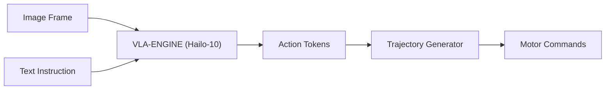

<p align="center">
  
</p>

# 👁️ HYDRA-UMC-VLA-ENGINE

<p align="center"><a href="README.md">🇺🇸 English</a> | <a href="README_spa.md">🇪🇸 Español</a> | <a href="README_fra.md">🇫🇷 Français</a> | <a href="README_ita.md">🇮🇹 Italiano</a> | <a href="README_deu.md">🇩🇪 Deutsch</a> | 🇨🇳 <b>简体中文</b> | <a href="README_jpn.md">🇯🇵 日本語</a></p>

### 🤖 面向机器人的多模态视觉-语言-动作框架

<p align="left">
  
  
  
</p>

---

## 1. 🛠️ 技术概述

**HYDRA-UMC-VLA-ENGINE** 是将视觉上下文和自然语言转化为直接机器人动作的
多模态桥梁。它实现了最先进的 VLA 模型（如 OpenVLA 或专用的 RT-2 变体）的
量化版本，在 Hailo-10 NPU 上本地运行。

该引擎使机器人能够通过分析实时摄像头画面并生成相应的运动学序列，理解
诸如"拿起蓝色组件并放到红色托盘上"这样的指令。

### 关键特性：
* 🌉 **语义控制：** 从像素和文本直接映射到关节位置或工具指令。
* ⚡ **实时推理：** Hailo-10 加速推理，实现低延迟动作生成。
* 🔄 **零样本泛化：** 能够基于语义描述处理未见过的物体。
* 🛠️ **任务规划：** 将复杂目标分解为原子级的机器人操作单元。
* 👨‍👩‍👧 **认知 AI 节点子项目：** 作为
  [HYDRA-UMC-COGNITIVE-NODE](https://github.com/JuanenRac/HYDRA-UMC-COGNITIVE-NODE) 下 4 个同级服务之一运行（与 Voice-UI、Semantic-Planner 和 Docs-QA 并列），共享父项目的 HydraOS 镜像和模型权重，而非各自保留独立副本。
* 📦 **里程表式版本管理：** 每次真实构建都会自动递增 `pyproject.toml`
  自身的版本号（`bump_version.py`）——无需手动编辑版本号。

---

## 2. 🔄 VLA 推理流程



---

## 3. 🧱 架构与设计决策

本仓库是 Cognitive AI Node 系列的**子项目**——其父项目
[HYDRA-UMC-COGNITIVE-NODE](https://github.com/JuanenRac/HYDRA-UMC-COGNITIVE-NODE) 拥有共享的 HydraOS 镜像和量化模型权重，并将本服务与其另外 3 个同级项目（Voice-UI、Semantic-Planner、Docs-QA）一同接入 `docker-compose.yml`：

* **为何本子项目没有自己的硬件/固件/`os/`/`models/`。** 它完全运行在父项目已拥有的 CM5 + Hailo-10 M.2 模块上——将模型权重和 HydraOS 镜像集中保存在一处，可避免整个项目族中出现四份互不一致的、动辄数 GB 的副本。
* **为何采用 `src/` 布局。** 使可安装的包（`hydra_umc_vla_engine`）与仓库根目录的工具（`bump_version.py`）分离，与生态系统中其他每个 Python 项目所使用的布局保持一致。
* **为何入口点今天只打印身份/版本/角色。** 这是脚手架（scaffolding）阶段：证明该包在实际目标 Python 版本上能够正确安装、编译并被导入，是后续添加真正的 VLA 推理逻辑的前提条件，并使那部分后续工作与打包相关的问题相互隔离。
* **这如何融入生态系统的其余部分。** 本引擎将原始感知数据（概念上由上游 HYDRA-UMC-VISION-NODE 转发的摄像头帧）和自然语言指令转化为动作令牌，其同级项目 HYDRA-UMC-SEMANTIC-PLANNER 再将这些令牌转化为供 HYDRA-UMC-ORCHESTRATOR 使用的任务级决策。

---

## 📂 目录结构

```text
HYDRA-UMC-VLA-ENGINE/
├── src/hydra_umc_vla_engine/   # 源代码（分词器、动作头、模型）
├── docs/                       # 文档与基准测试
├── images/                     # 媒体与图表
├── scripts/                    # 实用脚本
├── build/                      # 本地构建输出（已被 git 忽略）
├── pyproject.toml              # 包元数据（版本 0.0.3，里程表式递增）
├── bump_version.py             # 里程表式版本递增（由 build.sh/.bat 使用）
├── build.sh / build.bat        # 创建 venv、安装、验证导入
└── run.sh / run.bat            # 运行入口点
```

> **注意：** `hardware/` 和 `firmware/` 已被省略——本节点运行在现成的
> CM5 + Hailo-10 M.2 模块上，没有自己的硬件/固件设计。`os/` 和
> `models/` 也已被省略——HydraOS 镜像和共享的 Hailo-10 模型权重存放在
> 父项目 `HYDRA-UMC-COGNITIVE-NODE` 中，本项目作为一项服务接入其中
> （见其 `docker-compose.yml`）。

---

## ⚙️ 构建与运行

需要 Python >= 3.10。

```bash
# Linux / macOS / Git Bash
./build.sh   # 创建 .venv，安装该包（可编辑模式），验证导入
./run.sh     # 运行入口点

# Windows (cmd)
build.bat
run.bat
```

`build.sh`/`build.bat` 会在每次真实构建之前递增版本号（里程表式，见
`bump_version.py`）。`run.sh` 的预期输出：

```text
HYDRA-UMC-VLA-ENGINE v0.0.3
Vision-Language-Action engine (Hailo-10) - translates camera frames and text instructions into robotic action sequences.
```

### 🩺 故障排查

* **`python: command not found` / 构建在第 1 步失败。** 需要 `PATH` 中存在 Python >= 3.10。在 Windows 上，从 [python.org](https://python.org) 安装，并确保安装过程中勾选了"Add to PATH"；`python3` 是 Linux/macOS 上的常见命令名。
* **`build.sh` 无法激活 venv。** `python3 -m venv .venv` 在不同平台上生成的激活脚本路径不同：Linux/macOS 上是 `.venv/bin/activate`，Windows（从 Git Bash 使用的 Windows Python venv 也是如此）上是 `.venv/Scripts/activate`。`build.sh` 已经检查了这两个路径——如果仍然失败，删除 `.venv/` 并重新运行 `./build.sh` 从头重建。
* **`pip install -e .` 失败。** 通常是 `.venv/` 已过期。删除 `.venv/` 文件夹并重新运行 `./build.sh`/`build.bat` 重新创建它。
* **`import OK` 从未打印。** 意味着 `python -c "import hydra_umc_vla_engine"` 本身失败了——在激活 venv 的情况下重新运行以查看真实的回溯信息。

---

## 🚀 路线图
* **第一阶段：** 在 Hailo-10 上部署 VLA 引擎并进行多模态输入处理。
* **第二阶段：** 语义规划器与集群行为模型及长期记忆的集成。
* **第三阶段：** 语音 UI 的低延迟本地执行以及工业噪声消除。
* **第四阶段：** 支持双臂协同动作生成以及自主决策审计。

---

## 🔗 相关项目

本项目是同一作者（JuanenRac / Electro Hobby 3D）打造的更大规模机器人生态
系统的一部分，涵盖固件、控制软件、AI 节点和车队工具。除了上文已经说明的
内容之外，本引擎在其自身的项目族（父项目 HYDRA-UMC-COGNITIVE-NODE 以及
同级项目 HYDRA-UMC-VOICE-UI、HYDRA-UMC-SEMANTIC-PLANNER、
HYDRA-UMC-DOCS-QA）之外没有其他关联。

### 生态系统的其余部分

**HYDRA-UMC 平台** —— 多机器人微工厂单元
- **[HYDRA-UMC](https://github.com/JuanenRac/HYDRA-UMC)** —— 主板本身：Raspberry Pi CM5 主机 + 双核 STM32H745 实时协处理器，通过 CAN-OTA/SPI-OTA 协调最多 8 条分布式机械臂。
- **[HYDRA-UMC SERVER](https://github.com/JuanenRac/HYDRA-UMC-SERVER)** —— 拥有机器人状态的无头 Express/WebSocket 后端。
- **[HYDRA-UMC STUDIO](https://github.com/JuanenRac/HYDRA-UMC-STUDIO)** —— 基于 Web 的控制仪表盘。
- **[HYDRA-UMC-ANDROID-CONTROL](https://github.com/JuanenRac/HYDRA-UMC-ANDROID-CONTROL)** —— HYDRA-UMC 的 Android 控制应用。
- **[HYDRA-UMC-IOS-CONTROL](https://github.com/JuanenRac/HYDRA-UMC-IOS-CONTROL)** —— HYDRA-UMC 的 iOS/iPadOS 控制应用。
- **[HYDRA-UMC-SUITE](https://github.com/JuanenRac/HYDRA-UMC-SUITE)** —— 桌面端集群指挥中心。
- **[HYDRA-UMC-EDITOR-URDF](https://github.com/JuanenRac/HYDRA-UMC-EDITOR-URDF)** —— 桌面端图形化 URDF 创建/编辑器。
- **[HYDRA-UMC-DSI](https://github.com/JuanenRac/HYDRA-UMC-DSI)** —— HYDRA-UMC 的原生触摸屏 UI。

**URTC 平台** —— 每台 HYDRA-UMC 机械臂搭载的工具头控制器
- **[URTC](https://github.com/JuanenRac/URTC)** —— Universal Robot Tool Controller，固件。
- **[URTC Flasher](https://github.com/JuanenRac/URTC-FLASHER)** —— 桌面端 CAN-OTA + SWD/JTAG 刷写工具。
- **[URTC Tester](https://github.com/JuanenRac/URTC-TESTER)** —— 桌面端实时 CAN 总线诊断工具。
- **[URTC Web Studio](https://github.com/JuanenRac/URTC-WEB-STUDIO)** —— 上述两款桌面工具的浏览器端替代方案。

**👁️ 视觉 AI 节点（Hailo-8）**
- [HYDRA-UMC-VISION-NODE](https://github.com/JuanenRac/HYDRA-UMC-VISION-NODE)
- [HYDRA-UMC-VISION-STREAMER](https://github.com/JuanenRac/HYDRA-UMC-VISION-STREAMER)
- [HYDRA-UMC-DETECTION-HEF](https://github.com/JuanenRac/HYDRA-UMC-DETECTION-HEF)
- [HYDRA-UMC-SAFETY-ZONES](https://github.com/JuanenRac/HYDRA-UMC-SAFETY-ZONES)
- [HYDRA-UMC-VISUAL-SERVOING-API](https://github.com/JuanenRac/HYDRA-UMC-VISUAL-SERVOING-API)

**🐝 编排与集群**
- [HYDRA-UMC-ORCHESTRATOR](https://github.com/JuanenRac/HYDRA-UMC-ORCHESTRATOR)
- [HYDRA-UMC-SWARM-SYNC](https://github.com/JuanenRac/HYDRA-UMC-SWARM-SYNC)
- [HYDRA-UMC-PATH-PLANNER-3D](https://github.com/JuanenRac/HYDRA-UMC-PATH-PLANNER-3D)
- [HYDRA-UMC-JOB-DISPATCHER](https://github.com/JuanenRac/HYDRA-UMC-JOB-DISPATCHER)
- [HYDRA-UMC-NODE-HEALING](https://github.com/JuanenRac/HYDRA-UMC-NODE-HEALING)

**🎮 数字孪生与仿真**
- [HYDRA-UMC-TWIN](https://github.com/JuanenRac/HYDRA-UMC-TWIN)
- [HYDRA-UMC-PHYSICS-REPLICA](https://github.com/JuanenRac/HYDRA-UMC-PHYSICS-REPLICA)
- [HYDRA-UMC-HIL-BRIDGE](https://github.com/JuanenRac/HYDRA-UMC-HIL-BRIDGE)
- [HYDRA-UMC-SYNTHETIC-DATA-GEN](https://github.com/JuanenRac/HYDRA-UMC-SYNTHETIC-DATA-GEN)

**📊 数据与分析**
- [HYDRA-UMC-DATALAKE](https://github.com/JuanenRac/HYDRA-UMC-DATALAKE)
- [HYDRA-UMC-TELEMETRY-COLLECTOR](https://github.com/JuanenRac/HYDRA-UMC-TELEMETRY-COLLECTOR)
- [HYDRA-UMC-ANOMALY-DETECTOR](https://github.com/JuanenRac/HYDRA-UMC-ANOMALY-DETECTOR)
- [HYDRA-UMC-PRODUCTION-REPORTS](https://github.com/JuanenRac/HYDRA-UMC-PRODUCTION-REPORTS)

**🏭 工业网关**
- [HYDRA-UMC-GATEWAY-INDUSTRIAL](https://github.com/JuanenRac/HYDRA-UMC-GATEWAY-INDUSTRIAL)
- [HYDRA-UMC-OPCUA-SERVER](https://github.com/JuanenRac/HYDRA-UMC-OPCUA-SERVER)
- [HYDRA-UMC-MQTT-BROKER](https://github.com/JuanenRac/HYDRA-UMC-MQTT-BROKER)
- [HYDRA-UMC-MTCONNECT-ADAPTER](https://github.com/JuanenRac/HYDRA-UMC-MTCONNECT-ADAPTER)

**🛠️ 配套工具**
- [URTC-SMART-RACK](https://github.com/JuanenRac/URTC-SMART-RACK)
- [URTC-VISION-TOOL](https://github.com/JuanenRac/URTC-VISION-TOOL)
- [HYDRA-UMC-WATCH](https://github.com/JuanenRac/HYDRA-UMC-WATCH)
- [HYDRA-UMC-TOOL-CLI](https://github.com/JuanenRac/HYDRA-UMC-TOOL-CLI)
- [HYDRA-UMC-DASHBOARD-AI](https://github.com/JuanenRac/HYDRA-UMC-DASHBOARD-AI)

---

## 👤 作者
**JuanenRac**（Electro Hobby 3D）
📧 electrohobby3d@gmail.com

## 📜 许可证
GPL-3.0 —— 详见 LICENSE。

## 关联项目

> Canonical public ecosystem relationship map.

**Direct integrations:**
[HYDRA-UMC-OS](https://github.com/JuanenRac/HYDRA-UMC-OS) · [HYDRA-UMC-SDK](https://github.com/JuanenRac/HYDRA-UMC-SDK) · [HYDRA-UMC-SERVER](https://github.com/JuanenRac/HYDRA-UMC-SERVER) · [URTC](https://github.com/JuanenRac/URTC) · [HYDRA-UMC-COGNITIVE-NODE](https://github.com/JuanenRac/HYDRA-UMC-COGNITIVE-NODE) · [HYDRA-UMC-SEMANTIC-PLANNER](https://github.com/JuanenRac/HYDRA-UMC-SEMANTIC-PLANNER) · [HYDRA-UMC-PATH-PLANNER-3D](https://github.com/JuanenRac/HYDRA-UMC-PATH-PLANNER-3D)

**Platform and contracts:**
[HYDRA-UMC-OS](https://github.com/JuanenRac/HYDRA-UMC-OS) · [HYDRA-UMC-SDK](https://github.com/JuanenRac/HYDRA-UMC-SDK)

**Rest of the ecosystem:**
All remaining public repositories are grouped by the seven ecosystem layers in the [JuanenRac ecosystem dashboard](https://juanenrac.github.io/JuanenRac/).
